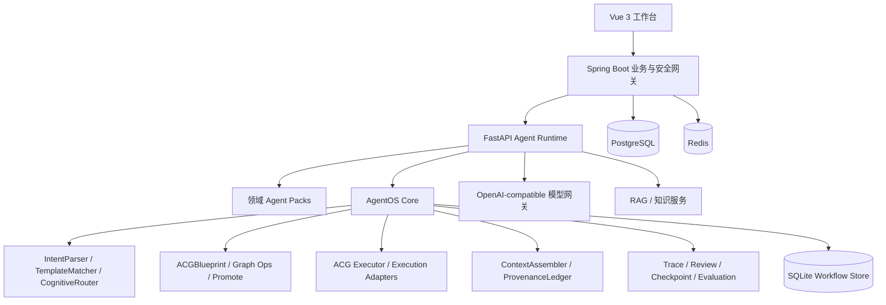

# 知弈 AgentOS：面向超长程复杂任务的动态异构群体智能运行时


---

## 摘要

随着基础大模型从直觉式响应向自主智能体范式跃迁，政务、金融、法律等领域的核心诉求已从单点提效演进为 AI 自主闭环主导超长程决策流——合同审查、案件分析、跨域投研、软件工程自动化。这类任务具备节点繁复、状态空间庞大、模态异构等高维特征，要求系统具备跨越数百次逻辑拓扑流转的深度耦合与长效时序规划能力。

然而，现有技术范式面临三重瓶颈：单体智能体在超长上下文膨胀中遭遇注意力稀释与记忆坍缩；传统刚性多智能体网络的密集交互引发 token 冗余爆炸与决策噪声级联放大；系统缺乏基于图结构的动态路由与内生容错机制。

知弈 AgentOS 将问题定义为：**给定自然语言任务目标、约束、风险与资源预算，如何即时构造一个可执行、可观察、可恢复、可审计的多智能体计算图？**

系统的核心答案是一套以 **Agentic Computation Graph（ACG）** 为统一中间表示的运行时抽象。ACG 将 Step、Agent、Skill、Memory、Evidence 和 Control 建模为有类型节点，将执行依赖、通信、控制、读写与支撑关系建模为不同类型的边。围绕 ACG，系统建立了 JIT 混合规划、就绪集并行调度、字段级低熵通信、数据血缘追溯，以及由故障注入、检查点和局部重规划构成的自愈闭环。

当前系统以律师合同审查为主要验证场景，提供 Vue 工作台、Spring Boot 业务网关、FastAPI Agent Runtime 与独立 AgentOS Core。185 项核心测试全部通过，覆盖 ACG 模型与图算法、工作流升格、混合规划、字段级通信、执行器与故障自愈。系统在 Windows Docker 环境中完成全栈联调与验证，理论设计上兼容国产化部署。

> 本系统是工程原型而非商业产品。合同审查的输出是辅助材料，不构成正式法律意见。Workflow Store 当前为单实例 SQLite，联邦学习子系统处于实验阶段。性能数字来自受控测试样例，不等同于生产基准。

**关键词：** 多智能体系统；Agentic Computation Graph；低熵通信；动态异构拓扑；数据血缘；故障自愈；可治理 AI

---

## 1. 问题定义

### 1.1 赛题背景与核心矛盾

赛题 XH-202631 要求构建一种"具备全局动态任务编排以及自适应网络拓扑流转机制的智能体生态网络"，重点攻克超长周期下的上下文连续性保持、神经符号协同推理与低熵通信难题。这是人工智能从单轮问答走向自主执行必须要解决的工程挑战。

我们将当前技术范式的瓶颈归纳为五类可验证的结构性矛盾：

**矛盾一：复杂任务需求与单次模型调用之间的张力。** 真实职业任务——合同审查、投研分析、项目方案设计——往往包含数十至数千个相互依赖的步骤、跨领域材料和工具调用。将这类任务压缩为一次模型调用，会不可避免地遭遇目标偏移、步骤遗漏、中间结果丢失等问题。扩大模型上下文窗口是缓解手段而非根本解决方案。

**矛盾二：多智能体能力扩展与通信冗余之间的张力。** 引入多个智能体能增强专业分工，但固定角色、全连接广播式的协作模式会令消息数量随参与方平方级增长。无关信息和决策噪声在智能体之间级联传播，token 消耗快速失控。通信效率决定了群体智能可以走多远。

**矛盾三：数据隐私与模型协同优化之间的张力。** 政务数据、医疗信息、商业机密不能随意离开原始安全域。不同机构拥有有价值的数据资源，却因安全与合规要求难以汇聚，形成数据孤岛。"数据不动、模型协同"的联邦学习范式提供了一个方向，但需要与任务编排系统统一调度。

**矛盾四：多模态交互能力与统一任务执行之间的张力。** 现有多模态系统通常分别实现文本、语音、图像和数字人功能，各模块之间缺乏统一的任务语义和状态管理。不同模态的输出往往直接拼接后交给模型，缺乏来源标记和执行约束。

**矛盾五：先进 AI 能力与国产化部署之间的张力。** 高敏感行业对数据本地化、系统可控性和离线部署有严格要求。部分 AI 应用高度依赖公有云和特定软件环境，难以满足自主可控的硬性要求。

### 1.2 工程目标

知弈 AgentOS 的定位不是大语言模型、联邦学习、RAG 和多智能体等技术的简单叠加，而是通过统一运行时内核对各类能力进行封装、规划和调度。系统围绕赛题要求的四个能力维度设计：

| 赛题要求 | 系统机制 |
| --- | --- |
| 超长程上下文连续性与记忆保持 | Task 状态机、WorkflowRun 持久化、Memory 节点与 Checkpoint 断点续跑 |
| 动态异构拓扑与低熵通信 | ACG 蓝图、认知路由、角色补位、`inputSpec` 字段契约与 ContextAssembler |
| 端-边-云异构资源自适应调度 | 调度器 ResourceProfile、多目标效用评分与隐私等级硬约束（架构设计已完成，调度执行链路处于实验阶段） |
| 典型产业场景可运行系统验证 | 律师合同审查完整链路（解析→分类→风险识别→证据匹配→修改建议→人审→报告） |

---

## 2. 核心计算模型：Agentic Computation Graph

### 2.1 设计动机

传统工作流 DAG 只描述步骤间的执行顺序。多智能体系统在此基础上还需回答：谁对哪个步骤负责？数据按什么契约在节点间流动？每一步的判断依据是什么？记忆如何被写入和唤醒？治理动作（人审、分支、恢复）如何嵌入执行流程？

如果将所有这些语义全部压入同一种依赖边，会导致执行调度、通信、记忆和治理逻辑纠缠在一起——图上关系越丰富，执行语义越混乱。

### 2.2 图模型

ACG 将不同语义关系拆分为独立的节点和边类型。只有一种边（DEPENDENCY）参与就绪集计算，其余边各司其职，表达不同维度的语义关系。这使调度器、通信器、记忆器和治理模块可以消费同一份蓝图而互不干扰。

**节点类型：**

| 类型 | 语义 | 核心字段 |
| --- | --- | --- |
| `StepNode` | 可调度的最小任务单元 | `goal`、`inputSpec`、`outputSpec`、`agentName`、`capability`、`reviewRequired` |
| `AgentNode` | 能力与责任的承担者 | `role`、`modelName`、`capabilityTags`、`maxConcurrency` |
| `SkillNode` | 可复用的工具或专业能力 | `skillId`、输入输出契约、资源需求 |
| `MemoryNode` | 工作/情节/语义记忆的读写锚点 | 记忆类型、摘要策略、读写范围 |
| `EvidenceNode` | 可引用、可校验的判断依据 | 来源、校验和、可信等级、引用信息 |
| `ControlNode` | 分支、汇聚、人工复核等治理动作 | `START` / `END` / `IF` / `LOOP` / `PARALLEL` / `CONSENSUS` / `REVIEW` |

**边类型：**

| 类型 | 语义 | 参与就绪集？ |
| --- | --- | --- |
| `DEPENDENCY` | Step 之间的前置依赖 | **是** |
| `COMMUNICATION` | 结构化数据的字段级投递关系 | 否 |
| `CONTROL_FLOW` | 分支、汇聚与控制触发 | 否 |
| `EXECUTION` | Agent 或 Skill 对 Step 的执行绑定 | 否 |
| `READ` / `WRITE` | 记忆数据的读写关系 | 否 |
| `SUPPORT` | Evidence 对判断或产物的支撑关系 | 否 |

### 2.3 双态模型

ACG 采用"设计时蓝图"与"运行时图景"的双态模型。蓝图在规划阶段静态生成，定义节点契约、拓扑结构与初始约束，是规划器的唯一标准输出和执行器的统一输入。执行器将其实例化为运行时图——节点状态迁移、边上承载真实数据流引用，并能根据策略动态注入新节点，实现自适应拓扑。

---

## 3. 核心技术方案

### 3.1 JIT 混合规划

规划器的任务不是简单拆分步骤，而是同时回答五个问题：任务需要哪些认知能力？由哪些 Agent 承担？节点之间如何依赖？需要交换哪些信息？在预算和风险约束下采用何种协作拓扑？

系统采用"静态优选，动态补位"的双路径策略。这一设计理念借鉴 JIT 编译：高频路径复用经过验证的模板（低成本、可预测），未知路径即时生成 ACG（灵活、不依赖先验），而执行层不需要区分蓝图来源。

```text
自然语言意图
    │
    ▼
IntentParser ──► TaskSemanticProfile ──► (primaryGoal, requiredCapabilities,
                                              estimatedComplexity, riskLevel,
                                              resourceBudget, entropyBudget)
    │
    ▼
TemplateMatcher ──► domain + intent 一级索引 + 字符 n-gram Dice 相似度
    │
    ├─ 命中 (≥0.85) ─► YAML Workflow → promote_workflow_to_acg()
    │                                              strategy = "static_template"
    │
    └─ 未命中 ─► CognitiveRouter → ACGBuilder → strategy = "dynamic_generation"
                                                       │
                                                       ▼
                                              validate_blueprint()
                                              (环检测、悬空依赖、角色覆盖)
```

**算法 3-1** 混合规划流程

```python
def plan(task):
    profile = intent_parser.parse(task.intent, task.domain, task.type)
    match = template_matcher.match(profile)
    if match.hit:
        blueprint = promote_workflow_to_acg(match.workflow)
        strategy = "static_template"
    else:
        network = cognitive_router.route(profile, agent_registry)
        blueprint = acg_builder.build(task, profile, network)
        strategy = "dynamic_acg"
    validate_blueprint(blueprint)
    trace(strategy, profile, blueprint)
    return blueprint
```

`IntentParser` 将非结构化自然语言转化为 `TaskSemanticProfile`（包含 `primaryGoal`、`keyConstraints`、`requiredCapabilities`、`estimatedComplexity`、`domainHint`、`riskLevel`、`resourceBudget`、`entropyBudget`），为后续所有规划阶段提供统一的语义约束空间。Core 仅定义 `IntentLLM` 协议，其实现由应用层注入，从而保持内核可离线测试。

`TemplateMatcher` 以 `domain` + `intent` 为一维索引，通过字符二元组 Dice 相似度对 `description` 和 `tags` 进行匹配（阈值 0.85）。命中时，既有 Prompt、Skill 和测试资产在不改变业务语义的情况下获得图执行能力。

`CognitiveRouter` 在模板未命中时介入，基于 `requiredCapabilities` 检索 Agent 注册中心，综合历史质量、当前负载、推理成本和网络通信成本进行加权评分，无候选 Agent 时动态生成临时角色。

### 3.2 工作流升格

`promote_workflow_to_acg()` 将既有 YAML 线性工作流自动提升为完整 ACG：步骤映射为 `StepNode`，`nextStepId` 映射为 `DEPENDENCY` 边，并可按能力与语义注入 Agent、Memory 和 Evidence 节点。

升格不是格式转换——它让存量流程在不改变业务语义的情况下获得 ACG 的全部运行能力：DAG 合法性验证、就绪集并行调度、字段级通信与数据血缘、Trace/Checkpoint/Review、以及统一的拓扑观察界面。线性链自然退化为单节点批次，存在并行分支的图则自动释放并发执行空间。

### 3.3 低熵通信

赛题明确要求"在架构层面抑制通信冗余与噪声级联，通过信息瓶颈设计或结构化消息协议，显著降低交互中的信息熵"。知弈的通信机制建立在三个核心设计决策之上：

**决策一：中心化可信中介。** 工作流引擎是所有 Step 间通信的唯一中介。单个 Step 不直接感知或呼叫其他 Step，仅与引擎交互。这杜绝了智能体间的私自通信和自然语言广播，解耦了智能体实现与协作逻辑。

**决策二：字段级契约投递。** 上游 Agent 的完整输出先进入运行时状态。下游 Step 通过 `inputSpec.fields` 或 `inputSpec.from` 声明所需字段。`ContextAssembler` 从指定来源中提取最小数据子集，聚合 `evidenceRefs`，生成标准化 `ContextPack`：

```text
ContextPack = {
  data,                 // 按 inputSpec 过滤后的字段子集
  evidenceRefs,         // 聚合自所有上游来源的证据引用
  sourceStepIds,        // 数据来源标记
  tokensAvailable,      // 上游完整输出 token 数
  tokensDelivered,      // 向下游投递 token 数
  savingRatio           // 1 - tokensDelivered / tokensAvailable
}
```

受控菱形图压力测试中，下游仅取两个关键字段时，投递量由 3157 token 降至 11 token，节省率 99.65%。该数据代表极端情形，不等同于所有生产任务的平均收益，但验证了字段投影在通信控制上的理论极限。

**决策三：双向数据血缘。** `ProvenanceLedger` 同步记录 `DataProductionEvent` 与 `DataConsumptionEvent`（包含 `producerStepId`、`consumerStepId`、`fieldNames`、`checksum`、`tokenSize` 和 `evidenceRefs`），支持"结论从何而来"的前向追溯与"数据影响了何处"的后向分析。

### 3.4 就绪集并行调度

执行器以 `StepNode` 为最小单元，每轮根据已完成集合与 `DEPENDENCY` 入边计算就绪集：

```text
R_t = { v ∈ V_step | status(v) ∈ {PENDING, RETRYING} ∧ Pred(v) ⊆ Completed_t }
```

每轮从 R_t 中选取不超过 `maxParallelism` 的节点，通过 `asyncio.gather` 并发执行。线性图每轮只有一个就绪节点；菱形图 A→{B, C}→D 在 A 完成后可同时执行 B 和 C，总耗时趋近关键路径。控制节点在就绪集计算前完成放行/分支判定；人审节点将运行实例置为 `WAITING_REVIEW`，审批后从同一 `run_id` 继续。

**算法 3-2** 就绪集并行调度

```python
async def drive(run, blueprint):
    completed = set(run.completed_step_ids)
    while True:
        resolve_control_nodes(blueprint, completed)
        ready = compute_ready_set(blueprint, completed)
        if not ready:
            if all_steps_completed(): complete_run()
            return run
        batch = ready[:run.max_parallelism]
        outcomes = await asyncio.gather(*[execute_step(n) for n in batch])
        for node, outcome in zip(batch, outcomes):
            if outcome.recoverable_fault:
                self_heal(run, node, outcome)
            elif outcome.waiting_review:
                return run
            elif outcome.completed:
                completed.add(node.id)
```

**核心算法复杂度：**

| 操作 | 时间复杂度 | 空间复杂度 |
| --- | --- | --- |
| 环检测（DFS 三色） | O(V+E) | O(V) |
| 拓扑排序（Kahn） | O(V+E) | O(V) |
| 单轮就绪集计算 | O(V_step · d̄) | O(V_step) |
| 上下文装配 | O(F+S) | O(F) |
| 血缘追溯 | O(C+P) | O(C) |
| 局部重规划 | O(V_a+E_a) | O(V_a) |

### 3.5 Harness 与故障自愈

赛题要求系统能够"接受动态注入的异常、需求变更或节点失效，并在无人工干预下自主完成从高层意图到最终交付物的全链路推理与执行"。知弈将混沌工程方法引入多智能体运行时：

```text
故障注入 (timeout / crash / empty_evidence)
  → STEP_FAILED Trace
  → 创建 Checkpoint（步骤状态、输出快照、已完成集合、上下文）
  → 复位受影响子图
  → local_replan（仅处理受影响子图，非全图重跑）
  → RUN_RECOVERED Trace（绑定 checkpointId、failedStepId、recoveryCount）
  → 使用同一 run_id 继续执行
```

单节点恢复次数上限为 3，防止无限循环。Trace 时间线覆盖调度、启动、数据消费、Agent 调用、数据生产、成功、失败与恢复等事件。恢复记录可审计其准确性。这套机制将长程任务从"从头重跑"的脆弱性提升为"精确定位、局部恢复、证据可查"的韧性工程。

### 3.6 记忆保持策略

当前版本已落地 WorkflowRun 持久状态、MemoryNode 语义节点、证据聚合、Checkpoint 快照和恢复续跑能力，使任务不依赖单次模型上下文。面向赛题要求的"数百步以上任务不遗忘不漂移"，后续将形成四级记忆体系：

| 层级 | 内容 | 写入时机 | 当前状态 |
| --- | --- | --- | --- |
| 工作记忆 | 当前 Step 输入、临时输出、资源租约 | 节点调度与完成时 | **已落地** |
| 情节记忆 | 事件序列、决策理由、失败与恢复轨迹 | Trace 事件产生时 | **部分落地** |
| 语义记忆 | 领域事实、规则、模板与技能经验 | 审核通过或任务完成后 | 规划中 |
| Memory Capsule | 阶段目标、关键结论、未决问题、证据索引 | 里程碑或上下文阈值触发 | 规划中 |

### 3.7 联邦学习：可插拔的隐私协同子系统

项目将联邦学习设计为可被 ACG 调用的模型优化服务：各参与节点在本地使用私有数据完成训练，只上传经过保护的模型参数或梯度，聚合服务生成新的全局模型——"数据不动，模型协同"。

联邦学习不替代 AgentOS 的任务规划功能，而是作为 ACG 中的一种特殊节点类型。当任务需要跨节点联合建模或分布式知识更新时，规划器才将联邦训练节点加入 ACG。当前已完成客户端本地训练、FedAvg 加权聚合、梯度裁剪与差分隐私噪声注入、模型版本治理、联邦 RAG 参数聚合等核心算法的原型验证，尚未在真实多机构部署环境中进行规模化测试。

---

## 4. 系统架构

### 4.1 总体架构



### 4.2 分层职责

| 层级 | 职责 | 代码位置 |
| --- | --- | --- |
| Frontend | Agent/Chat 交互、运行上下文、ACG 拓扑可视化与治理面板 | `frontend/` |
| Backend | 认证、用户与业务 API、AI 安全网关 | `backend/` |
| Agent Runtime | 模型路由、RAG、领域 Pack、API 与执行适配 | `agent/` |
| AgentOS Core | Task、Workflow、ACG、通信、执行与治理内核 | `agentOS/` |
| Infrastructure | Compose 基线、环境预检、备份、发布与安全脚本 | `docker/`、`scripts/infra/` |

### 4.3 一次任务的完整生命周期（感知→规划→执行→反馈闭环）

1. 用户输入被规范化为 `Task`，记录目标、领域、约束、风险等级和资源预算。
2. 复杂度评估决定执行策略：简单任务走低开销路径，复杂任务进入动态拓扑执行。
3. 规划器选择模板升格或动态生成，产出经过校验的 `ACGBlueprint`。
4. 执行器根据 `DEPENDENCY` 边计算就绪集，调度 Agent、Skill 与工具。
5. `ContextAssembler` 根据字段契约装配最小上下文，`ProvenanceLedger` 记录数据生产与消费。
6. Trace 持续记录运行事件；高风险节点可进入人工 Review。
7. 可恢复故障触发 Checkpoint 和局部重规划，在同一 `run_id` 中续跑。
8. 最终结果、证据链、执行轨迹和产物共同构成交付物——不仅返回一段文本，还交付可审计的计算过程。

---

## 5. 验证场景：律师合同审查

赛题要求"参赛方案须在典型产业场景中完成可运行系统验证"。我们选择律师合同审查作为第一个完整验证场景：

**验证链路：** 合同文件解析 → 条款分类 → 风险识别 → 法律证据匹配 → 修改建议生成 → 人工复核 → 审查报告交付

该场景的核心作用是验证以下工程命题——它们直接映射到赛题的评分维度和交付物要求：

1. 复杂请求能否从自然语言升格为显式任务图（对应赛题"从高维模糊的自然语言意图到结构化可执行计算图"）；
2. 多个专业步骤能否按依赖并行或串行执行（对应赛题"动态异构拓扑"）；
3. 风险结论能否通过 `SUPPORT` 边追溯到条款原文、法规引用与生产步骤（对应赛题"推理轨迹与中间决策过程"）；
4. 高风险决策能否暂停并进入人工 Review（对应赛题"感知-规划-执行-反馈闭环"）；
5. 单点故障发生后能否局部恢复而非整条链路重跑（对应赛题"节点失效后无人工干预下自主完成"）；
6. 图状态、执行轨迹与最终结果能否在同一工作台中观察（对应赛题"展示中间决策过程与推理轨迹"）。

合同审查只是验证载体。ACG、字段契约、治理对象和执行适配器均位于通用内核（`agentOS/`），法律、教育、程序开发、投研等场景通过领域 Agent Pack（`agent/packs/`）扩展，不应将专业逻辑写入核心运行时。这体现了赛题要求的"通用数字劳动力平台"设计思想——同一套内核通过替换领域能力包即可服务于不同行业。

**当前进展：** 合同审查链路在模板高速路径下已通过端到端测试，185 项核心测试覆盖全部六个工程命题。跨领域投研需求的动态规划路径已验证可工作（CognitiveRouter 在无模板命中时动态生成 ACG），但尚未进行完整的跨领域端到端测试。

---

## 6. 工程验证

### 6.1 赛题交付物矩阵

| 赛题要求 | 交付物 | 状态 |
| --- | --- | --- |
| 群体智能架构设计 | 本文档第 2-4 章 | 完成 |
| 动态拓扑路由算法 | 算法 3-1、3-2 及附录伪代码 | 完成 |
| 记忆保持策略 | 第 3.6 章四级记忆体系设计 | 部分完成 |
| 端云协同方案 | 调度器 ResourceProfile 与多目标效用评分 | 架构完成，执行链路实验阶段 |
| 核心算法伪代码与复杂性分析 | 第 3.4 章 | 完成 |
| 可部署系统环境 | Windows Docker Compose 全栈部署 | 完成 |
| 异常/节点失效无人工干预恢复 | FaultInjector + Checkpoint + local_replan | 完成并有测试 |
| 全链路推理与执行 | 合同审查 6 阶段端到端链路 | 完成 |
| 中间决策过程与推理轨迹展示 | Trace 时间线 + ACG 拓扑可视化 + 数据血缘面板 | 完成 |

### 6.2 测试基线

```powershell
$env:PYTHONPATH = "$PWD\agentOS\src;$PWD\agent"
python -m pytest agentOS/tests -q
python -m pytest agent/tests -q
```

2026 年 7 月本地结果：

| 测试集 | 结果 | 覆盖范围 |
| --- | ---: | --- |
| AgentOS Core | 51 passed | ACG 节点/边模型、图算法、工作流升格、蓝图校验 |
| Agent Runtime / API / Pack | 134 passed, 1 skipped | 规划器、通信器、执行器、合同审查 Pack、故障注入与自愈、API 聚合 |
| 合计 | **185 passed, 1 skipped** | |

两组测试需分别运行，因为两个目录包含同名的 `test_task_manager.py`，在同一 pytest 收集进程中会产生模块名冲突。

### 6.3 可复现实验

| 实验 | 操作 | 观察项 |
| --- | --- | --- |
| 模板高速路径 | 提交合同审查意图 | `strategy=static_template`，Workflow 升格为 ACG |
| 动态规划路径 | 提交无匹配模板的跨域任务 | `strategy=dynamic_generation`，CognitiveRouter 组网 |
| 低熵通信 | 运行菱形依赖图并限制下游字段 | `tokensAvailable`、`tokensDelivered`、`savingRatio` |
| 故障自愈 | 对指定 Step 注入 timeout / crash / empty_evidence | Checkpoint 创建、`RUN_RECOVERED`、`recoveryCount` |
| 人工复核 | 运行包含 Review 节点的任务 | `WAITING_REVIEW`、批准/编辑/拒绝与续跑 |
| 可视化审计 | 打开运行上下文与 ACG 面板 | 节点状态、依赖拓扑、数据血缘和 Trace 时间线 |

### 6.4 能力成熟度

我们区分"已完成"、"实验性实现"和"后续工程化"三个层次，以避免将设计目标误写为当前事实：

| 状态 | 能力 |
| --- | --- |
| **已实现并有测试** | ACG 数据结构与图算法、工作流升格、JIT 混合规划、就绪集并行执行、字段级低熵通信与 ProvenanceLedger、Trace、Review、Checkpoint、故障注入与自愈恢复、合同审查 Pack、ACG API 与前端拓扑可视化面板 |
| **实验性实现** | 联邦学习训练闭环（FedAvg、梯度裁剪、差分隐私、模型版本治理）、联邦 RAG 参数聚合、LangGraph 适配器、部分多模型与知识库能力、调度器 ResourceProfile 与多目标效用评分 |
| **后续工程化** | 端-边-云异构资源调度执行链路、完整四级记忆体系（情节/语义/Memory Capsule）、生产级多租户与 RBAC、统一遥测与 OpenTelemetry、高可用 Workflow Store、系统化安全审计与合规验收、国产化环境（银河麒麟 OS + 麒麟 AI SDK）部署验证 |

**需要诚实地承认的边界：**

- 合同审查输出是辅助材料，不构成正式法律意见。引用法规与案例库尚未接入权威官方数据源。
- Workflow Store 当前采用单实例 SQLite，代表原型阶段约束，不是生产级横向扩展方案。
- 端-边-云调度器的执行链路、联邦学习子系统的多机构部署验证，以及全部四级记忆中的后两级，是后续工作而非当前成果。
- 本文档中的性能数字来自受控测试样例，上线前需在目标模型、数据规模和硬件环境下重新基准测试。

---

## 7. 快速复现

### 7.1 Windows 11 + Docker Desktop

Docker Desktop 需使用 Linux containers；敏感配置保存在本地 `.secrets/`，不得提交到 Git。

```powershell
Copy-Item .env.windows.example .env.windows
python -m scripts.infra.init_secrets .secrets/kinlin-win-dev-001
.\scripts\infra\windows\up.ps1 -Build
```

模型 Key 保存在同一 Secret 目录的 `deepseek_api_key` 或 `dashscope_api_key` 文件中；至少配置一个文件才能调用真实模型。两个文件都为空时，容器仍可启动，但真实模型请求不可用。

打开 <http://127.0.0.1:8080>，首次使用自行注册账号。常用命令：

```powershell
.\scripts\infra\windows\status.ps1      # 查看各服务状态
.\scripts\infra\windows\logs.ps1        # 查看所有服务日志
.\scripts\infra\windows\up.ps1 -DebugPorts  # 启动并暴露调试端口
.\scripts\infra\windows\restart-service.ps1 -Service backend  # 增量编译并等待 DevTools 恢复
.\scripts\infra\windows\up.ps1 -BuildService backend  # 仅重建 Backend 后启动完整环境
.\scripts\infra\windows\preflight.ps1 -Full  # 完整主机、WSL 和磁盘诊断
.\scripts\infra\windows\down.ps1        # 停止所有服务
```

### 7.2 前端热更新 + 容器后端

```powershell
.\scripts\infra\windows\up.ps1 -DebugPorts
cd frontend
npm ci
$env:DEV_BACKEND_PROXY_TARGET = "http://127.0.0.1:18080"
npm run dev
```

前端开发服务默认位于 <http://localhost:3000>，通过代理调用容器中的完整后端能力。

### 7.3 Linux / macOS

```bash
cp .env.example .env
python -m scripts.infra.init_secrets .secrets/kinlin-dev-local
export KINLIN_DEPLOYMENT_ID=kinlin-dev-local
export KINLIN_SECRETS_DIR="$PWD/.secrets/kinlin-dev-local"
./dev.sh up
```

---

## 8. 代码与文档索引

### 8.1 核心代码层次

```text
agentOS/src/agentos/core/acg/
    nodes.py             ACG 节点类型定义
    edges.py             边类型定义
    blueprint.py         ACGBlueprint 数据结构与序列化
    promote.py           工作流升格（YAML → ACG）
    graph_ops.py         环检测、拓扑排序、就绪集计算
agentOS/src/agentos/core/planning/
    intent_parser.py     意图解析与 TaskSemanticProfile 生成
    template_matcher.py  模板索引与相似度匹配
    cognitive_router.py  认知路由与动态角色生成
    acg_builder.py       动态 ACG 构建与图校验
    engine.py            规划引擎统一编排
agentOS/src/agentos/core/communication/
    contract.py          通信契约（inputSpec / outputSpec 模型）
    assembler.py         ContextAssembler 按需装配与 token 估算
    audit.py             ProvenanceLedger 数据生产与消费事件记录
agentOS/src/agentos/core/execution/
    acg_executor.py      就绪集并行执行器
    adapters.py          运行时适配器注册与路由
    fault_injection.py   结构化故障注入
agentOS/src/agentos/core/governance/
    trace.py             Trace 事件时间线
    checkpoint.py        检查点生成与恢复
    review.py            人工审核管理
    evaluation.py        质量评估与验证
agent/app/graphs/contract_review/    合同审查 LangGraph 实现
agent/packs/legal/                    法律领域 Agent Pack
frontend/src/components/agentos/     AgentOS 与 ACG 交互组件
```

### 8.2 推荐阅读

- [文档总索引](docs/README.md)
- [项目设计方案](docs/01-赛题与项目概述/01-项目设计方案.md)
- [技术选型与技术路线](docs/01-赛题与项目概述/02-技术选型与技术路线报告.md)
- [AgentOS 总体架构](docs/02-架构设计/01-AgentOS架构说明.md)
- [核心代码层次](docs/02-架构设计/02-知弈AgentOS-Core代码层次架构图.md)
- [ACG 引擎技术设计](docs/02-架构设计/05-ACG动态群体智能引擎技术设计.md)
- [律师 AgentOS 技术设计](docs/02-架构设计/06-知弈律师AgentOS技术设计文档.md)
- [ACG 测试样例](docs/04-演示与交付/02-acg-test-samples.md)
- [ACG 引擎验证报告](docs/04-演示与交付/03-acg-engine-final-report.md)

---

## 9. 结语

知弈 AgentOS 试图回答一个朴素的问题：**如果我们要让一群 AI 共同完成一项需要数小时乃至数天的复杂工作，我们应该给它们什么样的运行时？**

我们的回答不是"更长的上下文窗口"或"更多的 Agent"，而是一组工程的、可测试的抽象：

- 用 ACG 描述计算——任务从自然语言编译为有类型图，而不是无结构的对话历史；
- 用字段契约控制通信——智能体之间传递结构化数据，而不是互相广播全文；
- 用就绪集驱动执行——DAG 拓扑决定何时可以并发，只有一种边参与这个决定；
- 用血缘和 Trace 保存依据——审计可以回答"谁在何时基于什么证据作出何种判断"；
- 用 Checkpoint 和局部重规划处理故障——长程任务不需要从头重跑。

这不是多智能体系统唯一的正确架构。但它是基于当前工程实践和 185 项测试的验证结果，是一个可运行、可观察、可复现的起点。赛题的"揭榜"，对我们而言不只意味着一份参赛文档，更代表着为群体智能建立运行时抽象的工程尝试——这套抽象如果做对了，会对产业真正有用。

路还很长。下一阶段需要在更多场景、更大规模的测试中，诚实地验证这些设计假设哪些能站住，哪些需要重来。我们期待这个过程。

---

*当前仓库版本：`1.0.0-alpha`*
