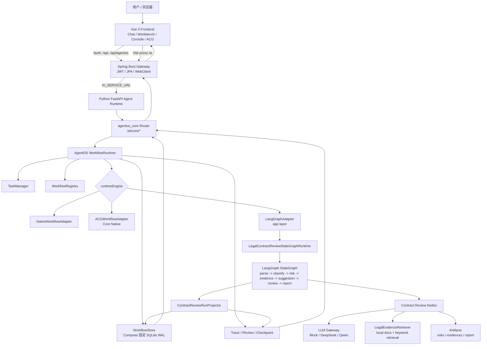
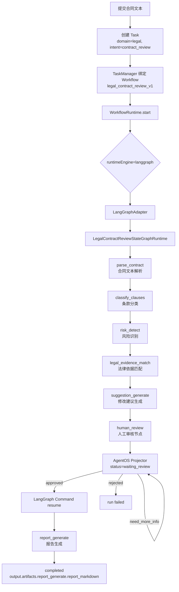

# 知弈 AgentOS


一句话定位：**知弈 AgentOS 是一个面向职业任务的智能体运行时，把大模型能力纳入 Task、Workflow、Trace、Review、Checkpoint 和 Artifact 的可治理生命周期。**

## Docker P0/P1 基线

仓库根目录的 `compose.yaml` 是唯一 Canonical Compose 基线；`compose.dev.yaml`、`compose.prod.yaml`、`compose.windows.yaml` 等文件只提供环境差异，不重复定义整套服务。部署前必须为每个环境选择不同的 `KINLIN_DEPLOYMENT_ID`，生成 Secret，并通过预检：

```powershell
python -m scripts.infra.init_secrets .secrets/kinlin-dev-001
$env:KINLIN_DEPLOYMENT_ID = "kinlin-dev-001"
$env:KINLIN_SECRETS_DIR = (Resolve-Path ".secrets/kinlin-dev-001").Path
python -m scripts.infra.preflight --deployment-id $env:KINLIN_DEPLOYMENT_ID --secrets-dir $env:KINLIN_SECRETS_DIR
docker compose -f compose.yaml -f compose.dev.yaml up -d --build --wait
```

生产入口默认只绑定 `127.0.0.1:8080`，Backend、FastAPI、PostgreSQL 和 Redis 均不发布宿主机端口。AgentOS Workflow Store 固定为单 FastAPI 实例、单 Uvicorn Worker 和 SQLite WAL；完成 PostgreSQL Workflow Store 前禁止水平扩容。已有数据库不得直接迁移，必须先执行 Schema 审计，再按审计报告显式 baseline。完整约束、备份恢复流程和已知风险见 [Docker 基础设施重构 RFC v1.1](docs/02-架构设计/07-docker-infrastructure-rfc-v1.1.md) 与 [P0/P1 实施报告](docs/03-开发记录/05-2026-07-18-docker-p0-p1-implementation.md)。

### Windows 11 + Docker Desktop 开发环境

Windows 下先从 `.env.windows.example` 生成仅包含非敏感配置的 `.env.windows`，并为其中的实例 ID 初始化 Secret，然后使用 Windows 专用覆盖层启动：

```powershell
Copy-Item .env.windows.example .env.windows
python -m scripts.infra.init_secrets .secrets/kinlin-win-dev-001
.\scripts\infra\windows\up.ps1
```

等价的标准 Compose 命令为：

```powershell
docker compose `
  -f compose.yaml `
  -f compose.dev.yaml `
  -f compose.windows.yaml `
  --env-file .env.windows `
  up -d --build
```

Windows 层仅为 Frontend 增加非 internal 的 `windows-ingress-network`，其他服务仍按 RFC 隔离。默认只可从 `http://127.0.0.1:8080` 访问 Frontend；Backend 和 FastAPI 调试端口只在显式启用 `debug-ports` profile 时绑定回环地址。详细命令证据、热更新时间、网络矩阵和已知边界见 [P1-Windows Docker Desktop 验收报告](docs/03-开发记录/06-2026-07-18-p1-windows-docker-desktop.md)。`P1.5-Linux` 仍为 `BLOCKED_EXTERNAL_ENVIRONMENT`，本地结果不等于麒麟/Linux 生产验收。

## 项目简介

普通聊天机器人通常把用户输入直接交给模型续写，过程难以拆解、难以审核，也难以在失败后从中间状态恢复。知弈 AgentOS 解决的是另一类问题：把合同审查、法律分析、教学设计、需求分析、写作规划等专业任务，转化为可调度、可追踪、可审核、可恢复的工作流。

项目的核心能力落在以下治理对象上：

- 用 `Task` 承接用户意图和输入材料。
- 用 `Workflow` 描述任务步骤、节点顺序、审核点和产物契约。
- 用 `Runtime` 选择 `native`、`acg` 或 `langgraph` 执行路径。
- 用 `Trace` 记录每一步执行、模型调用、数据消费和恢复事件。
- 用 `Review` 在高风险步骤引入人工确认。
- 用 `Checkpoint` 保存可恢复快照。
- 用 `Artifact` 固化风险、证据、建议和报告等交付物。

当前首个完整落地场景是 **律师合同审查**：合同解析、条款分类、风险识别、法律依据匹配、修改建议、人工审核和报告生成。项目当前处于 **V1.0-alpha / 演示闭环阶段**：可以本地运行并演示核心链路；生产级法律 RAG、企业级多租户和合规能力仍在后续建设范围内。

## 核心特性

### ✅ 已实现

| 能力 | 说明 | 代码依据 |
| --- | --- | --- |
| Vue 3 前端工作台 | 对话、合同审查、AgentOS Console、ACG 可视化、联邦学习页面 | `frontend/src/views/` |
| Spring Boot Gateway | 认证、用户、角色、文件、AgentOS 网关转发 | `backend/src/main/java/com/kinlin/ai/controller/` |
| Python FastAPI Agent Runtime | AI 服务入口、AgentOS API、LLM/RAG/联邦路由 | `agent/app/main.py` |
| AgentOS Core Runtime | Task、WorkflowRun、Trace、Review、Checkpoint、恢复 | `agentOS/src/agentos/core/runtime.py` |
| Execution Adapter 边界 | `native`、`acg` 内建，`langgraph` 由 app 层注册 | `agentOS/src/agentos/core/execution/adapters.py` |
| 合同审查 LangGraph Adapter | `legal_contract_review_v1` 映射到 StateGraph Runtime | `agent/app/execution/langgraph_adapter.py` |
| 合同审查工作流 | canonical workflow，含人工审核和 Artifact 路径 | `agent/packs/legal/workflows/contract_review.yaml` |
| 合同审查 StateGraph | 7 个真实节点，`report_generate` 前中断 | `agent/app/graphs/contract_review/graph.py` |
| LLM Gateway | Mock Provider + OpenAI-compatible Provider，DeepSeek/Qwen 环境变量回退 | `agent/app/llm/` |
| 本地法律 Evidence 检索 | 本地法律知识材料 + keyword retriever + fallback evidence | `agent/app/rag/` |
| AgentOS API | 创建任务、启动工作流、审核、恢复、Trace、ACG 聚合视图 | `agent/app/api/agentos_core.py` |
| Docker 开发环境 | 一键启动 Frontend、Backend、AI、PostgreSQL、Redis | `compose.yaml`, `compose.dev.yaml`, `dev.sh`, `dev.ps1` |

### 🟡 部分实现或实验性

| 能力 | 当前状态 | 代码依据 |
| --- | --- | --- |
| ACG 动态群体智能引擎 | 已有 ACG 数据模型、线性升格、就绪集执行、低熵通信、可视化；复杂依赖自动发现仍在演进 | `agentOS/src/agentos/core/acg/`, `agentOS/src/agentos/core/execution/acg_executor.py` |
| 认知规划器 | 已有意图解析、模板匹配、认知路由、ACG 构建；策略评分仍是简化版本 | `agentOS/src/agentos/core/planning/` |
| 低熵通信 | 已按 `input.fields` / `input.from` 组装 `ContextPack` 并记录血缘；尚未接入完整动态摘要压缩 | `agentOS/src/agentos/core/communication/` |
| 联邦学习 | 有 FedAvg / 简化 FedProx、全局模型管理、联邦模型页面；主要用于演示参数/经验聚合 | `agent/app/services/federatedlearning.py`, `frontend/src/views/FederatedLearningView.vue` |
| 联邦 RAG | 有检索统计收集和参数优化 API；跨机构知识网络仍处于演示验证阶段 | `agent/app/services/federatedragoptimizer.py` |
| 多职业 Agent Pack | 法律链路最完整；教育、程序员、作家有最小 workflow / skill 路径 | `agent/packs/` |

### ⏳ 规划中

| 能力 | 说明 |
| --- | --- |
| 完整法律法规库与案例库 | 当前 Evidence 主要来自本地演示材料和 fallback，正式法规版本校验待接入 |
| 生产级 Citation 校验 | 报告中的法律依据需要接入正式来源、版本和引用校验 |
| Word / PDF 正式导出 | 当前合同审查报告主要是 Markdown Artifact |
| 生产级权限与租户隔离 | 后端已有 JWT 和用户体系，但 AgentOS Runtime 还没有完整租户隔离策略 |
| 生产级审计与合规 | Trace/Checkpoint 已有，企业级审计、脱敏、审批策略仍需补全 |
| 端边云资源调度 | 目前是设计方向，尚未形成生产可用 Resource Fabric |

## 系统架构

真实分层如下：

- **Frontend**：Vue 3 + TypeScript + Vite，调用后端 Gateway 或 AI 代理接口。
- **Spring Boot Gateway**：认证、业务数据、AgentOS 网关转发。
- **Python/FastAPI Agent Runtime**：AI 服务、行业 Pack、LLM Gateway、RAG、联邦学习 API。
- **AgentOS Core**：通用 Runtime、WorkflowStore、Trace、Checkpoint、Review、Execution Adapter。
- **LangGraph Execution Adapter**：应用层适配器，只负责把具体 StateGraph 投影回 AgentOS 治理对象。
- **LLM Gateway**：Mock / OpenAI-compatible Provider，按环境变量接入 DeepSeek 或通义千问。
- **RAG / Evidence**：本地法律知识目录、上传文档和关键词检索。



## 核心执行流程

当前 canonical 合同审查工作流是 `legal_contract_review_v1`，定义在 `agent/packs/legal/workflows/contract_review.yaml`。真实节点顺序如下：

```text
parse_contract
  -> classify_clauses
  -> risk_detect
  -> legal_evidence_match
  -> suggestion_generate
  -> human_review
  -> report_generate
```

### 数据流与状态流



### 关键机制说明

1. **Task 如何创建**
   前端工作台或 API 调用 `/ai/core/workflows/start`，请求中包含 `title`、`domain`、`intent`、`workflowId`、`reviewMode` 和 `input.contractText`。`WorkflowRuntime.create_task()` 先创建 `AgentTask`，再启动 `WorkflowRun`。

2. **Workflow 如何选择**
   如果请求显式传入 `workflowId=legal_contract_review_v1`，`TaskManager` 直接绑定该工作流；否则会按 `domain/intent` 从 `WorkflowRegistry` 推荐。`legal_contract_review_v1` 是当前对外 canonical id，兼容 alias 包括 `legal_contract_review_stategraph_v1` 和 `legal_contract_review_langgraph_v1`。

3. **Runtime 如何执行**
   `WorkflowRuntime.start()` 读取 workflow 的 `runtimeEngine`。合同审查的 `runtimeEngine` 是 `langgraph`，所以 Runtime 通过应用层注册的 `LangGraphAdapter` 执行。

4. **LangGraph 如何接入**
   `agent/app/execution/runtime.py` 注册 `langgraph` adapter；`LangGraphImplementationRegistry` 将 `legal_contract_review_stategraph_v1` 映射到 `LegalContractReviewStateGraphRuntime`。LangGraph 的定位是应用层执行适配器，AgentOS Core 继续负责 Task、WorkflowRun、Trace、Review 和 Checkpoint。

5. **State 如何保存**
   LangGraph 使用 `InMemorySaver` 保存图执行线程状态；执行结果通过 `ContractReviewRunProjector` 投影回 AgentOS 的 `WorkflowRun.output`、`steps`、`Trace` 和 `Checkpoint`。库级默认仍可使用 `MemoryWorkflowStore`，Canonical Compose 强制设置 `AGENTOS_WORKFLOW_DB_PATH`，以单实例、单 Worker 的 SQLite WAL 持久化运行。

6. **何时进入 `waiting_review`**
   `build_contract_review_graph()` 配置了 `interrupt_before=["report_generate"]`。当流程到达 `human_review` 后，Projector 会把运行状态映射为 `waiting_review`，等待用户或评委在前端/接口中提交审核结果。

7. **批准或修改后如何恢复**
   对 `/ai/core/workflows/runs/{runId}/reviews` 提交 `approved` 后，`LegalContractReviewStateGraphRuntime.apply_review()` 用 LangGraph `Command(update=...)` 恢复执行，继续到 `report_generate`。`need_more_info` 会保持 `waiting_review`；`rejected` 会使运行失败。

8. **Report 和 Artifacts 如何生成**
   风险、证据和报告写入 `WorkflowRun.output.artifacts`。稳定路径在 workflow 中声明：
   - `output.artifacts.risk_detect.risks`
   - `output.artifacts.legal_evidence_match.evidences`
   - `output.artifacts.report_generate.report_markdown`

## 项目状态

| 项目 | 当前真实状态 |
| --- | --- |
| 当前版本 | 服务版本字段为 `1.0.0`；能力阶段按文档和实现边界视为 `V1.0-alpha` |
| 当前可演示能力 | 登录/注册、角色工作台、律师合同审查、AgentOS Console、Trace/Review/Checkpoint、ACG 可视化、联邦学习演示页 |
| 当前真实 LLM 接入 | `LLMConfig.from_env()` 可从 `DEEPSEEK_*` 或 `DASHSCOPE_*` 推断 OpenAI-compatible Provider；没有有效 key 时走 Mock |
| 当前 RAG 数据来源 | 本地法律知识目录、上传文档记录和关键词检索；Evidence 缺失时使用 fallback 数据 |
| Mock 使用情况 | LLM Gateway 有 Mock Provider；合同审查节点在模型失败或无结果时使用 fallback/mock_data；部分创新路由是演示实现 |
| 持久化 | Spring Boot 业务数据走 JPA；Docker 默认 PostgreSQL，dev profile 用 H2；AgentOS Workflow 默认内存，可用 `AGENTOS_WORKFLOW_DB_PATH` 切到 SQLite |
| 多用户 | 后端有注册、登录、JWT、用户实体；AgentOS WorkflowStore 尚未提供生产级租户隔离和细粒度权限 |
| 生产部署 | 仓库有 Docker 和生产 compose 配置；生产级安全、合规、监控、租户隔离和正式法律知识库仍未完成 |

## 技术栈

版本号来自 `package.json`、`pom.xml`、`.python-version`、Dockerfile 和 requirements。

### 前端

| 技术 | 版本 | 来源 |
| --- | --- | --- |
| Vue | `^3.3.4` | `frontend/package.json` |
| TypeScript | `5.4.5` | `frontend/package.json` |
| Vite | `^5.0.0` | `frontend/package.json` |
| Element Plus | `^2.4.4` | `frontend/package.json` |
| Pinia | `^2.1.7` | `frontend/package.json` |
| Vue Router | `^4.2.5` | `frontend/package.json` |
| vue-i18n | `^9.14.5` | `frontend/package.json` |
| vis-network | `^10.0.2` | `frontend/package.json` |
| Node.js | `24` | `frontend/Dockerfile.dev` |

### Java Gateway

| 技术 | 版本 | 来源 |
| --- | --- | --- |
| Java | `17` | `backend/pom.xml` |
| Spring Boot | `3.2.0` | `backend/pom.xml` |
| Maven | `3.9` 推荐 | `backend/Dockerfile.dev` |
| Spring Data JPA | Spring Boot 管理 | `backend/pom.xml` |
| Spring Security | Spring Boot 管理 | `backend/pom.xml` |
| JWT | `0.12.3` | `backend/pom.xml` |
| MapStruct | `1.5.5.Final` | `backend/pom.xml` |
| PostgreSQL Driver | Spring Boot 管理 | `backend/pom.xml` |
| Redis | Spring Boot 管理 | `backend/pom.xml` |

### Agent Runtime

| 技术 | 版本 | 来源 |
| --- | --- | --- |
| Python | `3.14.5` | `.python-version` |
| FastAPI | `>=0.116,<1` | `agent/requirements_minimal.txt` |
| Uvicorn | `>=0.35,<1` | `agent/requirements_minimal.txt` |
| LangGraph | `>=0.6,<0.7` | `agent/requirements_minimal.txt` |
| Pydantic | `>=2.7.4,<3.0` | `agent/requirements_minimal.txt` |
| Pytest | `>=8.4,<9` | `agent/requirements.txt` |

### 模型与知识能力

| 技术 | 版本/状态 | 来源 |
| --- | --- | --- |
| Mock Provider | 默认可用 | `agent/app/llm/` |
| OpenAI-compatible Provider | DeepSeek / Qwen 环境变量接入 | `agent/app/llm/config.py` |
| DashScope SDK | `>=1.23.1` | `agent/requirements_minimal.txt` |
| ChromaDB | `>=1.0,<2` | `agent/requirements_minimal.txt` |
| sentence-transformers | `>=5.1,<6.0` | `agent/requirements.txt` |
| 本地关键词 RAG | 已用于合同 Evidence | `agent/app/rag/providers/keyword_retriever.py` |

## 目录结构

```text
kinlin_ai/
├── frontend/
│   ├── src/views/                         # 页面入口：Chat、合同审查、AgentOS Console、ACG、联邦学习
│   ├── src/components/agentos/            # Workflow、Trace、Review、Checkpoint、ACG 可视化组件
│   ├── src/services/api/agentos.ts        # 前端 AgentOS API 类型与请求封装
│   └── vite.config.ts                     # 本地代理：/api、/ai
├── backend/
│   ├── src/main/java/com/kinlin/ai/controller/
│   │   └── AgentOsGatewayController.java  # Java Gateway 的 AgentOS 入口
│   ├── src/main/java/com/kinlin/ai/service/
│   │   └── AgentOsGatewayService.java     # WebClient 转发到 Python AI Service
│   └── pom.xml                            # Java/Spring 依赖
├── agent/
│   ├── app/main.py                        # FastAPI 应用入口
│   ├── app/api/agentos_core.py            # /ai/core/* API
│   ├── app/execution/                     # LangGraph Adapter 与实现注册表
│   ├── app/graphs/contract_review/        # 合同审查 LangGraph StateGraph、节点、Projector、Artifacts
│   ├── app/llm/                           # LLM Gateway、配置、Provider、Prompt Schema
│   ├── app/rag/                           # 法律文档加载、切分、关键词 Evidence 检索
│   ├── app/services/federated*.py         # 联邦学习、联邦模型、联邦 RAG、联邦数字人
│   └── packs/legal/workflows/             # 合同审查、案件分析、ACG 演示工作流
├── agentOS/
│   ├── src/agentos/core/runtime.py        # WorkflowRuntime 主入口
│   ├── src/agentos/core/acg/              # ACG 数据结构、图算法、线性升格
│   ├── src/agentos/core/execution/        # native/acg adapter、ACGExecutor、故障注入
│   ├── src/agentos/core/planning/         # 意图解析、模板匹配、认知路由、ACG 构建
│   ├── src/agentos/core/communication/    # ContextPack、ContextAssembler、ProvenanceLedger
│   ├── src/agentos/stores/                # MemoryWorkflowStore、SQLiteWorkflowStore
│   └── tests/                             # AgentOS Core 单元测试
├── docs/
│   ├── README.md                          # 文档总索引
│   ├── 01-赛题与项目概述/                 # 赛题背景、设计方案、技术路线、竞品
│   ├── 02-架构设计/                       # 系统/代码层次架构、各引擎技术设计与图
│   ├── 03-开发记录/                       # 当前能力边界、TODO 与实现计划
│   └── 04-演示与交付/                     # 演示指南、ACG 报告与测试样例
├── scripts/
│   ├── build_agentos_innovation_doc.py    # 生成 AgentOS 创新点文档
│   └── demo_federated_learning.py         # 联邦学习演示脚本
├── compose.yaml                           # Canonical Compose 全栈编排
├── dev.sh                                 # Linux/macOS Docker 开发脚本
└── dev.ps1                                # Windows PowerShell Docker 开发脚本
```

## 环境要求

| 项目 | 要求 |
| --- | --- |
| 操作系统 | Windows、Linux、macOS 均可；仓库提供 PowerShell 和 Bash 启动脚本 |
| Docker | 推荐 Docker Desktop 或 Docker Engine + Docker Compose plugin |
| Node.js | 推荐 24.x；仓库前端开发镜像为 `node:24-alpine` |
| 包管理器 | npm；仓库包含 `package-lock.json`，推荐 `npm ci` |
| Java | 17 |
| Maven | 推荐 3.9.x；仓库后端开发镜像为 `maven:3.9-eclipse-temurin-17` |
| Python | 3.14.5；仓库 `.python-version` 已声明 |
| 数据库 | Docker 全栈使用 PostgreSQL 15；后端 `dev` profile 可用 H2 内存库 |
| Redis | Docker 全栈使用 Redis 7；后端 `dev` profile 禁用 Redis |
| API Key | 可选。没有真实 key 时 LLM Gateway 可走 Mock / fallback；真实模型需配置 DeepSeek 或 DashScope |

## 快速开始

### 方式 A：Docker 一键启动全栈

Linux / macOS:

```bash
git clone <repo-url>
cd kinlin_ai
cp .env.example .env
./dev.sh up
```

Windows PowerShell:

```powershell
git clone <repo-url>
cd kinlin_ai
Copy-Item .env.windows.example .env.windows
python -m scripts.infra.init_secrets .secrets/kinlin-win-dev-001
.\scripts\infra\windows\up.ps1
```

服务地址：

| 服务 | 地址 |
| --- | --- |
| Windows Docker Desktop 前端 | http://127.0.0.1:8080 |
| Windows 默认直连其他服务 | 不可访问；仅 Frontend 发布端口 |
| Spring Boot Gateway 调试 profile | http://127.0.0.1:18080 |
| Python Agent Runtime 调试 profile | http://127.0.0.1:18000 |

可选：编辑 `.env` 填入真实模型 key。

```env
DEEPSEEK_API_KEY=sk-your-deepseek-key
DASHSCOPE_API_KEY=sk-your-dashscope-key
```

### 方式 B：本地手动启动三层服务

#### 1. 启动 Agent Runtime

Linux / macOS:

```bash
python -m venv .venv
source .venv/bin/activate
python -m pip install -r agent/requirements_minimal.txt
PYTHONPATH="$PWD/agentOS/src:$PWD/agent" \
  python -m uvicorn app.main:app --app-dir agent --host 0.0.0.0 --port 8000 --reload
```

Windows PowerShell:

```powershell
python -m venv .venv
.\.venv\Scripts\Activate.ps1
python -m pip install -r agent\requirements_minimal.txt
$env:PYTHONPATH="$PWD\agentOS\src;$PWD\agent"
python -m uvicorn app.main:app --app-dir agent --host 0.0.0.0 --port 8000 --reload
```

#### 2. 启动 Spring Boot Gateway

开发 profile 使用 H2 内存库，不强制依赖本地 PostgreSQL/Redis。

```bash
cd backend
mvn spring-boot:run -Dspring-boot.run.profiles=dev
```

#### 3. 启动前端

```bash
cd frontend
npm ci
npm run dev
```

打开 http://localhost:3000。

### 注册或登录

仓库没有写死默认用户。首次运行可在前端登录页注册，或直接调用后端注册接口：

```bash
curl -X POST http://localhost:8080/auth/register \
  -H "Content-Type: application/json" \
  -d "{\"username\":\"demo\",\"password\":\"demo123456\",\"email\":\"demo@example.com\"}"
```

Windows PowerShell 可使用：

```powershell
Invoke-RestMethod -Method Post `
  -Uri http://localhost:8080/auth/register `
  -ContentType "application/json" `
  -Body '{"username":"demo","password":"demo123456","email":"demo@example.com"}'
```

## 跑通合同审查演示

### 前端演示

1. 打开 http://localhost:3000 并注册/登录。
2. 进入 `/agentos/legal/contract-review`。
3. 粘贴或使用页面中的合同文本。
4. 启动合同审查。
5. 观察风险面板、Evidence 面板和 Trace。
6. 在人工审核面板提交通过。
7. 查看生成的 Markdown 审查报告。
8. 可进入 `/agentos-console` 查看同一个 `WorkflowRun` 的治理视图。

### API 演示

直接调用 Python Agent Runtime：

```bash
curl -X POST http://localhost:8000/ai/core/workflows/start \
  -H "Content-Type: application/json" \
  -d '{
    "title": "合同审查演示",
    "domain": "legal",
    "intent": "contract_review",
    "workflowId": "legal_contract_review_v1",
    "reviewMode": "human_in_loop",
    "input": {
      "contractText": "甲方委托乙方开发企业管理系统。乙方应在30日内交付。验收标准由甲方最终确认。甲方分三期付款。知识产权归属未明确。"
    }
  }'
```

响应中的 `run.runId` 会进入 `waiting_review`。提交审核：

```bash
curl -X POST http://localhost:8000/ai/core/workflows/runs/<runId>/reviews \
  -H "Content-Type: application/json" \
  -d '{
    "stepId": "human_review",
    "decision": "approved",
    "reviewer": "demo",
    "comment": "同意生成审查报告"
  }'
```

查看结果：

```bash
curl http://localhost:8000/ai/core/workflows/runs/<runId>
curl "http://localhost:8000/ai/core/workflows/runs/<runId>/trace?format=markdown"
```

## 运行测试

### AgentOS Core

```bash
pytest agentOS/tests -q
```

### Agent Runtime

```bash
pytest agent/tests -q
```

重点链路：

```bash
pytest agent/tests/test_legal_contract_review_stategraph.py -q
pytest agent/tests/test_acg_executor.py agent/tests/test_acg_api.py -q
pytest agent/tests/test_federated_global.py agent/tests/test_federated_rag.py -q
```

### Backend

```bash
cd backend
mvn test
```

### Frontend

```bash
cd frontend
npm run build
```

## 贡献者入口

### 新增或修改 Workflow

- 工作流定义位置：`agent/packs/{pack}/workflows/`
- Workflow Registry 加载入口：`agentOS/src/agentos/core/workflow/registry.py`
- Pack 注册入口：`agent/packs/{pack}/__init__.py`

如果是普通线性流程，使用 `runtimeEngine: native` 或省略；如果要使用 ACG，设置 `runtimeEngine: acg`；如果要接入 LangGraph，需要在 app 层注册 `implementationId`。

### 修改 Runtime 或治理能力

- Runtime 主入口：`agentOS/src/agentos/core/runtime.py`
- 状态机：`agentOS/src/agentos/core/workflow/state_machine.py`
- Trace：`agentOS/src/agentos/core/governance/trace.py`
- Review：`agentOS/src/agentos/core/governance/review.py`
- Checkpoint：`agentOS/src/agentos/core/governance/checkpoint.py`
- Store：`agentOS/src/agentos/stores/`

### 开发职业 Agent 或 Skill

- Agent 基类与注册：`agentOS/src/agentos/agents/`
- Skill 基类与注册：`agentOS/src/agentos/skills/`
- 法律 Pack 示例：`agent/packs/legal/`
- 教育 / 程序员 / 作家 Pack：`agent/packs/education`, `agent/packs/programmer`, `agent/packs/writer`

### 接入新的 LangGraph 工作流

1. 在 `agent/app/graphs/{workflow}/` 实现 StateGraph、State、nodes、runtime、projector。
2. 在 `agent/app/execution/langgraph_registry.py` 注册 `implementationId`。
3. 在对应 Pack 的 workflow YAML 中设置：

```json
{
  "runtimeEngine": "langgraph",
  "implementationId": "your_stategraph_runtime_id"
}
```

4. 确保输出能投影回 `WorkflowRun.output.artifacts`。

### 开发 ACG 工作流

- ACG 模型：`agentOS/src/agentos/core/acg/`
- ACG 执行器：`agentOS/src/agentos/core/execution/acg_executor.py`
- 低熵通信：`agentOS/src/agentos/core/communication/`
- 示例工作流：`agent/packs/legal/workflows/contract_review_acg.yaml`
- 前端视图：`frontend/src/views/AcgVisualizationView.vue`

ACG 工作流建议为下游步骤声明 `input.fields` 或 `input.from`，否则低熵通信会回退为透传上游输出。

## 当前限制和下一步工作

当前限制：

- 合同审查报告定位为辅助材料，正式法律意见需要专业律师复核。
- 当前 Evidence 主要来自本地知识材料和 fallback，完整法律法规库与案例库仍需接入。
- LangGraph checkpointer 当前使用内存实现；AgentOS WorkflowStore 默认也是内存，除非设置 `AGENTOS_WORKFLOW_DB_PATH`。
- 后端有用户/JWT，但 AgentOS Core 未完成生产级多租户隔离。
- 联邦学习、ACG 动态规划和联邦 RAG 仍偏演示/实验性，不应表述为生产级完整能力。
- Docker 生产 compose 可用于部署演示，但安全、监控、审计、密钥管理、数据脱敏和灾备仍需工程化。

下一步工作：

- 接入正式法律法规库、案例库和 citation 版本校验。
- 完成 Word / PDF 报告导出。
- 将 AgentOS Store 从本地内存/SQLite 推进到可运维的持久化方案。
- 补全租户隔离、权限策略和审计报表。
- 增强 ACG 依赖分析、并行子图识别、上下文压缩和资源调度。
- 扩展教育、程序员、作家 Pack 的完整生产闭环。

## 许可证

MIT License
