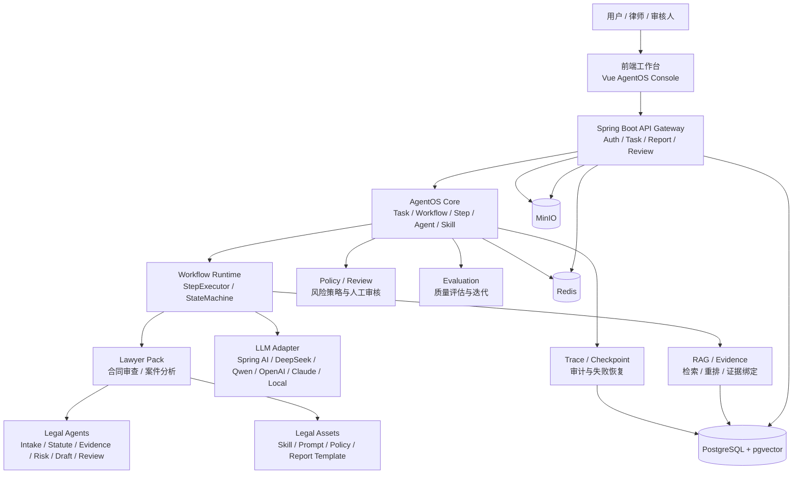

# 知弈 AgentOS 技术选型与技术路线报告

## 1. 项目定位

知弈 AgentOS 的定位不是普通聊天机器人，而是面向专业职业场景的可治理智能体运行底座。系统目标不是让大模型在对话框中自由发挥，而是把律师、教师、程序员、作家等职业智能体放入受控的任务生命周期中，使专业任务具备可调度、可记忆、可审核、可恢复、可追踪、可评估和可导出的能力。

第一阶段应优先以 Lawyer Pack 作为样板，跑通合同审查和案件分析两个核心流程。Core 只负责通用运行能力，包括 Task、Workflow、Step、Agent、Skill、Prompt、RAG、Evidence、Policy、Review、Trace、Checkpoint、Evaluation、Report。法律行业逻辑、法律知识库、法律风险策略和法律报告模板必须通过 WorkflowPack 扩展进入系统，不能写死在 Core 中。

## 2. 当前项目现状分析

### 2.1 当前总体结构

项目根目录已经具备清晰的三层结构：

| 路径 | 当前作用 | 对 AgentOS 的意义 |
| --- | --- | --- |
| `README.md` | 项目总说明，描述前端、后端、AI 服务三层架构 | 可作为总体定位依据，但当前更偏“多角色聊天与职业 Agent 系统” |
| `frontend/` | Vue 前端项目 | 已有聊天、RAG、AgentOS Console、工作台界面 |
| `backend/` | Spring Boot 后端项目 | 已有认证、角色、会话、文件、RAG 网关、AgentOS 网关 |
| `agent/` | Python FastAPI AI 服务与 AgentOS 原型 | 已有轻量 Workflow Runtime、Pack 注册、Legal Pack |
| `docker/` | Docker Compose、Nginx 配置 | 已具备 MVP 容器化基础 |
| `docs/` | 设计文档 | 已有 AgentOS Core 设计草案，可继续沉淀架构文档 |
| `scripts/` | 部署、打包、环境脚本 | 可复用到 MVP 部署流程 |

判断：当前项目是前后端分离，并额外包含 Python AI 服务的三层架构，即 `Vue 前端 + Spring Boot 后端 + FastAPI AI/Agent 服务`。

### 2.2 当前前端技术栈

真实依据：

- `frontend/package.json`
- `frontend/vite.config.ts`
- `frontend/src/main.ts`
- `frontend/src/router/index.ts`
- `frontend/src/views/AgentOsConsoleView.vue`
- `frontend/src/services/api/agentos.ts`
- `frontend/src/services/api/workflow.ts`
- `frontend/src/components/agentos/WorkflowRunPanel.vue`
- `frontend/src/components/agentos/WorkflowStepList.vue`
- `frontend/src/components/agentos/TraceEventTimeline.vue`
- `frontend/src/components/agentos/HumanReviewPanel.vue`
- `frontend/src/components/agentos/CheckpointPanel.vue`

当前前端采用：

- Vue 3
- TypeScript
- Vite
- Element Plus
- Pinia
- Vue Router
- vue-i18n
- Axios
- Three.js
- vis-network
- markmap
- mermaid
- Sass

当前可复用能力：

- `frontend/src/views/AgentOsConsoleView.vue` 已经提供 WorkflowRun 列表、详情、步骤、Trace、Checkpoint、Review、Evaluation 指标的控制台雏形。
- `frontend/src/services/api/agentos.ts` 已定义 `WorkflowRun`、`WorkflowStep`、`TraceEvent`、`Checkpoint`、`ReviewRecord`、`EvaluationRun` 等前端类型。
- `frontend/src/views/ChatView.vue` 已支持“升级 Workflow”的入口，能把聊天输入升级为 WorkflowRun。
- `frontend/src/views/ContractClausePlannerView.vue` 和 `frontend/src/views/FederatedAgentWorkbenchView.vue` 已有合同、风险、工作台类界面素材，可作为 Lawyer Pack 工作台的视觉基础。

当前缺失：

- 未使用 React、Tailwind CSS、shadcn/ui、React Flow、Monaco Editor、Tiptap。
- 当前工作流展示是卡片和时间线，不是可拖拽的 React Flow 或 Vue Flow 图形化编排。
- Prompt / Workflow 配置还没有 Monaco Editor 级别的版本化编辑器。
- 报告预览还没有独立 Markdown / DOCX / PDF 导出闭环。

评估：MVP 阶段不建议为了追求推荐路线而立即从 Vue 迁移到 React。当前 Vue 3 + TypeScript + Vite + Element Plus 已经可承载第一阶段工作台，继续演进成本最低。React + Tailwind + shadcn/ui 可以作为后续新建 `agentos-web` 或大改版时的目标路线。

### 2.3 当前后端技术栈

真实依据：

- `backend/pom.xml`
- `backend/src/main/resources/application.yml`
- `backend/src/main/resources/application-dev.yml`
- `backend/src/main/java/com/kinlin/ai/KinlinAiApplication.java`
- `backend/src/main/java/com/kinlin/ai/controller/AgentOsGatewayController.java`
- `backend/src/main/java/com/kinlin/ai/service/AgentOsGatewayService.java`
- `backend/src/main/java/com/kinlin/ai/config/SecurityConfig.java`
- `backend/src/main/java/com/kinlin/ai/filter/JwtAuthenticationFilter.java`

当前后端采用：

- Java 17
- Spring Boot 3.2.0
- Maven
- Spring Web
- Spring WebFlux WebClient
- Spring Data JPA
- PostgreSQL Driver
- H2
- Redis
- Spring Security
- JWT
- WebSocket
- Validation
- MapStruct
- Lombok
- Actuator / Micrometer
- Hibernate Types JSONB

当前可复用能力：

- `backend/src/main/java/com/kinlin/ai/controller/AgentOsGatewayController.java` 已经暴露 `/api/agentos`、`/agentos`、`/ai` 的 AgentOS 网关入口。
- `backend/src/main/java/com/kinlin/ai/service/AgentOsGatewayService.java` 已经通过 WebClient 转发 `/ai/core/*` 到 Python AgentOS Core。
- `backend/src/main/java/com/kinlin/ai/config/SecurityConfig.java` 和 `backend/src/main/java/com/kinlin/ai/util/JwtUtil.java` 已有 JWT 认证基础。
- `backend/src/main/java/com/kinlin/ai/service/RagService.java` 已能转发 RAG 查询、文档上传、文档列表和删除。
- `backend/src/main/java/com/kinlin/ai/service/FileService.java` 已有本地文件上传能力。

当前缺失：

- 后端正式 Core 实体和仓储仍缺失，例如 `Task`、`WorkflowDefinition`、`WorkflowStepDefinition`、`TaskStep`、`Evidence`、`PolicyRecord`、`ReviewRecord`、`TraceLog`、`Checkpoint`、`EvaluationRecord`、`Report`。
- 没有 Spring AI 依赖，也没有 Java 侧统一 LLM Adapter。
- 没有 pgvector、Qdrant、MinIO、OpenTelemetry、Langfuse、Phoenix、Temporal、Camunda / Flowable 依赖。
- 数据迁移脚本存在于 `backend/src/main/resources/db/migration/`，但 `backend/pom.xml` 中未看到 Flyway / Liquibase 依赖，当前更像 Docker 初始化脚本与 JPA `ddl-auto` 混用。
- `backend/src/main/resources/application-dev.yml` 使用 H2 内存库，和 PostgreSQL 生产配置存在差异，后续治理表和 JSONB / vector 能力需要统一验证。

评估：当前后端非常适合继续 Spring Boot 路线。Java 17 可以平滑升级到 Java 21。Spring Boot 3.2 已满足 Java 21 迁移基础，但需要补齐正式 AgentOS Core 数据模型和服务层。

### 2.4 当前数据库与配置情况

真实依据：

- `backend/src/main/resources/application.yml`
- `backend/src/main/resources/application-dev.yml`
- `backend/src/main/resources/db/migration/V1__init_schema.sql`
- `backend/src/main/resources/db/migration/V2__optimize_indexes.sql`
- `backend/src/main/resources/db/migration/V3__add_password_hash.sql`
- `backend/src/main/resources/db/migration/V4__create_user_feedback_table.sql`
- `compose.yaml`（唯一基线）
- `compose.dev.yaml`（开发环境覆盖）
- `compose.prod.yaml`（生产环境覆盖）

当前数据库：

- 默认生产配置为 PostgreSQL。
- 开发 profile 使用 H2 内存数据库。
- Docker Compose 使用 PostgreSQL 15 和 Redis 7。
- 当前已有表主要包括 `users`、`roles`、`conversations`、`messages`、`user_feedback`。

当前可复用能力：

- 用户、角色、会话、消息等基础业务数据已经有 JPA 实体和 Repository。
- PostgreSQL 和 Redis 已在 Docker Compose 中具备部署基础。

当前缺失：

- 没有 `pgvector` 扩展配置和向量字段。
- 没有 AgentOS Core 的治理表。
- 没有 Evidence 表和 Evidence 与结论绑定关系。
- 没有 MinIO 对象存储。
- 没有报告、评估、策略、审核的正式持久化表。

### 2.5 当前 AI 接入代码

真实依据：

- `agent/requirements.txt`
- `agent/requirements_minimal.txt`
- `agent/app/config.py`
- `agent/app/ai_engine/deepseekadapter.py`
- `agent/app/ai_engine/qwenadapter.py`
- `agent/app/ai_engine/kylin_sdk/client.py`
- `agent/app/services/embeddingservice.py`
- `backend/src/main/java/com/kinlin/ai/service/AiService.java`
- `backend/src/main/java/com/kinlin/ai/service/AgentGatewayService.java`
- `backend/src/main/java/com/kinlin/ai/service/AgentOsGatewayService.java`

当前已有：

- Python 侧使用 OpenAI SDK 兼容模式接入 DeepSeek 和 Qwen。
- `agent/app/config.py` 已配置 DeepSeek、Qwen、DashScope、文本引擎自动选择。
- `agent/app/services/embeddingservice.py` 已支持通义千问 `text-embedding-v2`，并有 TF-IDF 降级。
- Java 后端当前主要是网关，未直接接入模型供应商。

当前缺失：

- 没有 Java 侧 Spring AI。
- 没有统一的 `chat()`、`streamChat()`、`embedding()`、`rerank()`、`structuredOutput()`、`toolCall()` LLM Adapter 接口。
- 没有 Claude、本地模型、Ollama 的统一适配。
- 没有模型调用审计、Token 统计、成本统计、结构化输出校验的正式表。

### 2.6 当前 AgentOS Core 与 WorkflowPack 情况

真实依据：

- `agentOS/src/agentos/core/types.py`
- `agentOS/src/agentos/core/workflow_runtime.py`
- `agentOS/src/agentos/core/orchestrator.py`
- `agentOS/src/agentos/core/workflow_registry.py`
- `agentOS/src/agentos/core/trace.py`
- `agentOS/src/agentos/core/checkpoint.py`
- `agentOS/src/agentos/core/review.py`
- `agentOS/src/agentos/core/evaluation.py`
- `agentOS/src/agentos/agents/base.py`
- `agentOS/src/agentos/agents/registry.py`
- `agent/packs/registry.py`
- `agent/packs/legal/__init__.py`
- `agent/packs/legal/workflows/contract_review.yaml`
- `agent/packs/legal/workflows/case_analysis.yaml`

当前可复用能力：

- 已有轻量 Python `WorkflowRuntime`，可以创建 Task、启动 WorkflowRun、执行 Step、进入 Review、创建 Checkpoint、恢复运行、导出 Trace、计算 Evaluation 指标。
- `AgentRegistry` 和 `WorkflowRegistry` 已经实现 Pack 注册机制。
- `agent/packs/legal/__init__.py` 已通过 `register_pack()` 注册 Legal Pack 的 Agent 和 workflows，方向上符合“Core 不依赖 Pack，Pack 依赖 Core”。
- `agent/packs/legal/workflows/contract_review.yaml` 已包含 `case_intake -> statute -> evidence -> risk -> draft -> final_review`，其中 `risk` 步骤设置 `reviewRequired: true`。
- `agent/packs/legal/workflows/case_analysis.yaml` 已包含案件分析最小流程。
- `agent/tests/test_agentos_core.py`、`agent/tests/test_pack_registry.py`、`agent/tests/test_sqlite_workflow_store.py` 已覆盖运行、审核、恢复、Pack 注册、SQLite 持久化的原型测试。

当前缺失：

- Python Core 当前仍是原型运行时，主要使用内存或 SQLite 存储，未落到 PostgreSQL 正式治理表。
- Core 中还没有独立 `PolicyService`、`EvidenceService`、`PromptService`、`ReportService` 的正式实现。
- Legal Pack 目前是 Demo Pack，规则、法条、判例、证据绑定仍偏静态和示例化。
- 法律 Skill 已收敛到 `agent/packs/legal/skills/`，但尚未形成统一 SkillRegistry 持久化和版本治理。

### 2.7 当前 RAG、文档解析、知识库情况

真实依据：

- `agent/app/services/ragservice.py`
- `agent/app/api/rag.py`
- `agent/app/services/embeddingservice.py`
- `agent/app/services/documentprocessoradvanced.py`
- `agent/app/services/documentprocessorenhanced.py`
- `agentOS/src/agentos/adapters/retrieval/chroma_client.py`
- `agentOS/src/agentos/adapters/retrieval/legal_index_builder.py`
- `agent/packs/legal/data/statutes.json`
- `agent/packs/legal/data/cases.json`
- `agent/packs/legal/data/evidence_rules.json`
- `agent/packs/legal/data/jurisdiction_rules.json`
- `agent/packs/legal/data/limitation_rules.json`
- `agent/app/data/rag/knowledge_base/律师-法律知识库.md`

当前可复用能力：

- 已有 RAG 上传、检索、构建上下文接口。
- 已集成 ChromaDB，支持关键词降级。
- 已有通义千问 embedding 和 sentence-transformers 降级路径。
- 法律数据已有 statute、case、evidence rule、jurisdiction、limitation 的种子数据。
- 文档解析已支持 PyPDF2、pdfplumber、python-docx、openpyxl、pandas、BeautifulSoup，并预留 mineru / easydoc。

当前缺失：

- RAG 还不是 Evidence-Centered RAG。当前返回 source 和 excerpt，但没有 Evidence 对象、证据编号、证据来源可信度、证据与结论绑定、证据审计状态。
- 没有 PostgreSQL + pgvector。
- 没有 Qdrant、OpenSearch / Elasticsearch、正式 Reranker。
- 文档解析主要是文本提取，还没有面向合同审查的结构化条款识别、签署页识别、金额日期抽取、附件识别和版式坐标保存。

### 2.8 当前部署与文档情况

真实依据：

- `compose.yaml`
- `compose.dev.yaml`
- `compose.prod.yaml`
- `backend/Dockerfile`
- `frontend/Dockerfile`
- `agent/Dockerfile`
- `scripts/deploy.sh`
- `scripts/quick-deploy.sh`
- `scripts/build-release.sh`
- `docs/99-归档/core-legacy-design.md`
- `docs/01-项目架构/core-arch.md`
- `docs/02-项目开发日志/core-todo.md`
- `docs/01-项目架构/agent-structure.md`

当前可复用能力：

- Docker Compose 已覆盖 PostgreSQL、Redis、backend、ai-service、frontend、nginx。
- 生产 Compose 已包含 healthcheck 和持久卷。
- `docs/01-项目架构/` 和 `docs/02-项目开发日志/` 已有 AgentOS Core 设计草案和 TODO，可作为架构演进参考。

当前缺失：

- 没有 Kubernetes 部署。
- 没有 MinIO、OpenSearch、Prometheus、Grafana、OpenTelemetry、Langfuse / Phoenix。
- 部署配置中仍有旧 Agent 聊天端点 `/ai/agent/{role}/chat`，而当前 Python AgentOS Core 已主要走 `/ai/core/*`。需要清理旧链路，或明确保留兼容实现。

### 2.9 当前代码结构对 AgentOS 的适配程度

总体判断：当前项目已经具备 AgentOS 的原型骨架，但还没有完成“可生产治理底座”。

可复用：

- 前端 AgentOS Console 雏形。
- Spring Boot 网关、JWT、JPA、PostgreSQL、Redis 基础。
- Python Workflow Runtime、Trace、Review、Checkpoint、Evaluation 原型。
- Legal Pack 的工作流、Agent、法律种子数据、部分法律 Skill。
- Docker Compose 部署基础。

当前缺失：

- Java 侧正式 AgentOS Core 服务与数据库模型。
- Evidence-Centered RAG。
- Policy 风险策略中心。
- Report 生成与导出。
- Prompt / Workflow / Skill 版本治理。
- 统一 LLM Adapter 与 Spring AI 接入。
- pgvector / MinIO / OpenTelemetry 等工程化组件。

## 3. 总体技术路线

| 层面 | 推荐路线 | 当前项目状态 | 采用原因 | 暂不采用其他方案的原因 |
| --- | --- | --- | --- | --- |
| 前端 | MVP 继续 Vue 3 + TypeScript + Vite + Element Plus；后续可新建 React + Tailwind + shadcn/ui | 当前为 Vue 3 | 迁移成本最低，已有 Console 和工作台 | 第一阶段直接迁 React 会消耗 MVP 时间 |
| 后端 | Java 21 + Spring Boot | 当前 Java 17 + Spring Boot 3.2 | 治理、审计、权限、事务、数据一致性更适合 Java | 不建议把治理 Core 全部放在 Python |
| 数据库 | PostgreSQL + pgvector | 当前 PostgreSQL + H2 dev | 统一关系数据、JSONB、向量数据和审计数据 | MySQL 方案不是当前项目主线 |
| 向量检索 | MVP pgvector；过渡期可保留 Chroma；后期 Qdrant | 当前 ChromaDB | pgvector 降低组件数量，便于 MVP | Qdrant 第一阶段会增加部署和数据同步复杂度 |
| 文件存储 | MinIO | 当前本地文件系统 | 支持对象存储、版本、权限、可迁移 | 本地文件不适合长期审计和集群部署 |
| AI 接入 | Spring AI + 自研 LLM Adapter；Python 适配层过渡保留 | 当前 Python OpenAI SDK 兼容 DeepSeek / Qwen | 避免绑定单一模型，保留 Java 生态治理能力 | 不让 Spring AI 替代 Core 语义 |
| RAG | Evidence-Centered RAG | 当前普通 RAG + Chroma / 关键词 | 法律场景必须结论绑定证据 | 只做向量检索无法满足审计 |
| 工作流 | 第一阶段自研轻量 Workflow Runtime | 当前 Python 已有原型 | 业务语义可控，利于 Trace / Review / Checkpoint | LangGraph / Temporal 首期引入成本偏高 |
| 审计 | 自研 TraceLog + OpenTelemetry | 当前 Python TraceEvent 原型 | 业务审计和系统观测分离 | 只依赖日志无法追踪专业结论依据 |
| 权限 | Spring Security + JWT；后期 Keycloak | 当前已具备 JWT | MVP 足够，改造成本低 | Keycloak 第一阶段配置成本偏高 |
| 部署 | Docker Compose；后期 Kubernetes | 当前已具备 Compose | MVP 足够验证闭环 | Kubernetes 会提前引入运维复杂度 |

## 4. 总体架构设计



设计原则：

- 前端只负责工作台、任务入口、过程可视化、审核操作和报告预览。
- Spring Boot 后端应成为正式治理入口和数据一致性边界。
- Python AI 服务可保留为模型、文档解析、RAG 或 Pack 执行适配层，但不应长期成为唯一治理 Core。
- Lawyer Pack 只能依赖 Core，不允许 Core 反向依赖法律包。

## 5. AgentOS Core 技术选型

| Core 模块 | 推荐实现 | 是否必须自研 | 采用原因 | 可依赖框架 |
| --- | --- | --- | --- | --- |
| TaskService | Spring Boot Service + PostgreSQL | 必须自研 | Task 是系统治理入口，承载状态、优先级、来源、权限 | JPA / MyBatis 均可 |
| WorkflowService | Workflow 定义、版本、运行实例管理 | 必须自研 | 需要控制职业任务流程，不是普通对话 | 可用 Jackson/YAML 解析配置 |
| StepExecutor | 执行 Step、记录输入输出和耗时 | 必须自研 | 每一步都要保存输入、输出、错误、风险和审计 | 可后接 LangGraph / Temporal Adapter |
| AgentRegistry | 注册 Core 可调度 Agent | 必须自研 | 保证 Core 只认识通用 Agent 元数据 | 可参考当前 `agentOS/src/agentos/agents/registry.py` |
| SkillRegistry | 注册 Skill、版本、输入输出 Schema | 必须自研 | Skill 是可治理工具能力，不应散落在代码中 | JSON Schema / Bean Validation |
| PromptService | Prompt 模板、变量、版本、灰度 | 必须自研 | 专业任务需要可回滚 Prompt | 可接 Monaco Editor |
| RAGService | 检索编排、混合召回、重排 | 部分自研 | 检索策略要服务 Evidence | pgvector / Qdrant / OpenSearch |
| EvidenceService | Evidence 生成、绑定、审计 | 必须自研 | 这是区别于普通 RAG 的关键 | 可复用文档解析和检索框架 |
| PolicyService | 风险规则、拦截、人审触发 | 必须自研 | 法律高风险节点必须可解释 | 可后接规则引擎，但 MVP 不需要 |
| ReviewService | 人工审核、通过、驳回、重跑、终止 | 必须自研 | 需要和 Workflow 状态强绑定 | Spring Security 获取审核人 |
| TraceService | 业务 TraceLog | 必须自研 | 业务审计不同于系统日志 | 可补 OpenTelemetry |
| CheckpointService | 状态快照、恢复点 | 必须自研 | 失败恢复是 AgentOS 核心能力 | PostgreSQL JSONB |
| EvaluationService | 指标、样例集、Prompt/Skill/Workflow 评估 | 必须自研核心指标 | 评估要服务持续迭代 | 可接 Langfuse / Phoenix |
| ReportService | Markdown、Word、PDF 报告 | 必须自研编排 | 报告要绑定 Evidence 和 Trace | docx4j / POI / LibreOffice |

当前项目中，`agentOS/src/agentos/core/workflow_runtime.py`、`trace.py`、`checkpoint.py`、`review.py`、`evaluation.py` 已经给出可参考的原型。建议把这些领域概念固化到 Java 后端的正式服务和数据表中，Python 侧保留为运行适配器或实验场。

## 6. 工作流与 Agent 编排选型

| 方案 | 优点 | 不足 | 本项目结论 |
| --- | --- | --- | --- |
| 自研轻量 Workflow Runtime | 语义可控，容易绑定 Trace / Review / Checkpoint / Evidence，和现有原型一致 | 初期能力有限，需要自己维护状态机 | 第一阶段推荐 |
| LangGraph | 适合复杂 Agent 状态图和 Python 生态工具调用 | 和 Java 治理栈割裂，状态、审计、权限落库需要二次封装 | 后期作为 Workflow Runtime Adapter |
| Temporal | 长任务可靠执行、重试、补偿、可观测强 | 学习和部署成本高，业务语义仍需自研 | 后期生产级长任务引擎 |
| Camunda / Flowable | BPMN、审批流、企业流程成熟 | 对 LLM Step、Evidence、Prompt、Checkpoint 不天然友好，偏重流程审批 | 第一阶段不建议引入 |

结论：

第一阶段建议自研轻量 Workflow Runtime。现有 `agentOS/src/agentos/core/workflow_runtime.py` 已证明此路线可行，但正式版本应将状态、Trace、Review、Checkpoint 落到 PostgreSQL。LangGraph 不应作为系统唯一内核，可作为后期复杂 Agent 编排适配器。Temporal 可作为后期生产级长周期可靠任务执行引擎。不建议第一阶段引入重型 BPMN 工作流。

## 7. AI 接入层技术选型

### 7.1 为什么需要 LLM Adapter

当前 Python 侧已经通过 `agent/app/ai_engine/deepseekadapter.py`、`agent/app/ai_engine/qwenadapter.py` 和 `agent/app/ai_engine/kylin_sdk/client.py` 接入 DeepSeek 与 Qwen。这说明项目已经具备多模型接入意识，但接口仍分散在 Python 服务中。

正式 AgentOS 需要统一 LLM Adapter：

- 统一模型调用协议，避免业务代码绑定 DeepSeek、Qwen 或某个 SDK。
- 统一记录 prompt、参数、响应、Token、耗时、错误。
- 统一支持流式输出、结构化输出、工具调用和 embedding。
- 便于后续切换 OpenAI、DeepSeek、Qwen、Claude、本地模型或私有化模型。

### 7.2 Spring AI 的定位

Spring AI 适合作为 Java 生态中的模型客户端和向量检索集成层。它可以简化模型调用、Embedding、ChatClient 和部分工具调用，但不能替代 AgentOS Core。

采用原因：

- 和 Spring Boot、配置管理、依赖注入、监控、权限集成自然。
- 适合把模型调用纳入 Java 后端审计和事务边界。
- 可降低直接对接多个模型 API 的代码量。

暂不让 Spring AI 替代 Core 的原因：

- Spring AI 不负责 Task、Workflow、Evidence、Review、Trace、Checkpoint 的业务语义。
- 专业任务治理必须由自研 Core 控制，而不是交给模型客户端框架。

### 7.3 统一接口建议

```java
public interface LlmAdapter {
    ChatResult chat(ChatRequest request);
    Flux<ChatDelta> streamChat(ChatRequest request);
    EmbeddingResult embedding(EmbeddingRequest request);
    RerankResult rerank(RerankRequest request);
    <T> T structuredOutput(StructuredRequest<T> request);
    ToolCallResult toolCall(ToolCallRequest request);
}
```

建议支持的 Provider：

- OpenAI：通用国际模型能力。
- DeepSeek：当前项目已有配置，适合作为文本生成主力或低成本模型。
- Qwen：当前项目已有配置，适合中文、多模态、语音、图像生态。
- Claude：后期用于复杂法律文本推理对照。
- Local / Ollama：私有化和离线部署备选。

Embedding 与 Reranker：

- MVP：先用 Qwen embedding 或开源 bge-m3 / bge-large-zh，统一写入 pgvector。
- 进阶：引入 bge-reranker、Qwen rerank 或商业 Reranker。
- 暂不采用复杂多路模型投票，因为第一阶段更需要跑通证据闭环。

## 8. RAG 与 Evidence 技术选型

普通 RAG 的目标是“检索相关文本并辅助回答”。Evidence-Centered RAG 的目标是“生成可审计证据对象，并要求结论逐条绑定证据”。法律场景不能只问模型“根据资料回答”，必须知道每个结论来自哪个文档、哪一条款、哪个页码、哪个检索结果、是否经过人工审核。

### 8.1 推荐流程

```text
文档上传
-> 文档解析
-> 结构化切分
-> Chunk 元数据标注
-> Embedding
-> 关键词检索
-> 向量检索
-> Reranker 重排
-> Evidence 生成
-> 模型基于 Evidence 输出
-> 结论绑定 Evidence
-> Trace 保存
```

### 8.2 Evidence 对象建议

Evidence 至少包含：

- `evidence_id`
- `task_id`
- `document_id`
- `chunk_id`
- `source_type`
- `filename`
- `page_no`
- `section_title`
- `clause_no`
- `quote_text`
- `normalized_text`
- `retrieval_score`
- `rerank_score`
- `confidence`
- `used_by_step_id`
- `used_by_claim_id`
- `review_status`
- `created_at`

### 8.3 MVP 为什么可以用 PostgreSQL + pgvector

采用原因：

- 当前项目已经使用 PostgreSQL，根目录唯一基线 `compose.yaml` 和 `backend/src/main/resources/application.yml` 都支持 PostgreSQL。
- pgvector 可把结构化业务表、JSONB 元数据、向量检索放在一个数据库中，降低部署复杂度。
- MVP 更需要验证 Evidence 绑定、Trace、Review、Report 闭环，而不是追求极致检索性能。

暂不直接上 Qdrant + OpenSearch 的原因：

- 会增加组件数量、数据同步、备份恢复和运维复杂度。
- 如果 Evidence 模型没有定型，过早引入专用检索集群会拖慢迭代。

### 8.4 后期为什么升级 Qdrant + OpenSearch

当法律文档规模扩大后：

- Qdrant 适合高性能向量检索、过滤和集合管理。
- OpenSearch / Elasticsearch 适合法条编号、条款标题、金额、日期、主体名称等关键词和字段检索。
- Reranker 负责把多路召回结果按法律相关性重排。

法律场景不能只靠向量检索。原因是法条编号、合同条款编号、金额、日期、主体名称、管辖地、期限等信息要求精确匹配，向量相似度不能替代结构化检索和关键词检索。

## 9. 数据库与存储选型

### 9.1 PostgreSQL + pgvector 方案

推荐作为最终主线。

采用原因：

- 当前项目已经采用 PostgreSQL。
- JSONB 适合保存 Step 输入输出、Trace payload、Checkpoint snapshot。
- pgvector 适合 MVP 向量检索。
- 关系表适合审计、审核、证据、报告等强一致数据。

暂不采用 MySQL 主线的原因：

- 当前项目没有 MySQL 配置。
- MySQL 缺少和 pgvector 等价的成熟一体化能力。

### 9.2 如果迁移或部署环境必须使用 MySQL

兼容方案：

- MySQL 保存业务表、任务表、审核表、报告表。
- Qdrant 保存向量。
- OpenSearch 保存关键词和全文索引。

此方案适合组织已有 MySQL 标准化运维时使用，但对当前项目不是最小代价。

### 9.3 Redis 用途

- 短期任务队列。
- WorkflowRun 执行锁。
- Step 幂等键。
- 临时进度缓存。
- SSE / WebSocket 推送状态。
- 限流和会话缓存。

MVP 可用 Redis Stream 或简单队列。暂不引入 Kafka / RabbitMQ，原因是任务量和可靠性要求尚未验证。

### 9.4 MinIO 用途

- 合同原文、附件、解析中间文件。
- 报告 DOCX / PDF。
- OCR 图片、页面截图、证据定位图。
- 文件版本和审计引用。

当前 `backend/src/main/java/com/kinlin/ai/service/FileService.java` 使用本地文件系统，可作为开发阶段能力，但正式审计场景建议迁移到 MinIO。

### 9.5 OpenSearch / Elasticsearch 后期用途

- 法条编号精确检索。
- 合同条款、主体、金额、日期字段检索。
- 大规模文档全文检索。
- 和向量检索做 hybrid search。

第一阶段暂不引入，避免组件过重。

## 10. 文档解析技术选型

当前 Python 侧已有 `agent/app/services/documentprocessoradvanced.py` 和 `agent/app/services/documentprocessorenhanced.py`，支持 PyPDF2、pdfplumber、python-docx、openpyxl、pandas、BeautifulSoup，并预留 mineru / easydoc。这是可复用基础。

推荐 Java 侧正式路线：

| 技术 | 用途 | 采用原因 | 暂不采用其他方案的原因 |
| --- | --- | --- | --- |
| Apache Tika | 多格式文本和元数据抽取 | 格式覆盖广，Java 生态成熟 | 不单独依赖某个文件格式库 |
| Apache PDFBox | PDF 文本、页码、坐标、页面处理 | 适合法律 PDF 定位证据页 | 纯文本提取无法满足证据定位 |
| Apache POI | Word / Excel 解析和报告生成辅助 | Java 生态稳定 | Python docx 可过渡，但治理链应在后端 |
| PaddleOCR | 扫描件、图片合同 OCR | 中文 OCR 能力较强 | 第一阶段可先不做，避免文档解析范围过大 |

合同审查不能只做纯文本提取，还要识别：

- 合同标题
- 合同主体
- 条款编号
- 金额
- 日期
- 违约责任
- 争议解决
- 附件
- 签署页

MVP 建议先完成 DOCX 和可复制 PDF 的结构化解析。扫描 PDF 和复杂 OCR 放到第二阶段。

## 11. 前端技术选型

当前项目已经使用 Vue 3 + TypeScript + Vite。虽然推荐路线中包含 React + TypeScript + Vite、Tailwind CSS、shadcn/ui、React Flow、Monaco Editor、Tiptap，但结合现状，MVP 不建议盲目推翻 Vue。

### 11.1 是否适合继续 Vue

适合。

采用原因：

- `frontend/src/views/AgentOsConsoleView.vue` 已经实现 AgentOS 控制台雏形。
- `frontend/src/services/api/agentos.ts` 已经定义工作流相关类型。
- `frontend/src/components/agentos/` 已经有 Review、Trace、Checkpoint、Step 等组件。
- 继续 Vue 可以把时间投入到真实业务闭环，而不是框架迁移。

暂不立即迁移 React 的原因：

- 当前项目不是空白项目。
- React Flow、shadcn/ui 的价值主要在可视化编排和高级配置台，第一阶段还不是最大瓶颈。

### 11.2 后续前端增强建议

- 工作流展示：Vue 项目可先引入 Vue Flow；若后续新建 React 前端，再使用 React Flow。
- Prompt / Workflow 配置：引入 Monaco Editor。
- 报告预览：MVP 使用 Markdown Preview；后续引入 Tiptap 做富文本编辑和批注。
- 任务工作台：以“任务列表 + 当前步骤 + Evidence 面板 + 风险面板 + 审核面板 + 报告预览”为主，不做普通聊天首页。

### 11.3 Tailwind + shadcn/ui 是否适合

适合新建 React 版 AgentOS Web，但不适合作为当前 Vue MVP 的强制迁移目标。当前 Element Plus 足够完成管理台、审核台、任务台。后续若要做更高级的专业工作台，可以在新模块中逐步引入 Tailwind 风格体系。

## 12. 权限、审核与风险控制选型

当前项目已有：

- `backend/src/main/java/com/kinlin/ai/config/SecurityConfig.java`
- `backend/src/main/java/com/kinlin/ai/filter/JwtAuthenticationFilter.java`
- `backend/src/main/java/com/kinlin/ai/util/JwtUtil.java`

### 12.1 MVP 权限

采用 Spring Security + JWT。

采用原因：

- 当前已经具备，改造成本低。
- 足以覆盖登录、接口鉴权、审核人身份记录。
- 可和 TraceLog、ReviewRecord 绑定用户 ID。

暂不采用 Keycloak 的原因：

- 第一阶段不需要完整企业身份联邦。
- Keycloak 会增加部署、Realm、Client、Role Mapping 配置成本。

### 12.2 后期权限

企业版可扩展 Keycloak + OAuth2 / OIDC，用于：

- 企业 SSO。
- 多组织权限。
- 审核角色分离。
- 外部身份提供方接入。

### 12.3 风险等级

建议统一风险等级：

| 等级 | 含义 | 处理方式 |
| --- | --- | --- |
| LOW | 信息完整、影响较低 | 可自动继续 |
| MEDIUM | 存在信息缺口或一般法律风险 | 可继续，但 Trace 标注 |
| HIGH | 影响重大、证据不足、法律结论不确定 | 必须人工审核 |
| CRITICAL | 可能导致重大损失、违法合规风险、不可逆操作 | 阻断执行，必须高级审核 |

### 12.4 必须进入人工审核的法律任务

- 风险等级为 HIGH 或 CRITICAL。
- 合同审查中涉及违约责任、赔偿上限、担保、解除权、争议解决。
- 案件分析中涉及诉讼时效、管辖、证据真实性、核心请求权基础。
- 生成正式法律意见书、律师函、起诉状、答辩状。
- 模型证据不足但仍尝试给出结论。
- 用户要求直接给出行动建议且可能产生法律后果。

## 13. Trace、Checkpoint 与 Evaluation

### 13.1 TraceLog 是业务审计

当前 `agentOS/src/agentos/core/trace.py` 已支持 TraceEvent，并能导出 JSON / Markdown。正式系统应将 TraceLog 持久化到 PostgreSQL。

TraceLog 记录：

- Task 创建。
- WorkflowRun 启动。
- Step 开始和结束。
- Agent 调用。
- Skill / Tool 调用。
- RAG 检索和 Evidence 使用。
- Prompt 版本。
- 模型调用。
- 风险策略命中。
- 人工审核。
- 错误和恢复。

TraceLog 不等于普通系统日志。系统日志关注异常栈、请求日志、服务器状态；TraceLog 关注专业任务为什么得到这个结论。

### 13.2 OpenTelemetry 是系统观测

OpenTelemetry 用于：

- HTTP 请求链路。
- 数据库耗时。
- Redis 耗时。
- 模型调用耗时。
- 服务间调用。

它不能替代业务审计。TraceLog 和 OpenTelemetry 应通过 `trace_id` 或 `run_id` 关联。

### 13.3 Checkpoint 如何支持失败恢复

当前 `agentOS/src/agentos/core/checkpoint.py` 已能保存 `stateSnapshot` 和 `outputSnapshot`。正式系统建议：

- 每个 Step 完成后创建 Checkpoint。
- 高风险 Step 进入审核前创建 Checkpoint。
- 失败时允许从最近成功 Checkpoint 恢复。
- Checkpoint 保存 WorkflowRun 状态、当前 Step、所有已完成 Step 输出、Evidence 引用、Prompt 版本、模型参数。
- 恢复时必须写入 TraceLog，记录恢复来源和恢复人。

### 13.4 Evaluation 如何支持迭代

当前 `agentOS/src/agentos/core/evaluation.py` 已提供完成率、失败率、恢复成功率、审核数量等指标。后续应扩展：

- Prompt 版本对比。
- Skill 成功率和耗时。
- RAG 召回准确率。
- Evidence 覆盖率。
- 人审驳回率。
- 报告质量评分。
- 样例集回归测试。

Langfuse / Arize Phoenix 可作为后期 LLM 调试和观测工具，但不能代替业务 Evaluation。

## 14. Lawyer Pack 技术路线

第一阶段只做 Lawyer Pack，目标是把合同审查和案件分析跑成完整闭环。

当前已有基础：

- `agent/packs/legal/manifest.yaml`
- `agent/packs/legal/workflows/contract_review.yaml`
- `agent/packs/legal/workflows/case_analysis.yaml`
- `agent/packs/legal/agents/case_intake.py`
- `agent/packs/legal/agents/statute.py`
- `agent/packs/legal/agents/evidence.py`
- `agent/packs/legal/agents/risk.py`
- `agent/packs/legal/agents/draft.py`
- `agent/packs/legal/agents/review.py`
- `agent/packs/legal/data/*.json`
- `agent/packs/legal/prompts/*.txt`

第一阶段 Lawyer Pack 包括：

- 合同审查 Workflow。
- 案件分析 Workflow。
- 法律 Agent。
- 法律 Skill。
- 法律 Prompt。
- 法律 RAG 知识库。
- 法律风险 Policy。
- 法律报告模板。

第一批建议实现的 Skill：

- `contract_parse`
- `clause_split`
- `legal_entity_extract`
- `law_retrieval`
- `case_retrieval`
- `risk_clause_detect`
- `evidence_bind`
- `legal_report_generate`
- `human_review_gate`

当前项目已有近似能力：

- `agent/packs/legal/skills/statute_retrieval_skill.py`
- `agent/packs/legal/skills/case_retrieval_skill.py`
- `agent/packs/legal/skills/evidence_analysis_skill.py`
- `agent/packs/legal/skills/risk_assessment_skill.py`
- `agent/packs/legal/skills/document_generation_skill.py`

需要补齐：

- 合同结构化解析和条款切分。
- Evidence 绑定。
- Policy 规则。
- 法律报告模板。
- 人审闭环落库。

## 15. 后端模块结构建议

当前项目是单体三目录结构：`frontend/`、`backend/`、`agent/`。从最小代价出发，不建议第一阶段直接拆成多个微服务。建议先在单体中按包结构清晰隔离 Core 与 Lawyer Pack。

### 15.1 推荐最终多模块方向

```text
zhiyi-agentos
├── agentos-core
├── agentos-rag
├── agentos-llm
├── agentos-pack-lawyer
└── agentos-web
```

依赖方向：

```text
agentos-pack-lawyer -> agentos-core
agentos-rag -> agentos-core
agentos-llm -> agentos-core
agentos-web -> backend api
agentos-core 不依赖 agentos-pack-lawyer
```

### 15.2 当前项目的单体分包建议

在 `backend/src/main/java/com/kinlin/ai/` 下建议增加：

```text
agentos/
  core/
    task/
    workflow/
    step/
    agent/
    skill/
    prompt/
    trace/
    checkpoint/
    review/
    evaluation/
    report/
  llm/
    adapter/
    provider/
  rag/
    document/
    chunk/
    retrieval/
    evidence/
  policy/
  pack/
    api/
    registry/
    lawyer/
```

当前 Python 侧可继续保留：

```text
agentOS/src/agentos/
  core/
  agents/
  skills/
  packs/
```

但建议逐步明确：

- Java 后端负责正式持久化、权限、审计、报告、审核。
- Python 服务负责模型执行、RAG 实验、部分 Pack 运行适配。
- 最终 Core 语义以 Java 后端表和 API 为准。

## 16. 数据表初步设计

| 表 | 作用 | 关键字段 |
| --- | --- | --- |
| `user` | 用户和审核人 | `id`、`username`、`email`、`status`、`created_at` |
| `task` | 专业任务入口 | `id`、`title`、`domain`、`intent`、`status`、`priority`、`created_by` |
| `workflow_definition` | 工作流定义 | `id`、`code`、`domain`、`intent`、`version`、`status`、`definition_json` |
| `workflow_step_definition` | 工作流步骤定义 | `id`、`workflow_id`、`step_code`、`agent_code`、`skill_code`、`review_required` |
| `task_step` | 任务步骤实例 | `id`、`task_id`、`run_id`、`step_code`、`status`、`retry_count`、`started_at`、`completed_at` |
| `task_step_result` | 步骤输入输出 | `id`、`task_step_id`、`input_json`、`output_json`、`error_message`、`duration_ms` |
| `agent` | Agent 注册信息 | `id`、`code`、`domain`、`capabilities`、`risk_level`、`enabled` |
| `skill` | Skill 注册信息 | `id`、`code`、`domain`、`version`、`input_schema`、`output_schema` |
| `prompt_template` | Prompt 模板 | `id`、`code`、`version`、`template`、`variables`、`status` |
| `document` | 上传文档 | `id`、`task_id`、`filename`、`mime_type`、`storage_key`、`sha256` |
| `document_chunk` | 文档切片 | `id`、`document_id`、`chunk_no`、`content`、`metadata_json`、`embedding` |
| `evidence` | 证据对象 | `id`、`task_id`、`document_id`、`chunk_id`、`quote_text`、`score`、`review_status` |
| `policy_record` | 策略命中记录 | `id`、`task_id`、`step_id`、`policy_code`、`risk_level`、`action` |
| `review_record` | 人工审核记录 | `id`、`task_id`、`step_id`、`decision`、`reviewer_id`、`comment` |
| `trace_log` | 业务审计事件 | `id`、`run_id`、`task_id`、`step_id`、`event_type`、`payload_json`、`duration_ms` |
| `checkpoint` | 恢复点 | `id`、`run_id`、`step_id`、`state_snapshot`、`output_snapshot`、`can_resume` |
| `evaluation_record` | 评估记录 | `id`、`workflow_id`、`prompt_version`、`dataset_id`、`metrics_json` |
| `report` | 最终报告 | `id`、`task_id`、`report_type`、`markdown`、`docx_key`、`pdf_key`、`status` |

当前已有 `users`、`roles`、`conversations`、`messages`、`user_feedback`。上述 AgentOS 表是第一阶段需要优先新增的核心治理模型。

## 17. MVP 实现路径

### 第一阶段：最小闭环

目标：用 Lawyer Pack 跑通合同审查和案件分析。

必须完成：

- 用户创建合同审查任务。
- 上传合同。
- 文档解析。
- 创建 Task。
- 绑定 Workflow。
- 执行 Step。
- RAG 检索。
- 生成 Evidence。
- 风险识别。
- 人工审核。
- 导出报告。
- 保存 Trace。

建议优先顺序：

1. Java 后端新增 AgentOS Core 表和服务。
2. 接入当前 Python WorkflowRuntime 或把核心 Runtime 迁入 Java。
3. 合同解析生成 document / chunk。
4. pgvector 建立最小向量检索。
5. EvidenceService 绑定检索结果和结论。
6. PolicyService 在风险步骤触发人工审核。
7. ReportService 输出 Markdown 报告。
8. 前端复用 AgentOS Console 展示任务状态、证据、审核、报告。

### 第二阶段：增强

- 案件分析完善。
- Prompt 版本管理。
- Evaluation 样例集。
- Langfuse / Phoenix。
- Qdrant / OpenSearch。
- Reranker。
- OCR。
- Word / PDF 高质量导出。

### 第三阶段：平台化

- WorkflowPack 管理。
- 多行业 Pack。
- Temporal。
- Keycloak。
- Kubernetes。
- 多租户。
- 企业级审计报表。

## 18. 不建议第一阶段引入的技术

| 技术 | 不建议原因 |
| --- | --- |
| Kubernetes | 当前 Docker Compose 已足够，K8s 会增加运维复杂度 |
| 微服务 | 领域模型未稳定，过早拆分会增加接口和事务成本 |
| 复杂 BPMN | Camunda / Flowable 不适合快速验证 LLM Step 与 Evidence 闭环 |
| 全行业 Pack | 会稀释 Lawyer Pack 样板目标 |
| 完全自治 Multi-Agent | 法律场景需要受控流程，不适合让模型自由协作 |
| 知识图谱 | 当前 Evidence-RAG 还未闭环，知识图谱可后置 |
| 企业级规则引擎 | MVP 可先用轻量 PolicyService |
| 插件市场 | Pack 注册机制先内部可用即可 |
| 复杂多租户 | 会增加权限、数据隔离、计费和审计复杂度 |

核心原因：这些技术会拖慢 MVP，增加复杂度，无法验证 AgentOS 最重要的任务、证据、审核、恢复、报告闭环。

## 19. 技术风险与应对方案

| 风险 | 表现 | 应对方案 |
| --- | --- | --- |
| 法律知识库不完整 | 检索不到关键法条或案例 | 先限定合同审查和案件分析范围，建立种子库和人工补录机制 |
| 模型幻觉 | 模型编造法条、事实、结论 | 强制 Evidence 输入，结论必须绑定 Evidence，无 Evidence 不允许输出确定结论 |
| RAG 召回不准 | 检索结果相关性弱 | 混合检索、Reranker、法条编号和条款关键词检索并行 |
| 文档解析不稳定 | PDF 乱码、条款断裂 | Tika / PDFBox / POI 分层解析，保留原文、页码和解析置信度 |
| 工作流过度设计 | 流程复杂但不能交付 | 第一阶段只做两个法律流程 |
| LangGraph 与 Java 技术栈割裂 | 状态、审计、权限分散 | LangGraph 后期以 Adapter 接入，不做唯一内核 |
| 审核流程复杂 | 人审阻塞任务 | 先只支持通过、驳回、重跑、终止四类决策 |
| 报告格式不稳定 | Word / PDF 版式不可控 | MVP 先 Markdown，后续 docx4j / POI / LibreOffice |
| 数据安全与隐私 | 合同和案件材料敏感 | MinIO 私有化、对象权限、脱敏、审计、加密和访问控制 |
| 旧 Agent 聊天链路不一致 | `/agent/{role}/chat` 与 `/ai/core/*` 并存 | 明确兼容期，最终统一到 Task / WorkflowRun |

## 20. 最终推荐结论

知弈 AgentOS 最终技术路线建议为：

```text
Spring Boot + Java 21
+ 自研 AgentOS Core
+ 自研轻量 Workflow Runtime
+ Spring AI / 自研 LLM Adapter
+ PostgreSQL / pgvector
+ Redis
+ MinIO
+ Evidence-Centered RAG
+ TraceLog
+ Review
+ Checkpoint
```

当前项目更适合继续 Java / Spring Boot 路线，而不是把 LangGraph 或 Python/FastAPI 作为唯一核心内核。原因是当前项目已经有 Spring Boot 后端、JWT、JPA、PostgreSQL、Redis、Docker Compose 和 AgentOS 网关基础，治理、审计、权限、报告、数据一致性更适合沉淀在 Java 后端。Python/FastAPI 可以继续作为 AI 服务、RAG 实验、文档解析和 Pack 执行适配层。

LangGraph 不应作为核心内核。它适合作为后期复杂 Agent 编排 Adapter。Temporal 也不应第一阶段直接引入，可在长周期任务、可靠重试、生产级调度需求明确后接入。

第一阶段不要做通用大平台，而是用 Lawyer Pack 跑通合同审查和案件分析两个样板流程。项目看起来不像普通聊天机器人的关键，不是界面上多放几个 Agent 名称，而是每个任务都进入 Task / Workflow / Step 生命周期，每一步都有输入、输出、证据、风险、耗时、错误、Trace、Checkpoint 和 Review，最终生成可追溯、可审核、可导出的专业报告。

## 附录 A：后期技术论证备选清单

本附录用于后续向老师、老板、评审或团队论证时展开对比。它不改变本文主推荐路线，主路线仍是 Spring Boot + 自研 AgentOS Core + 轻量 Workflow Runtime + Evidence-Centered RAG。以下技术可作为“为什么选当前路线、为什么暂缓其他路线”的论证素材。

### A.1 后端与服务框架

| 技术 | 可论证价值 | 适用阶段 | 暂不作为主路线原因 |
| --- | --- | --- | --- |
| Spring Boot | Java 生态成熟，适合权限、审计、事务、企业集成 | MVP 至长期 | 当前主路线 |
| Quarkus | 启动快、云原生、GraalVM 友好 | 后期云原生优化 | 当前项目已有 Spring Boot，迁移收益不够高 |
| Micronaut | 低内存、启动快、依赖注入轻量 | 后期性能优化 | 生态与团队熟悉度通常弱于 Spring |
| FastAPI | Python AI 生态友好，适合模型、RAG、文档解析 | 当前 AI 服务保留 | 不适合承载全部权限、审计、治理 Core |
| NestJS | TypeScript 全栈统一 | 新项目备选 | 当前 Java 后端基础较完整 |
| Go + Gin / Fiber | 高并发、部署轻量 | 高性能网关或推理代理 | AgentOS 复杂业务建模效率不如 Java |

### A.2 Workflow / Agent 编排

| 技术 | 可论证价值 | 适用阶段 | 暂不作为第一阶段主路线原因 |
| --- | --- | --- | --- |
| 自研轻量 Workflow Runtime | 可控、易绑定 Trace / Review / Checkpoint / Evidence | MVP | 当前主路线 |
| LangGraph | 复杂 Agent 状态图、Python 工具生态强 | 第二阶段 Adapter | 与 Java 治理栈割裂，需要二次封装 |
| Temporal | 长任务可靠执行、重试、补偿能力强 | 第三阶段生产增强 | 学习和部署成本高 |
| Camunda | BPMN、企业审批流程成熟 | 企业流程集成 | 对 LLM Step 和 Evidence 不天然友好 |
| Flowable | Java BPMN 生态，轻量于 Camunda | 企业审批集成 | 第一阶段会过度流程化 |
| Airflow / Dagster | 数据管道调度成熟 | 批处理、离线评估 | 不适合交互式专业任务执行 |

### A.3 AI / LLM 应用框架

| 技术 | 可论证价值 | 适用阶段 | 暂不作为 Core 原因 |
| --- | --- | --- | --- |
| Spring AI | Java 模型调用、Embedding、向量集成 | MVP 到长期 | 只做 AI 接入层，不替代 Core |
| LangChain4j | Java Agent / RAG 组件丰富 | 可评估 | Core 语义仍需自研 |
| Semantic Kernel | Planner、Skill、函数调用抽象 | 后期多语言编排 | 与现有 Spring 栈整合需验证 |
| LangChain | Python 生态丰富 | AI 服务侧可用 | 不适合直接成为 Java 平台内核 |
| LlamaIndex | 文档索引、RAG 数据连接器强 | RAG 增强 | Evidence 绑定仍需自研 |
| Dify / FastGPT | 低代码 Agent 和 RAG 快速验证 | 外部对比或演示 | 不适合作为自研 AgentOS Core |

### A.4 模型与推理供应商

| 技术 | 可论证价值 | 适用场景 |
| --- | --- | --- |
| OpenAI | 通用能力强，工具调用和结构化输出成熟 | 高质量复杂推理 |
| DeepSeek | 成本和中文推理表现较好，当前项目已有接入 | 文本生成主力或备选 |
| Qwen | 中文、多模态、Embedding、语音生态完善，当前项目已有接入 | 国内部署和多模态 |
| Claude | 长文本、法律文本审阅能力可作为对照 | 高质量审查对比 |
| Ollama / vLLM | 本地模型和私有化部署 | 离线或敏感数据场景 |

### A.5 向量数据库与检索

| 技术 | 可论证价值 | 适用阶段 | 暂缓原因 |
| --- | --- | --- | --- |
| PostgreSQL + pgvector | 组件少，和业务数据同库，适合 MVP | MVP | 当前推荐 |
| Qdrant | 向量检索性能和过滤能力好 | 第二阶段 | 增加独立服务和数据同步 |
| Milvus | 大规模向量检索能力强 | 大规模知识库 | 运维成本较高 |
| Weaviate | 向量 + Schema + GraphQL 体验完整 | 知识平台化 | 与现有 Java/PostgreSQL 路线重叠 |
| ChromaDB | 开发简单，当前项目已有使用 | 原型和过渡期 | 不适合作为正式治理存储 |
| OpenSearch / Elasticsearch | 关键词、全文、字段检索强 | 第二阶段混合检索 | 第一阶段组件过重 |

### A.6 队列、缓存与任务调度

| 技术 | 可论证价值 | 适用阶段 |
| --- | --- | --- |
| Redis / Redis Stream | 当前已有 Redis，适合 MVP 队列、锁、进度缓存 | MVP |
| RabbitMQ | 可靠消息、路由、确认机制成熟 | 中期异步任务 |
| Kafka | 高吞吐事件流和日志型数据 | 大规模事件和审计流 |
| NATS JetStream | 轻量、高性能消息系统 | 云原生事件通信 |
| Quartz | Java 定时任务成熟 | 定时评估、批处理 |

### A.7 文档解析与 OCR

| 技术 | 可论证价值 | 适用阶段 |
| --- | --- | --- |
| Apache Tika | 多格式文本和元数据抽取 | MVP |
| Apache PDFBox | PDF 页码、坐标、文本定位 | MVP |
| Apache POI | Word / Excel 解析和 Word 报告生成 | MVP |
| PaddleOCR | 中文扫描件 OCR | 第二阶段 |
| MinerU | PDF 版面解析和结构化抽取 | 第二阶段评估 |
| Unstructured / Docling | 文档结构化解析能力强 | 第二阶段对比 |

### A.8 前端与可视化

| 技术 | 可论证价值 | 适用阶段 |
| --- | --- | --- |
| Vue 3 + Element Plus | 当前已有，迁移成本低 | MVP |
| React + Tailwind + shadcn/ui | 适合高级工作台和组件一致性 | 后续新前端 |
| React Flow | 工作流编排与执行图可视化成熟 | 后续 React 版 |
| Vue Flow | 在当前 Vue 项目中实现流程图成本低 | MVP 增强 |
| Monaco Editor | Prompt / Workflow 配置编辑 | 第二阶段 |
| Tiptap | 报告富文本编辑和批注 | 第二阶段 |
| Markdown Preview | 报告预览最小实现 | MVP |

### A.9 权限与身份认证

| 技术 | 可论证价值 | 适用阶段 |
| --- | --- | --- |
| Spring Security + JWT | 当前已有，适合 MVP | MVP |
| Keycloak | 企业 SSO、OIDC、多组织权限 | 第三阶段 |
| Authentik | 开源身份平台，部署相对友好 | 企业版备选 |
| Ory Kratos / Hydra | 云原生身份组件 | 平台化后评估 |
| Casdoor | 国内团队较常见，支持多身份源 | 私有化备选 |

### A.10 观测、审计与 LLM 调试

| 技术 | 可论证价值 | 适用阶段 |
| --- | --- | --- |
| 自研 TraceLog | 业务审计，记录任务和证据链 | MVP |
| OpenTelemetry | 分布式链路追踪 | 第二阶段 |
| Prometheus + Grafana | 指标监控和看板 | 第二阶段 |
| Loki / ELK | 日志聚合与检索 | 第二阶段 |
| Langfuse | Prompt、模型调用、成本、Trace 调试 | 第二阶段 |
| Arize Phoenix | LLM 观测和评估 | 第二阶段备选 |
| Helicone | LLM 网关和成本统计 | 外部模型调用场景 |

### A.11 报告生成与导出

| 技术 | 可论证价值 | 适用阶段 |
| --- | --- | --- |
| Markdown | 最小可追溯报告格式 | MVP |
| docx4j | Java 生成 Word，模板能力较强 | MVP / 第二阶段 |
| Apache POI | Word / Excel 生成和处理 | MVP |
| LibreOffice Headless | DOCX 转 PDF 效果稳定 | 第二阶段 |
| PDFBox | PDF 合成、签章前处理、页面处理 | 第二阶段 |
| Playwright PDF | HTML 报告转 PDF | Web 报告路线备选 |

### A.12 部署与平台化

| 技术 | 可论证价值 | 适用阶段 |
| --- | --- | --- |
| Docker Compose | 当前已有，适合 MVP 私有化演示 | MVP |
| Helm + Kubernetes | 标准云原生部署 | 第三阶段 |
| Argo CD | GitOps 持续交付 | 平台化 |
| Terraform | 基础设施即代码 | 企业部署 |
| Harbor | 私有镜像仓库 | 企业私有化 |

### A.13 结论性论证话术

后期汇报时可以这样总结：

> 我们不是没有比较 LangGraph、Temporal、Dify、Qdrant、Keycloak、Kubernetes 等成熟方案，而是根据第一阶段目标选择了最小可验证路线。MVP 的核心不是堆组件，而是验证 AgentOS 的治理闭环：Task、Workflow、Step、Evidence、Review、Trace、Checkpoint、Report。成熟框架会通过 Adapter 和分阶段演进接入，避免第一阶段技术过载。
