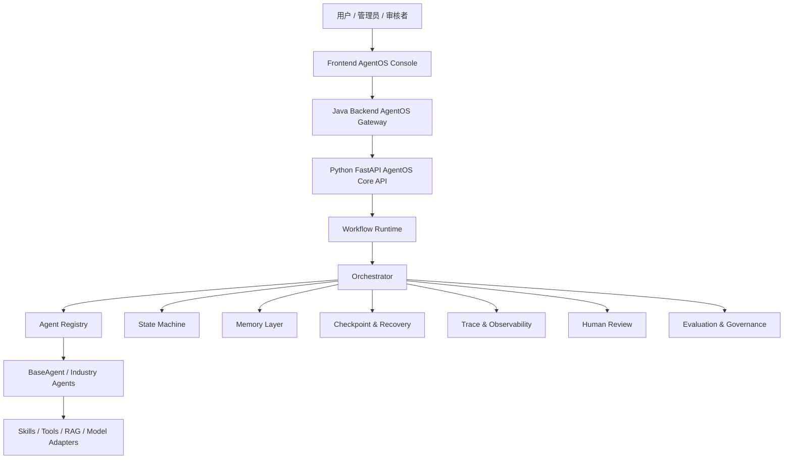
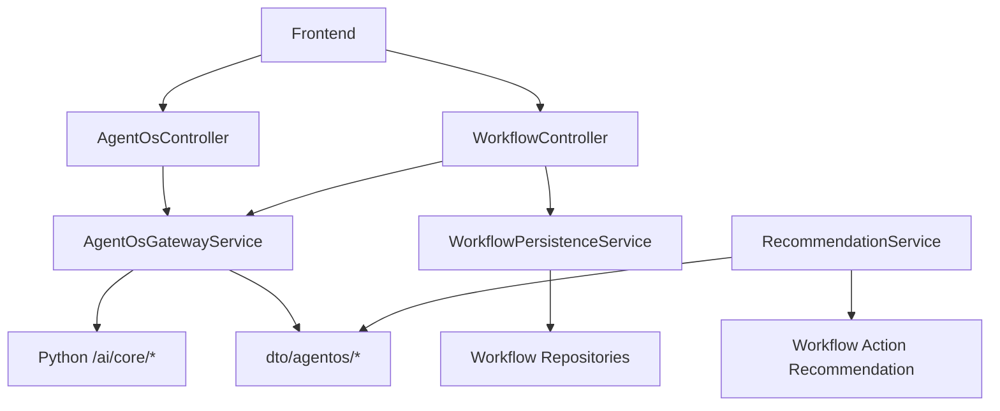
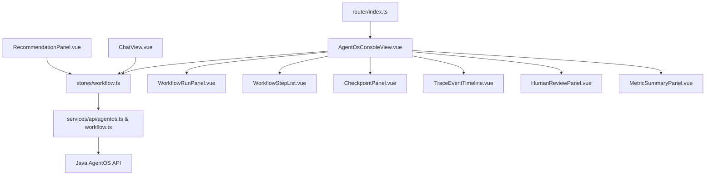
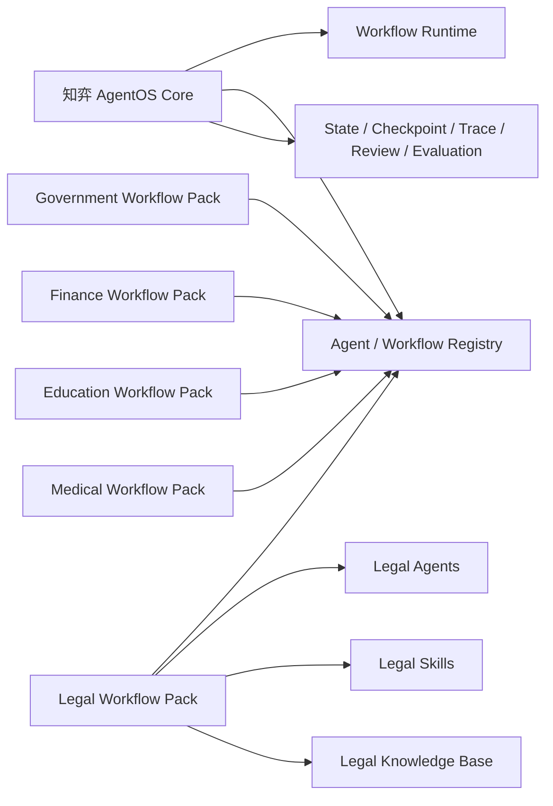
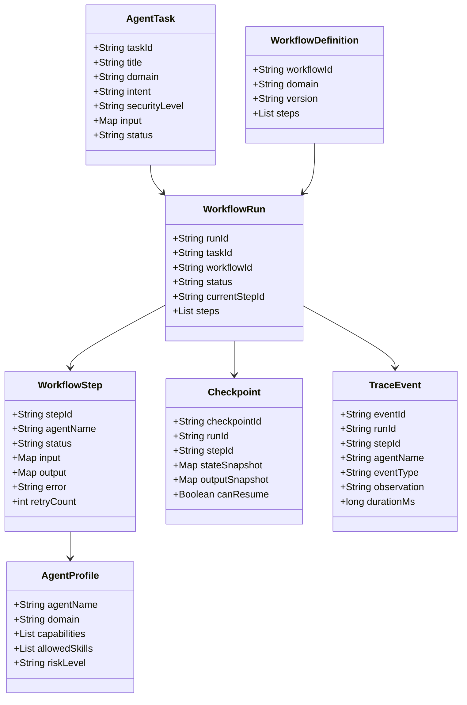
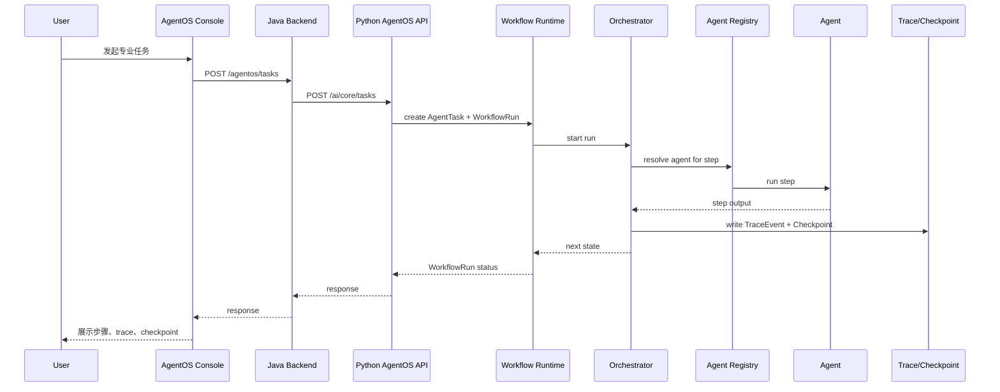
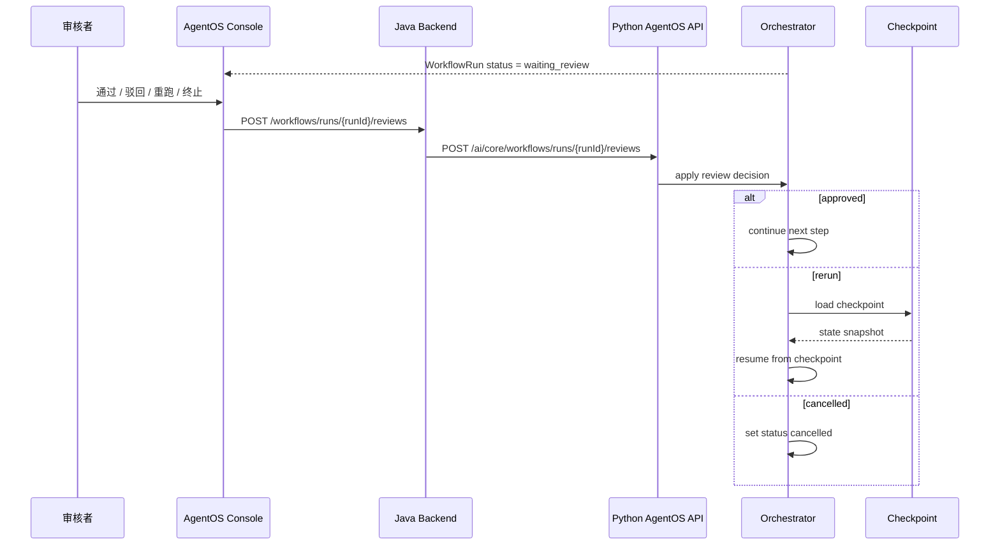

# 知弈 AgentOS Core 代码层次架构图

日期：2026-05-14

范围：第一层 `知弈 AgentOS Core`

目标：说明通用智能体操作系统底座在前端、Java 后端、Python Agent 服务中的代码分层与依赖关系。

---

## 1. 总览

`知弈 AgentOS Core` 是第一层通用底座，不直接绑定政务、金融、教育、医疗、法律等行业业务。行业能力通过第二层 `Industry Workflow Packs` 注册进 Core。

整体代码关系：



---

## 2. 目标目录层次

### 2.1 Python AgentOS Core

Python 是第一层 Core 的运行时核心。

```text
agent/
	app/
		main.py
			FastAPI 应用入口，注册普通聊天、RAG，以及新的 AgentOS Core API。

		config.py
			统一读取环境变量和运行配置，提供模型、跨域、服务名、超时等基础配置。

		api/
			agentos_core.py
				AgentOS Core 对外 API，提供任务创建、工作流启动、状态查询、人工审核、恢复执行等接口。

			chat.py
				普通聊天入口；当用户请求变成复杂专业任务时，可以升级为 WorkflowRun。

			rag.py
				RAG 查询入口，负责文档检索、知识库查询和向量检索能力暴露。

		agentos/
			orchestration/
				__init__.py
					AgentOS Core 控制平面包入口。

				types.py
					定义核心数据对象：AgentTask、WorkflowDefinition、WorkflowRun、WorkflowStep、Checkpoint、TraceEvent、ReviewDecision。

				workflow_runtime.py
					管理 WorkflowRun 生命周期，负责启动、推进、暂停、取消、查询工作流运行状态。

				orchestrator.py
					核心编排器，负责选择下一步、调度 Agent、处理失败、触发审核、汇总最终结果。

				workflow_registry.py
					注册和加载行业工作流模板，让 Core 能发现行业包提供的 WorkflowDefinition。

				state_machine.py
					统一管理任务、工作流、步骤、Agent 的状态迁移，防止非法状态跳转。

				checkpoint.py
					创建、查询和恢复 Checkpoint，使长任务可以从中间步骤继续执行。

				trace.py
					记录 TraceEvent，保存任务创建、步骤开始、Agent 调用、工具调用、审核、失败、恢复等事件。

				review.py
					处理 Human Review 节点，支持通过、驳回、重跑、终止等人工决策。

				evaluation.py
					计算工作流级指标，例如完成率、恢复成功率、循环率、协作质量和专业工作流得分。

			agents/
				__init__.py
					Agent 抽象层包入口。

				base_agent.py
					定义 BaseAgent、AgentProfile、AgentCapability，规定所有行业 Agent 的统一接口。

				agent_registry.py
					注册和解析行业 Agent，供 Orchestrator 按 domain、capability、workflow step 查找 Agent。

			packs/
				registry.py
					发现、校验和注册应用层 Pack。Core 不承载 legal、education 等具体领域 Agent。

	agent/
		packs/
			legal/
				agents/
					case_intake.py
					statute.py
					evidence.py
					risk.py
					draft.py
					review.py

			education/
			programmer/
			writer/

			memory/
				__init__.py
					记忆层包入口。

				workflow_memory.py
					保存 WorkflowRun 的步骤输入、步骤输出、中间产物和上下文传递记录。

				profile_memory.py
					保存用户偏好、组织配置、常用风格和业务约束。

				career_memory.py
					保存职业经验、模板、规则和可复用专业模式。

				federated_memory.py
					保存匿名联邦经验统计，只记录模式和指标，不保存用户原始敏感数据。

			react/
				planner.py
					现有 ReAct Planner，可作为 Agent 内部的局部规划器。

				executor.py
					现有 ReAct Executor，可作为 Agent 内部执行 Skill 的循环。

				tool_router.py
					现有 Tool Router，把动作名映射到具体 Skill。

			schema/
				agent_types.py
					旧专业 Agent DTO，后续逐步迁移到 orchestration/types.py。

			skills/
				base.py
					Skill 基类，定义工具能力的统一输入输出形式。

				case_understanding_skill.py
					法律案情理解 Skill，后续由 CaseIntakeAgent 调用。

				statute_retrieval_skill.py
					法条检索 Skill，后续由 StatuteAgent 调用。

				evidence_analysis_skill.py
					证据分析 Skill，后续由 EvidenceAgent 调用。

				risk_assessment_skill.py
					风险评估 Skill，后续由 RiskAgent 调用。

				document_generation_skill.py
					文书生成 Skill，后续由 DraftAgent 调用。

				teacher/
					教师领域 Skill 目录，后续作为教育行业包的工具层。

				programmer/
					程序员领域 Skill 目录，后续作为研发行业包的工具层。

				writer/
					写作领域 Skill 目录，后续作为写作行业包的工具层。

			retrieval/
				chroma_client.py
					Chroma 向量数据库客户端，提供向量检索基础能力。

				legal_index_builder.py
					法律知识索引构建器，为法律行业包准备检索索引。

				education_index_builder.py
					教育知识索引构建器，为教育行业包准备检索索引。

				code_index_builder.py
					代码知识索引构建器，为研发行业包准备检索索引。

			federated/
				federated_adapter.py
					联邦增强适配器，后续接入联邦经验、推荐排序和调度优化。

		ai_engine/
			deepseekadapter.py
				DeepSeek 模型适配器，提供文本生成主力能力。

			qwenadapter.py
				通义千问模型适配器，提供备用或多模态相关能力。

			speechadapter.py
				语音模型适配器，处理语音识别或语音合成相关调用。

			multimodaladapter.py
				多模态模型适配器，处理图像、文本等混合输入。

			kylin_sdk/
				麒麟 SDK 封装目录，负责国产生态和麒麟相关接口兼容。

		services/
			aiservice.py
				统一 AI 服务封装，供 Skill、Agent 或普通聊天调用。

			ragservice.py
				RAG 服务封装，提供文档检索和知识增强能力。

			performancemonitor.py
				性能监控服务，收集响应时间、资源使用和错误率等指标。

			federatedlearning.py
				联邦学习服务，后续主要用于推荐、调度、偏好和经验统计，不训练主模型。
```

---

## 3. Java 后端代码层次

Java 后端不承载 Core 的智能体运行逻辑，它负责业务网关、鉴权、持久化、审计和前端 API 稳定性。

```text
backend/src/main/java/com/kinlin/ai/
  controller/
    AgentOsController.java           # 新增：AgentOS Core 网关入口
    WorkflowController.java          # 新增：WorkflowRun 查询、审核、恢复
    AgentController.java             # 现有：旧专业 Agent 网关，后续兼容保留
    ChatController.java              # 现有：聊天入口
    RecommendationController.java    # 现有：推荐入口，后续推荐下一步 workflow action

  service/
    AgentOsGatewayService.java       # 新增：调用 Python /ai/core/*
    WorkflowPersistenceService.java  # 新增：持久化 WorkflowRun 摘要和审计信息
    AgentGatewayService.java         # 现有：旧 Agent 网关
    AgentConversationPersistenceService.java
    RecommendationService.java

  dto/
    agentos/                         # 新增
      AgentTaskRequest.java
      AgentTaskResponse.java
      WorkflowRunRequest.java
      WorkflowRunResponse.java
      WorkflowStepResponse.java
      CheckpointResponse.java
      TraceEventResponse.java
      ReviewDecisionRequest.java
      WorkflowMetricResponse.java

    agent/                           # 现有：旧专业 Agent DTO
      AgentChatRequest.java
      AgentChatResponse.java

  entity/                            # 中期新增，MVP 可先不落库
    WorkflowRun.java
    WorkflowStep.java
    WorkflowCheckpoint.java
    WorkflowAuditLog.java

  repository/                        # 中期新增
    WorkflowRunRepository.java
    WorkflowStepRepository.java
    WorkflowCheckpointRepository.java
    WorkflowAuditLogRepository.java

  config/
    AgentProperties.java             # 现有：Python Agent 服务地址
    WebClientConfig.java             # 现有：HTTP 客户端
```

Java 依赖图：



---

## 4. 前端代码层次

前端是 Core 的控制台形态，不只是展示回答，而是让用户看到、审核和恢复 Agent 工作流。

```text
frontend/src/
  views/
    AgentOsConsoleView.vue           # 新增：第一层 Core 主控制台
    FederatedAgentWorkbenchView.vue  # 现有：可逐步迁移或承载 Core 入口
    ChatView.vue                     # 现有：复杂对话可升级为 Workflow
    RagView.vue                      # 现有：知识检索入口

  services/api/
    agentos.ts                       # 新增：AgentOS Core API
    workflow.ts                      # 新增：WorkflowRun / Review / Checkpoint API
    recommendation.ts                # 现有：后续推荐 workflow action

  stores/
    workflow.ts                      # 新增：WorkflowRun 状态管理
    chat.ts                          # 现有：聊天和专业 Agent 消息状态

  components/agentos/
    WorkflowRunPanel.vue             # 新增：工作流总览
    WorkflowStepList.vue             # 新增：步骤状态列表
    AgentStateBadge.vue              # 新增：Agent / Step 状态标签
    CheckpointPanel.vue              # 新增：Checkpoint 列表与恢复操作
    TraceEventTimeline.vue           # 新增：Core Trace 时间线
    HumanReviewPanel.vue             # 新增：人工审核
    MetricSummaryPanel.vue           # 新增：运行指标摘要

  components/agent/
    TraceTimeline.vue                # 现有：旧 Agent trace，可复用或升级
    LawyerSkillPanel.vue             # 现有：行业包结果展示
    TeacherSkillPanel.vue
    ProgrammerSkillPanel.vue
    WriterSkillPanel.vue

  router/
    index.ts                         # 新增 /agentos-console 路由
```

前端依赖图：



---

## 5. Core 与行业包边界

Core 只定义接口，不写死行业业务。



边界规则：

- Core 可以知道 `domain=legal`，但不应该写死法律流程细节。
- 行业包可以注册 `WorkflowDefinition`，但不能绕过 Core 自己跑任务。
- 行业 Agent 可以调用 Skill、RAG 和模型，但必须把状态、trace、checkpoint 回写 Core。
- 行业包的输出必须符合 Core 的 `WorkflowStep.output` 和 `TraceEvent` 规范。

---

## 6. 核心数据对象关系



---

## 7. 调用链路

### 7.1 创建并执行工作流



### 7.2 人工审核与恢复



---

## 8. 实现顺序

推荐先从 Python Core 开始，再接 Java 网关和前端控制台。

```text
Step 1: orchestration/types.py
Step 2: orchestration/state_machine.py
Step 3: orchestration/workflow_runtime.py
Step 4: agents/base.py + agents/registry.py
Step 5: orchestration/trace.py
Step 6: orchestration/checkpoint.py
Step 7: orchestration/orchestrator.py
Step 8: api/agentos_core.py
Step 9: Java AgentOsGatewayService + AgentOsController
Step 10: Frontend AgentOsConsoleView + workflow store
```

第一轮只需要一个 demo 行业包验证 Core：

```text
Legal Demo Pack
  CaseIntakeAgent
  StatuteAgent
  EvidenceAgent
```

这个 demo pack 不代表第一层绑定法律，只是用于证明 Core 可以调度行业 Agent。

---

## 9. 当前已有代码复用点

| 现有文件 | 在 Core 中的角色 |
|---|---|
| `agentOS/src/agentos/core/types.py` | 保留 `WorkflowRun`、`TraceEvent`、`Checkpoint`、`ReviewDecision`、`SkillRequest`、`SkillResult` |
| `agentOS/src/agentos/memory/workflow_memory.py` | 保存 WorkflowRun 步骤上下文 |
| `agent/packs/<pack_id>/skills/*` | 作为 Pack Agent 的领域原子能力 |
| `agentOS/src/agentos/adapters/federated_adapter.py` | 后续接入 Federated Memory / Experience |
| `frontend/src/components/agent/TraceTimeline.vue` | 可升级为 `TraceEventTimeline.vue` |
| `frontend/src/views/FederatedAgentWorkbenchView.vue` | 可迁移为 AgentOS Console 雏形 |
| `backend/src/main/java/com/kinlin/ai/service/AgentGatewayService.java` | 可参考实现 `AgentOsGatewayService` |
| `backend/src/main/java/com/kinlin/ai/dto/agent/AgentChatResponse.java` | 可参考设计 workflow response DTO |

---

## 10. 第一层代码架构完成标准

- [ ] Python 有独立 `agentos/core/` 包。
- [ ] Python 有独立 `agentos/agents/` 包。
- [ ] Core 类型不依赖法律、教育、金融、医疗等具体行业。
- [ ] 行业包通过 registry 注册 Agent 和 Workflow。
- [ ] Java 有 AgentOS Core 网关和 DTO。
- [ ] 前端有 AgentOS Console 页面和 workflow store。
- [ ] 任意 WorkflowRun 都有状态、步骤、trace、checkpoint。
- [ ] 人工审核和恢复不是临时逻辑，而是 Core 级能力。
- [ ] 评估指标能按 workflow / agent / domain 聚合。
