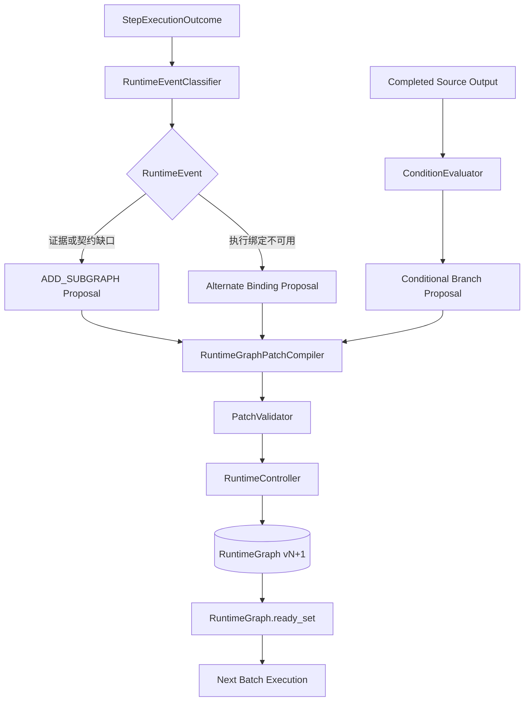

# Runtime Graph 与受控动态 ACG MVP 实施总结

> 日期：2026-07-27
> 范围：RuntimeGraph 基础、执行权威迁移、事件驱动补救子图、备选执行绑定、确定性条件分支
> 代码基线：`158c49c` 之前的静态 ACG 运行能力
> 最终版本：`5232e19a657bed1007e34dc2fdccd2cfbd2c21b0`

## 1. 摘要

本轮工作完成了知弈 AgentOS 从“执行静态 ACG 蓝图”到“运行期间受控演化 ACG”的最小闭环。

系统现在具备三类真实的运行时动态能力：

1. 执行内容不足时，通过 `ADD_SUBGRAPH` 插入受约束的补救子图；
2. 当前执行者不可用时，通过 `RETRY_ALTERNATE_BINDING` 保持节点不变并切换备选 Agent 或模型绑定；
3. 上游输出满足不同条件时，通过 `ACTIVATE_CONDITIONAL_BRANCH` 激活一条预声明路径，并明确终结其他路径。

这三类能力没有把图修改权限交给 Agent、Planner 或 API，而是统一收敛到以下控制链：

```text
运行事实或确定性控制求值
→ GraphChangeProposal
→ RuntimeGraphPatch
→ PatchValidator
→ RuntimeController
→ graphVersion + 1
→ 下一轮 RuntimeGraph.ready_set()
```

MVP 的核心成果不是增加了几种 Patch JSON，而是建立了可执行、可持久化、可恢复、可审计、可去重的动态图运行内核。动态新增节点会真正进入 Ready Set 并执行；绑定切换后的下一 Attempt 会真正调用备选 Agent；条件分支中的未选 Agent 不会被调用，Join 也不会错误等待已经终结的路径。

## 2. 改造前的问题

早期 ACG 运行路径由多个对象共同维护执行事实：

```text
ACGBlueprint
+ WorkflowRun.steps
+ completedStepIds / activeStepIds
+ WorkflowStep.status
+ Checkpoint
```

这种模型可以执行静态 DAG，但不适合运行时改图：

- Blueprint 同时承担设计结构和运行参考，缺少明确的不可变边界；
- Ready Set 依赖 Blueprint 与多个状态集合，新增节点无法自然进入执行循环；
- 并行 Step 可以直接修改共享 `WorkflowRun`，存在结果相互覆盖风险；
- Checkpoint 可能用旧快照覆盖更新后的图；
- 普通重试、换 Agent、插入补救步骤没有统一的结构变更语义；
- 图变化缺少 base version、幂等键和单写入者；
- WorkflowStep 既是 API DTO 又是运行状态，无法安全承载动态图权威。

因此，本轮首先重构“执行真相”，再逐步开放受控动态能力。

## 3. 最终权威模型

MVP 完成后的职责边界如下：

```text
ACGBlueprint
= 不可变的设计时计划与审计快照

RuntimeGraph
= 运行拓扑、节点状态、输出、Binding、Attempt、事件、Patch 和分支决策的权威

WorkflowStep
= 从 RuntimeGraph 单向生成的 API 兼容投影

WorkflowRun.runtimeGraph
= RuntimeGraph 的持久化载体
```

### 3.1 graphVersion

`graphVersion` 只表示运行时语义图版本，只在以下操作成功后递增：

- `ADD_SUBGRAPH`；
- `RETRY_ALTERNATE_BINDING`；
- `ACTIVATE_CONDITIONAL_BRANCH`。

以下普通执行行为不会增加 graphVersion：

- `PENDING → RUNNING → COMPLETED`；
- Attempt 创建和完成；
- 输出写入和 outputVersion 递增；
- Progress、Trace、Checkpoint 更新；
- 普通原 Binding 重试。

RuntimeGraph 初始化时：

```text
sourceBlueprintVersion = ACGBlueprint.version
graphVersion = 1
```

两者语义严格分离。

### 3.2 WorkflowStep 单向投影

`refresh_run_execution_projection()` 从 RuntimeGraph 统一生成：

- `run.steps`；
- `run.completedStepIds`；
- `run.activeStepIds`；
- `run.currentStepId`。

执行、审核、取消和恢复路径不再从 WorkflowStep 反向更新 RuntimeGraph。修改投影对象不会改变权威 RuntimeNode。

## 4. RuntimeGraph 执行内核

### 4.1 RuntimeNode

RuntimeNode 承载单个运行节点的权威事实：

```text
nodeId
nodeType
spec
status
activation
currentBinding
bindingCandidates
bindingHistory
bindingSwitchCount
attempts
output
outputVersion
error
sourcePatchId
createdGraphVersion
updatedAt
```

Blueprint 节点被深复制为 RuntimeNode，运行时 enrichment、Binding 和输出不会写回原始 Blueprint。

### 4.2 Attempt 追加历史

每次真实 Agent 执行都会追加一个 RuntimeAttempt：

```text
attemptId
attemptNumber
graphVersion
bindingId
agentName
modelName
status
startedAt / endedAt
resolvedInput
output
error
traceContext
```

失败 Attempt 不会被后续重试或 Binding 切换覆盖。历史 Attempt 保存当时真实使用的 bindingId、Agent 和模型，不能根据当前 Binding 反推。

### 4.3 Ready Set

Executor 每轮重新从 Store 加载最新 WorkflowRun 和 RuntimeGraph，然后调用：

```text
RuntimeGraph.ready_set()
```

Ready Set 不再读取 `completedStepIds`。节点进入 Ready Set 必须满足：

- 是可执行 Step Node；
- activation 为 ACTIVE；
- 状态为 PENDING 或 RETRYING；
- 所有当前有效前驱已经完成；
- 不存在尚未决策的 INACTIVE 条件入口边。

`RUNNING`、`COMPLETED`、`FAILED`、`CANCELLED` 和 `SKIPPED_BY_CONDITION` 均不会再次进入 Ready Set。

### 4.4 Batch 快照与 Barrier

并行执行采用以下边界：

```text
锁内重新加载 RuntimeGraph
→ 计算 Ready Set
→ 创建 Attempt
→ Batch 节点统一转为 RUNNING
→ save_run()
→ 释放锁
→ 并发执行不可变 StepExecutionPackage
→ 收集 StepExecutionOutcome
→ 再次获取锁并重读最新 Run
→ 校验 graphVersion、nodeId、attemptId 和节点状态
→ Barrier 合并结果
→ 投影 WorkflowStep
→ Checkpoint
→ save_run()
```

Agent、LLM 和远端工具调用均在锁外执行。并行协程只返回 Outcome，不直接修改共享 WorkflowRun。

迟到 Outcome 如果遇到 Run 已取消、graphVersion 变化或 attemptId 不匹配，会被安全忽略并记录 Trace，不能覆盖较新的运行事实。

## 5. Patch 与一致性内核

### 5.1 唯一写入者

RuntimeController 是 RuntimeGraph 语义变更的唯一入口。Agent、Executor、ProposalFactory、PatchCompiler、Recovery 和 API 均不能直接改写图结构或 Binding。

公开应用流程为：

```text
获取 GLOBAL_RUN_LOCK_MANAGER 的 run lock
→ 从 Store 读取最新 WorkflowRun
→ 检查幂等与取消状态
→ 校验 baseGraphVersion
→ deep copy 当前 Run
→ PatchValidator 在副本上纯验证
→ 在候选 RuntimeGraph 上应用语义变化
→ graphVersion + 1
→ 写 AppliedPatchRecord 和 Trace
→ 创建包含最新 RuntimeGraph 的 Checkpoint
→ 一次 save_run()
→ 保存成功后返回
```

Barrier 已持锁时使用内部 `apply_patch_to_candidate()`，避免非重入锁死锁，同时复用相同验证和应用逻辑。

### 5.2 幂等和冲突

AppliedPatchRecord 保存：

```text
patchId
idempotencyKey
contentHash
semanticHash
operationType
baseGraphVersion
resultGraphVersion
sourceEventId
checkpointId
appliedAt
```

规则如下：

- 相同 patchId、相同内容：返回幂等重放，版本不变；
- 相同 patchId、不同内容：`PATCH_ID_CONTENT_CONFLICT`；
- 相同 idempotencyKey、相同语义：返回第一次结果；
- 相同 idempotencyKey、不同语义：拒绝；
- baseGraphVersion 过期：`GRAPH_VERSION_CONFLICT`；
- 已取消 Run：拒绝新 Patch；
- 保存失败：不污染调用方对象或 Store 中旧对象。

当前一致性前提为：

```text
单进程、单 Uvicorn Worker
+ 全局 per-run lock
+ 锁内重读最新 Run
+ graphVersion 乐观检查
+ SQLite 单行事务保存
```

MVP 没有虚构数据库 CAS，也没有宣称支持多进程一致性。

## 6. 动态能力一：ADD_SUBGRAPH

### 6.1 触发链

StepExecutionOutcome 可以携带结构化 `runtimeSignals`。RuntimeEventClassifier 将输出、异常和契约错误归类为稳定 RuntimeEvent。

当前可记录的事件包括：

- `EVIDENCE_MISSING`；
- `INPUT_CONTRACT_VIOLATION`；
- `OUTPUT_CONTRACT_VIOLATION`；
- `LOW_CONFIDENCE`；
- `STEP_EXECUTION_FAILED`；
- `BINDING_UNAVAILABLE`。

只有有确定性 Recipe 的事件才能生成子图 Proposal。没有 Recipe 的事件会被安全忽略、拒绝或转人工，不允许 LLM 自由组图。

实际链路：

```text
StepExecutionOutcome
→ RuntimeEventClassifier.classify()
→ RuntimeEventPolicy.decide()
→ RecoveryRecipeRegistry
→ DeterministicProposalFactory.propose()
→ RuntimeGraphPatchCompiler.compile()
→ PatchValidator.validate()
→ RuntimeController.apply_patch_to_candidate()
→ graphVersion + 1
→ RuntimeGraph.ready_set()
```

### 6.2 受限插入语义

MVP 只允许：

```text
ADD_SUBGRAPH + INSERT_BEFORE_TARGET
```

例如原图：

```text
A ─┐
   ├→ Target
B ─┘
```

插入补救链后：

```text
A ─┐
   ├→ Retrieve → Validate → Target
B ─┘
```

原入边不会物理删除，而是在历史图中标记 superseded。新增节点为 PENDING，记录 `sourcePatchId` 和新的 `createdGraphVersion`。

PatchValidator 检查目标状态、替换入边、ID 唯一性、端点、DAG、能力、契约、数据路径以及图预算。已完成节点和输出不能被修改或失效。

### 6.3 Recipe 与防无限扩图

当前确定性 Recipe 包括：

- `evidence_retrieval_and_validation.v1`；
- `contract_repair.v1`。

Recipe 只描述 capability、契约和数据映射，不在 Core 中硬编码合同主题或业务字段。

除全局 Patch/节点/深度预算外，同一 `recipeId + targetNodeId` 每个 Run 最多应用一次。重复缺口不会形成无限的 retrieve/validate 链，而是产生 `RECIPE_REAPPLICATION_BLOCKED` 审计事件。

## 7. 动态能力二：RETRY_ALTERNATE_BINDING

### 7.1 ExecutionBinding

ExecutionBinding 是不包含凭据的安全执行绑定：

```text
bindingId
agentName
agentId
domain
capability
modelName
allowedSkills
bindingType
source
priority
metadata
```

bindingId 由以下稳定字段的规范化哈希生成：

```text
agentName + agentId + modelName + capability
```

相同注册事实会产生相同 bindingId，不使用随机 UUID。

### 7.2 CandidateResolver

CandidateResolver 从 AgentRegistry 枚举候选并过滤：

- domain；
- capability；
- requiredSkills；
- excludedBindingIds；
- enabled/availability。

候选按以下顺序稳定排序：

```text
priority 降序
→ registrationOrder
→ bindingId
```

当前使用轻量 Registry availability provider，不建设完整资源租约系统。

### 7.3 故障与切换边界

以下故障可以立即触发 `BINDING_UNAVAILABLE`：

- Agent 未注册或消失；
- Agent 被禁用；
- Binding 不再注册；
- 模型端点被移除。

Timeout、连接、传输、限流和远端暂时不可用等瞬时故障，会先在当前 Binding 重试一次；超过固定阈值后才请求切换。

契约错误、证据缺失和业务低置信度不会被错误归类为“换人”。

### 7.4 Patch 语义

`RETRY_ALTERNATE_BINDING` Patch：

- 不改变 nodeId；
- 不增删节点或边；
- 不创建 Attempt；
- 校验 expectedAttemptId 和 expectedCurrentBindingId；
- 校验新 Binding 的 domain、capability、skills 和注册状态；
- 更新 currentBinding；
- 追加 bindingHistory；
- bindingSwitchCount 增加；
- 节点进入 RETRYING；
- graphVersion 增加一次。

下一轮调度才创建新 Attempt，因此失败 Attempt 完整保留，新 Attempt 明确记录新 bindingId。

候选耗尽时事件被拒绝，节点不会循环回到已经失败的 Binding。

## 8. 动态能力三：ACTIVATE_CONDITIONAL_BRANCH

### 8.1 受限 IF 结构

MVP 支持以下显式结构：

```text
DecisionSource
      ↓
    IF Control
    ↙       ↘
Branch A   Branch B
    ↘       ↙
      Join
       ↓
   Downstream
```

每个 IF Control 必须声明：

```text
conditionSpec
branchEdgeIds
joinNodeId
```

Blueprint 验证器要求：

- 决策源唯一且为 Step；
- 2 至 4 条分支；
- Join 唯一且是无条件 Control；
- 每条分支最终汇聚到 Join；
- Join 前分支节点互不共享；
- 不存在未声明分支边；
- 每条分支均可由 case 或 default 选择；
- 不允许嵌套 IF；
- LOOP 继续被拒绝。

### 8.2 ConditionSpec 与安全求值

ConditionSpec 包含：

```text
sourceNodeId
jsonPointer
operator
cases
defaultEdgeId
valueType
```

支持的 operator 仅限：

- `EQUALS`；
- `IN`；
- `EXISTS`；
- `BOOLEAN`。

ConditionEvaluator 是纯函数，只能读取声明的 RuntimeNode.output，并使用受限 JSON Pointer 查找值。它不访问 Store、AgentRegistry、网络、环境变量或文件，不执行 Python/JavaScript 表达式。

求值结果包含 sourceOutputVersion 和 inputHash，因此 Patch 可以证明自己基于哪个确定性输入产生。

没有匹配 case 时：

- 存在 defaultEdgeId：稳定选择默认分支；
- 不存在 defaultEdgeId：返回 `CONDITION_NO_MATCH`，Run 进入结构化失败；
- 不会随机选择路径。

### 8.3 Edge activation

边新增运行时 activation：

```text
INACTIVE
ACTIVE
TERMINATED
```

普通边默认 ACTIVE。IF 声明的分支入口边在 RuntimeGraph 初始化时变为 INACTIVE，因此决策前任何分支都不能进入 Ready Set。

Patch 成功后：

- 选中入口边变为 ACTIVE；
- 未选入口边变为 TERMINATED；
- IF Control 变为 COMPLETED；
- 未选分支独占节点变为 SKIPPED_BY_CONDITION；
- Join 及 Join 后节点不被跳过；
- 节点和边数量保持不变；
- graphVersion 增加一次。

### 8.4 SKIPPED_BY_CONDITION

`SKIPPED_BY_CONDITION` 是独立终态：

- 不执行 Agent；
- 不生成业务输出；
- 不算失败；
- 不能 Retry；
- 不能转换为 RUNNING 或 COMPLETED；
- 可以持久化和恢复；
- 在 WorkflowStep 与 Progress 中单独展示。

只有 PENDING 节点可以通过条件 Patch 进入该状态。如果未选分支已经 RUNNING、COMPLETED 或 WAITING_REVIEW，Patch 会以 `BRANCH_ALREADY_STARTED` 拒绝。

### 8.5 Join 语义

RuntimeGraph 只把 ACTIVE 的 Dependency/Control Flow Edge 作为有效前驱。

Join 会忽略来源已为 SKIPPED_BY_CONDITION 的终结路径，但仍等待：

- 选中分支的 ACTIVE 前驱；
- 其他普通必选依赖。

因此，未选分支没有输出不会导致 Join 死锁，也不会被误认为业务失败。

### 8.6 BranchDecision

每次成功决策写入冻结的 BranchDecision：

```text
decisionId
controlNodeId
sourceNodeId
sourceOutputVersion
inputHash
selectedCaseKey
selectedEdgeIds
terminatedEdgeIds
skippedNodeIds
joinNodeId
sourceEventId
sourcePatchId
decidedAtGraphVersion
decidedAt
```

同一 controlNodeId 只能存在一个决策。Checkpoint 恢复后会保留边 activation、skipped 状态、inputHash 和 BranchDecision，不会重新求值或重复增加 graphVersion。

## 9. 三类动态机制的统一关系



三类 Patch 的变化范围互斥：

| Patch                       | 节点数量 |             边数量 | Binding      | 节点状态                        | Edge activation   |
| --------------------------- | -------: | -----------------: | ------------ | ------------------------------- | ----------------- |
| ADD_SUBGRAPH                |     增加 | 增加并保留旧边历史 | 新节点初始化 | Target RETRYING、新节点 PENDING | 不负责条件激活    |
| RETRY_ALTERNATE_BINDING     |     不变 |               不变 | 切换         | 原节点 RETRYING                 | 不变              |
| ACTIVATE_CONDITIONAL_BRANCH |     不变 |               不变 | 不变         | IF 完成、未选节点 skipped       | ACTIVE/TERMINATED |

## 10. Progress、API 与前端兼容

### 10.1 Progress

Progress 在原字段基础上增加：

```text
graphVersion
dynamicStepCount
bindingSwitchCount
skippedByConditionCount
conditionalDecisionCount
```

ADD_SUBGRAPH 会增加 totalSteps，因此百分比允许回落。Binding 切换和条件决策不改变 totalSteps。

条件分支后的有效完成量为：

```text
effectiveFinished = completedSteps + skippedByConditionCount
percent = effectiveFinished / totalSteps
```

`completedSteps` 仍只统计真实完成节点，不把 skipped 混装成 completed。

### 10.2 Run Detail 与 ACG View

接口现在可以暴露：

- 最新 RuntimeGraph 投影；
- graphVersion；
- appliedPatches；
- runtimeEvents；
- currentBinding 与 bindingHistory；
- bindingSwitchCount；
- edge.activation；
- branchDecisions；
- selectedEdgeIds / terminatedEdgeIds；
- skippedByConditionCount；
- conditionalDecisionCount。

未开放客户端 Patch 写入 API。

### 10.3 Java 与 TypeScript

Java 强类型 Progress DTO 和 TypeScript 类型已同步新增字段。TypeScript StepStatus 增加 `skipped_by_condition`，ACG Edge 增加 activation，BranchDecision 有明确类型。

前端暂不自动刷新动态图，也没有分支编辑器；现有步骤列表和拓扑详情为 skipped 状态提供安全样式，对未知未来状态使用文本 fallback，不会抛异常。

## 11. Checkpoint、恢复与 Store

Checkpoint 保存完整 RuntimeGraph，因此包含：

- 节点状态、Attempt、输出和 Binding；
- graphVersion；
- RuntimeEvent 与 pending 队列；
- appliedPatches；
- edge.activation；
- BranchDecision；
- SKIPPED_BY_CONDITION；
- conditionalDecisionCount。

恢复前先比较当前 RuntimeGraph.graphVersion 与 Checkpoint graphVersion：

- 相同版本：允许恢复；
- Checkpoint 更旧：拒绝覆盖新图；
- Checkpoint 更高：视为数据异常；
- 旧数据缺少 RuntimeGraph：只能走显式兼容初始化。

恢复以 RuntimeGraph 为权威，再投影 WorkflowStep。RUNNING 节点恢复为 RETRYING；已应用 Patch、最新 Binding 和已完成分支决策不会被回滚或重复应用。

MemoryWorkflowStore 与 SQLiteWorkflowStore 都通过了 RuntimeGraph、Event/Patch 映射、Binding、Attempt、Edge activation、BranchDecision 和 Checkpoint 的重载验证。

## 12. 审计与可观测性

Trace 继续作为审计投影，不承担执行状态权威。动态链路会记录：

- RuntimeEvent 分类、忽略和拒绝；
- Recipe 选择与重复应用阻断；
- GraphChangeProposal；
- Patch 成功、拒绝和版本冲突；
- graphVersion、runtimeNodeId、attemptId、bindingId；
- selectedEdgeIds、terminatedEdgeIds；
- Checkpoint 创建。

ContextPack 每个 Attempt 重新装配，并从 RuntimeGraph 读取当前拓扑、上游输出、graphVersion、attemptId 和 bindingId。Binding 切换后不会复用旧 resolvedInput 对象。

## 13. 验收场景

### 13.1 证据缺失动态扩图

```text
Target 第一次 Attempt
→ EVIDENCE_MISSING
→ evidence_retrieval_and_validation.v1
→ 插入 Retrieve → Validate
→ graphVersion 1 → 2
→ 新节点实际执行
→ Target 第二次 Attempt
→ 后续节点完成
```

### 13.2 执行者失效切换 Binding

```text
Primary Attempt 失败
→ BINDING_UNAVAILABLE
→ 排除失败 bindingId
→ 选择 Alternate Binding
→ graphVersion 1 → 2
→ 下一轮创建新 Attempt
→ Alternate Agent 实际执行
→ Run 完成
```

合同与代码两个测试域都使用同一 CandidateResolver、ProposalFactory、PatchCompiler、Validator 和 RuntimeController。

### 13.3 高风险合同

```text
riskLevel = high
→ high branch ACTIVE
→ direct branch TERMINATED
→ deep/review 实际执行
→ direct SKIPPED_BY_CONDITION
→ Join 和 final 完成
→ graphVersion 1 → 2
```

### 13.4 低风险合同

```text
riskLevel = low
→ direct branch ACTIVE
→ deep/review branch TERMINATED
→ direct 实际执行
→ deep/review 不调用 Agent
→ Join 和 final 完成
```

### 13.5 Critical 代码审查

```text
severity = critical
→ 深度审查路径 ACTIVE
→ 普通路径 TERMINATED 并 skipped
→ 使用与合同场景相同的 Core 条件链
→ Run 完成
```

## 14. 测试结果

最终版本完整测试结果：

| 测试域                |                  结果 |
| --------------------- | --------------------: |
| 阶段 4 Core 精确测试  |             24 passed |
| 阶段 4 Agent 精确测试 |             50 passed |
| AgentOS Core 全量     |            134 passed |
| Agent 应用全量        | 216 passed, 1 skipped |
| Java Backend          |            145 passed |
| Frontend              |             82 passed |
| ruff                  |                passed |
| git diff --check      |                passed |

阶段提交：

```text
5232e19 feat(agentos): execute conditional runtime branches
d6c112b feat(agentos): switch failed steps to alternate bindings
158c49c feat(agentos): execute event-driven runtime subgraph patches
5571266 refactor(agentos): make runtime graph execution authority
579e215 feat(agentos): establish versioned runtime graph foundation
527a53b fix(agentos): align workflow progress lifecycle message contract
```

## 15. 当前明确边界

本轮没有实现：

- LLM Planner 或 LLM 自由组图；
- LLM 自由选择 Agent；
- 动态创建 Agent；
- LOOP；
- 任意表达式执行；
- 任意节点或边删除；
- 已完成输出失效和下游自动重算；
- 子图回滚；
- 完整 Resource Manager 和租约；
- PostgreSQL WorkflowStore；
- 多 Worker 或多进程一致性；
- SSE Patch 事件；
- 公共 Patch 写 API；
- 前端实时图刷新和复杂分支编辑器。

因此，当前能力应准确描述为：

> **单进程前提下，基于版本化 RuntimeGraph、确定性策略和受限 Patch 的动态 ACG MVP。**

它已经解决“运行时能否安全改变执行结构”的核心问题，但还没有扩展为任意规划语言、分布式调度系统或完整认知操作系统。

## 16. 后续演进建议

### 16.1 优先补齐 stateRevision

graphVersion 只表达语义图变化。进入多 Worker 或更强并发前，应增加独立 stateRevision，用于普通状态更新的数据库乐观锁，禁止复用 graphVersion。

### 16.2 PostgreSQL CAS 与事务

正式多实例运行需要：

- `(run_id, state_revision)` 条件更新；
- patchId、eventId、idempotencyKey 唯一约束；
- Patch、Trace、Checkpoint 的事务边界；
- 冲突重读和有限重试策略。

### 16.3 输出失效与子图重算

当前禁止修改已完成节点和使已完成输出失效。后续若支持更复杂重规划，需要显式引入：

- output lineage；
- inputRevision/outputVersion 传播；
- 下游失效集合；
- 可重算边界；
- 审计可见的重新执行原因。

### 16.4 动态图读取体验

可以在不开放写 Patch API 的前提下，逐步增加：

- Run Detail 的 graphVersion 条件刷新；
- Patch 审计时间线；
- Edge activation 和 BranchDecision 可视化；
- Progress 中动态节点、Binding 切换和条件决策提示。

### 16.5 Planner 接入原则

未来接入 LLM Planner 时，仍应保持当前控制权边界：

```text
LLM 只能提出结构化 Proposal
→ 确定性 Compiler
→ PatchValidator
→ RuntimeController
```

不得允许 Planner、Agent 或客户端直接写 RuntimeGraph。

## 17. 结论

本轮 MVP 建立了知弈 AgentOS 动态 ACG 的最小可信内核：

- Blueprint 与 RuntimeGraph 权威分离；
- RuntimeGraph 接管执行状态、输出、Binding 和 Attempt；
- Executor 每轮基于最新 RuntimeGraph 重新计算 Ready Set；
- 并行执行采用快照与 Barrier；
- 三类动态图变化统一经过 Proposal、Patch、Validator 和单写入 Controller；
- graphVersion、幂等、Checkpoint 和 Trace 形成一致性与审计闭环；
- 合同和代码场景复用相同 Core 机制，没有把业务关键词写入动态控制内核。

这使系统从“只能执行一张预先确定的 DAG”演进为“能够在严格边界内，根据运行事实调整拓扑、执行者和路径的版本化 AgentOS Runtime”。
