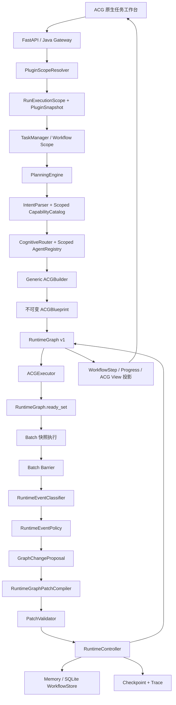

# 知弈OS动态 ACG 与插件化 MVP 现状及下一步决策报告

> 报告日期：2026-07-29  
> 代码分支：`master`  
> 代码基线：`c67c51bab9f02fd79309310203ca80ccca17134f`  
> 报告目的：说明当前 MVP 已经真实实现的能力、产品边界、主要缺口，并为下一阶段任务选择提供依据。

## 1. 执行摘要

当前知弈OS已经不再是“固定律师流程加一个通用页面”，而是形成了四层可以独立解释的 MVP：

1. **原生通用规划层**：`general/general` 不加载 Legal Pack 也能经过正式 PlanningEngine 生成 ACG 并完成执行；
2. **RuntimeGraph 动态执行层**：运行拓扑、状态、输出、Attempt 和 Binding 已由 RuntimeGraph 统一管理；
3. **受控动态图层**：支持补救子图、备用绑定和确定性条件分支三种运行时变化；
4. **Run 级专业能力隔离层**：已安装 Pack 可以全局注册，但每个 Run 只看见自己启用的 Capability、Agent 和 Workflow，并冻结插件快照。

当前最重要的判断是：

> **MVP 的底层运行机制已经成立，但面向普通用户的任务创建体验和非法律专业 Pack 的完整度尚未达到同一成熟度。**

用户在工作台“不知道填什么”，不是 RuntimeGraph 或 Planner 缺失，而是产品入口仍把内部任务字段直接交给了用户。与此同时，Legal Pack 已具备较完整的能力、Agent、Workflow 和 UI 扩展，Education、Programmer、Writer 则主要停留在静态 Workflow/Agent 脚手架阶段。

因此，下一阶段不建议继续增加第四种动态图操作。更合理的选择是优先完成以下三项之一：

- **路线 A（推荐）**：任务创建引导与示例任务；
- **路线 B**：选择一个非法律 Pack，完成从能力描述到 UI、规划、执行和交付的全链路产品化；
- **路线 C**：让真实业务 Agent 稳定产生 RuntimeEvent，减少动态能力对测试信号和故障注入的依赖。

## 2. 当前基线与验证状态

### 2.1 Git 基线

```text
branch: master
HEAD: c67c51bab9f02fd79309310203ca80ccca17134f
latest: fix(acg-workbench): 将专业能力包改为单选叠加
```

`git status` 当前将 5 个前端文件显示为修改，但这些文件的工作区对象哈希与 Index 对象哈希完全一致，`git diff` 为空；本报告未修改这些文件，也未把它们视为功能差异。

### 2.2 本轮实际测试

| 测试域 | 命令 | 结果 |
| --- | --- | --- |
| AgentOS Core | `cd agentOS && python -m pytest tests -q` | `177 passed` |
| Agent 应用 | `$env:PYTHONPATH='agentOS\src;agent'; python -m pytest agent/tests -q` | `235 passed, 1 skipped` |
| Java Backend | `cd backend && mvn test -q` | `149 passed` |
| Frontend | `cd frontend && npm test -- --run` | `105 passed` |

同一 HEAD 下前端 `vue-tsc` 与生产构建已通过。当前测试基线没有发现回归。

## 3. 当前产品与架构定位

### 3.1 当前系统是什么

当前系统可以定义为：

> 一个以 ACG 为统一执行模型、以 RuntimeGraph 为运行事实、支持确定性规划和三类受控运行时变化，并允许专业能力 Pack 按 Run 隔离叠加的通用 AgentOS MVP。

### 3.2 当前系统不是什么

当前系统还不是：

- 能由 LLM 任意创建和修改运行图的自由自治系统；
- 具备插件市场、在线安装、运行中卸载或沙箱的插件平台；
- 支持多个 Worker、分布式锁和 PostgreSQL CAS 的生产级调度系统；
- 已完成所有 Education、Programmer、Writer 专业体验的成品工作台；
- 用户只说一句模糊需求就一定能生成高质量专业成果的成熟产品。

## 4. 当前真实架构



核心控制边界保持为：

```text
Agent 只产生结果或诊断信号
Planner 只产生设计时 Blueprint
PatchValidator 只验证
RuntimeController 是运行图语义变化的唯一写入者
```

## 5. 已实现能力清单

### 5.1 原生通用 ACG 启动链

Core 注册了 `native_acg_runtime_v1`，它是允许空静态 Step 的受控 Planner Bootstrap，不是另一个 General Profile，也不是 Legal Workflow 的变体。

通用任务实际链路为：

```text
general/general 请求
→ native_acg_runtime_v1
→ PlanningEngine
→ IntentParser 从 CapabilityCatalog 选择能力
→ CognitiveRouter 绑定 Agent
→ Generic ACGBuilder 构图
→ RuntimeGraph 初始化
→ ACGExecutor 执行
→ 最终交付
```

Core Native Catalog 当前包含任务理解、信息提取、资料检索、需求分析、流程拆解、资源规划、架构设计、通用分析、证据分析、比较分析、成本分析、风险分析、方案设计、验证和成果生成等能力。

`NativeGeneralAgent` 为这些能力提供离线可测的确定性执行实现。这保证了没有外部模型配置时测试仍可完成，但也意味着当前 Native 输出更接近“稳定演示与基础交付”，还不是依赖大模型深度推理形成的高质量专业成果。

### 5.2 Catalog 驱动的通用规划

能力信息的唯一主要来源是 `CapabilityCatalog` 中的 `PlanningCapabilityDescriptor`。Descriptor 声明：

- 稳定 capabilityId；
- alias 和描述；
- dependsOn / optionalDependencies；
- planningStage；
- input/output contract；
- parallelizable；
- requiresEvidence；
- writesMemory；
- requiresReview。

`IntentParser` 从 Catalog 读取 alias 和可选能力，`CognitiveRouter` 处理规范化 capabilityId，`ACGBuilder` 只根据 Descriptor 和已解析 Binding 构图。

图差异因此来自能力组合和依赖声明，而不是：

```python
if domain == "industrial":
    return INDUSTRIAL_GRAPH
```

并行关系也由相同 planningStage、相同依赖和 `parallelizable=true` 推导，不由任务标题关键词直接决定。

### 5.3 RuntimeGraph 执行权威

当前职责已经迁移为：

```text
ACGBlueprint = 不可变设计快照
RuntimeGraph = 运行拓扑、状态、输出、Binding、Attempt 和动态历史权威
WorkflowStep = RuntimeGraph 的单向 API 兼容投影
```

Executor 每轮重新加载最新 RuntimeGraph，并通过 `RuntimeGraph.ready_set()` 决定可执行节点，不再以 Blueprint、`completedStepIds` 和 `WorkflowStep.status` 的组合为权威。

并发 Batch 使用：

```text
锁内调度并保存 RUNNING Attempt
→ 锁外执行 Agent
→ 锁内 Barrier 合并 Outcome
→ 投影 WorkflowStep
→ Checkpoint
→ save_run
```

每次真实执行追加 Attempt，旧失败 Attempt 不会被覆盖；Cancel 后迟到 Outcome 不能把节点恢复为 Completed。

### 5.4 受控动态图能力

当前支持三种 Patch：

| 动态能力 | 作用 | 图结构是否变化 | graphVersion |
| --- | --- | --- | --- |
| `ADD_SUBGRAPH` | 在目标节点前插入补救子图 | 是 | `+1` |
| `RETRY_ALTERNATE_BINDING` | 保持节点不变，切换备选 Agent/模型绑定 | 否，但执行语义变化 | `+1` |
| `ACTIVATE_CONDITIONAL_BRANCH` | 激活一个预声明条件分支并终结其他分支 | 有效拓扑变化 | `+1` |

普通状态迁移、输出写入、Trace 和 Checkpoint 不增加 graphVersion。

#### ADD_SUBGRAPH

支持 `INSERT_BEFORE_TARGET`：原前驱被重新连接到补救子图，子图末端再连接目标节点；旧边保留审计记录但退出有效边集合。新增节点会真实进入下一轮 Ready Set 并执行。

#### Alternate Binding

Binding 候选、Binding 历史和 Attempt 历史保存在 RuntimeNode。主 Binding 不可用时，只能从当前 Run Scope 内选择备选 Binding，不能越过插件边界。

#### 条件分支

条件使用受限 `ConditionSpec` 和确定性求值，不执行任意表达式。选中路径激活，未选路径进入 `SKIPPED_BY_CONDITION`，Join 不等待已终结路径。

### 5.5 一致性、幂等与恢复

当前一致性内核为：

```text
单进程、单 Worker
+ GLOBAL_RUN_LOCK_MANAGER 的 per-run lock
+ 锁内重读最新 WorkflowRun
+ baseGraphVersion 乐观检查
+ Memory/SQLite 单次 save_run
```

Patch 保存 `patchId`、`idempotencyKey`、内容哈希和结果版本，支持重放去重和内容冲突识别。Patch、最新 RuntimeGraph、Trace 和 Checkpoint 在同一个 Run 副本中一次保存。

Checkpoint 恢复先比较当前图版本与快照图版本，旧 v1 Checkpoint 不能覆盖当前 v2 RuntimeGraph。恢复使用保存的 RuntimeGraph 和插件 Scope，不从 WorkflowStep 或当前全局插件集合重新推导事实。

### 5.6 Run 级插件隔离

Pack 在进程启动时统一发现并注册，但 Run 创建时由 `PluginScopeResolver` 生成不可变的 `RunExecutionScope`：

```text
enabledPluginIds
capabilityIds
agentIds
workflowIds
pluginSnapshots
capabilityCatalogRevision
```

三态语义为：

| 请求值 | 语义 |
| --- | --- |
| `null` / 缺省 | 兼容策略，根据显式或推荐 Workflow 解析最小插件范围 |
| `[]` | Native-only |
| `["kinlin.legal"]` | Native + Legal |

Native 不是插件，始终存在。恢复时会校验 Manifest Hash、Contribution Revision 和 Catalog Revision；原插件缺失或贡献发生变化时明确拒绝，不能静默扩大范围。

Core 数据模型仍使用数组，因此内核具备多 Pack 范围表达能力；当前 ACG 工作台采用更保守的产品策略：**每个新 Run 最多选择一个专业能力包，Native Core 始终叠加**。

### 5.7 前端工作台与运行审计

当前 ACG 页面已经从默认合同表单改为原生通用工作台，具备：

- Native Core 与专业能力包选择；
- 文本材料与文件上传；
- 任务目标、约束和预期交付物；
- 动态规划、思考强度和审核模式；
- Progress、WorkflowStep 和运行详情；
- RuntimeGraph 图形展示；
- graphVersion、动态节点数、Patch 数和 Binding 切换摘要；
- RuntimeEvent、Patch 和 BranchDecision 的可读时间线；
- Legal Pack 的编译期 UI 扩展、法律输入和法律结果展示；
- 历史 Run 的插件快照锁定与缺失插件提示。

前端不提供公共 Patch 写入口；图变化仍来自运行内核。

## 6. 各能力包当前成熟度

| 能力范围 | Capability Catalog | Agent | Workflow | 专用 UI | 动态规划闭环 | 当前判断 |
| --- | --- | --- | --- | --- | --- | --- |
| Native Core | 完整声明 | `NativeGeneralAgent` | `native_acg_runtime_v1` | 原生工作台 | 是 | 可运行 MVP |
| Legal Pack | 7 项法律能力 | 14 个法律 Agent | 合同审查、案件分析 | 已有 | 是 | 当前最完整专业包 |
| Programmer Pack | 未形成 Pack Catalog 贡献 | 4 个 Agent | 1 个静态 Workflow | 无 | 不完整 | 脚手架 |
| Education Pack | 未形成 Pack Catalog 贡献 | 1 个 Agent | 1 个静态 Workflow | 无 | 不完整 | 脚手架 |
| Writer Pack | 未形成 Pack Catalog 贡献 | 1 个 Agent | 1 个静态 Workflow | 无 | 不完整 | 脚手架 |

这里的“不完整”并不表示 Agent 或静态 Workflow 不存在，而是表示它们尚未完成以下统一闭环：

```text
Manifest Contribution
→ CapabilityDescriptor
→ Run Scoped Catalog
→ IntentParser
→ Generic ACGBuilder
→ 专业 UI 输入
→ 专业 Artifact 输出
```

因此，当前用户选择 Programmer、Education 或 Writer 后，界面仍主要展示通用输入，系统也不会像 Legal Pack 一样自然切换到完整专业体验。这是当前产品最明显的能力落差。

## 7. 当前端到端可用场景

### 7.1 Native-only 通用任务

```text
enabledPluginIds=[]
domain=general
intent=general
```

可以经过正式 Planner 选择能力、构建非空 Blueprint、初始化 RuntimeGraph、执行节点并形成最终交付。适合方案设计、任务分析、需求拆解和通用报告等 MVP 演示。

### 7.2 法律任务

```text
enabledPluginIds=["kinlin.legal"]
```

Native 基础能力仍然存在，Legal Capability、Agent、Workflow 和 UI 扩展叠加到同一工作台。合同审查、证据、风险、建议、人工审核和报告链路保留。

### 7.3 动态运行演示

系统已有自动化场景证明：

- 证据缺失后插入检索与验证子图；
- 原 Binding 不可用后切换备用 Binding；
- 高低风险条件只执行一个分支；
- 新节点、第二 Attempt、跳过节点和 graphVersion 均可持久化、恢复和展示。

需要注意：这些机制在 Core 中是真实执行闭环，但业务 Agent 是否稳定产生高质量 `runtimeSignals` 仍取决于具体 Pack 的输出适配。不能把“内核支持 RuntimeEvent”直接等同于“所有线上业务任务都会自然触发合理扩图”。

## 8. 当前最主要问题

### 8.1 用户不知道如何创建任务

当前页面要求用户理解“任务名称、目标、材料、约束、预期交付物、规划方式、思考强度和审核方式”。从系统内部看这些字段合理，但从首次使用者角度看，输入成本过高。

普通用户实际上只应该被要求回答：

> 你想完成什么？

其余字段应自动推断、提供示例或收进高级设置。当前只有 Legal UI Extension 提供较清晰的专业默认值，Native 和其他专业包缺少任务示例与一键填充。

### 8.2 “已安装”与“可产品化使用”没有区分

当前插件列表会展示 Education、Programmer、Writer，因为它们确实被发现并注册；但 UI 没有表达“完整能力包”和“脚手架包”的成熟度差异。

建议后续在安全投影中增加或推导：

```text
status: scaffold | preview | ready
supportedIntents
exampleTasks
hasUiExtension
```

在完成这些字段前，也可以先只在主任务入口展示 `ready` Pack，把脚手架放到开发或实验区域。

### 8.3 Native Agent 输出质量仍是确定性 MVP

NativeGeneralAgent 的执行分支保证稳定和离线测试，但内容深度有限。它适合验证 Planner、图、调度、恢复和交付链路，不应被误认为已经完成高质量通用智能体能力。

### 8.4 动态能力与真实业务诊断之间仍有距离

RuntimeEventClassifier、EventPolicy、Recipe、PatchCompiler 和 RuntimeController 已经完整；下一步需要专业 Agent 按稳定契约输出缺口信号，并对误触发、重复触发和无 Recipe 情况做真实数据验收。

### 8.5 生产一致性边界明确但尚未突破

当前只承诺单进程、单 Uvicorn Worker、Memory/SQLite。尚未实现：

- PostgreSQL WorkflowStore；
- 数据库层 CAS；
- 多 Worker 分布式 Run Lock；
- Patch 与外部副作用的 Outbox；
- `stateRevision` 与普通状态并发控制。

## 9. 下一步可选路线

### 路线 A：任务创建引导与示例任务（推荐优先）

目标：让不了解 AgentOS、ACG 和专业字段的用户也能在 1～2 分钟内启动正确任务。

最小范围：

1. 主输入改为“告诉知弈OS你想完成什么”；
2. 任务名称自动生成，不再作为首要必填项；
3. Native 和每个 Ready Pack 提供 3～5 个示例任务；
4. 点击示例自动填充目标、约束和交付物；
5. 材料上传保留为可选；
6. 约束、交付物、规划和审核放入高级设置；
7. Pack 的示例和字段由 `PluginUiExtension` 贡献，主工作台不写 Legal/Programmer 专用分支；
8. 脚手架 Pack 显示成熟度或暂不进入主选择区。

收益：最快改善当前截图暴露的真实可用性问题，不改动动态内核。

风险：需要先确定“示例任务是纯前端配置还是 Pack Manifest/UI Extension 贡献”。推荐由 Native Workbench 与各 Pack UI Extension 分别贡献。

### 路线 B：完成一个新的专业 Pack

目标：证明 Legal Pack 的成功不是特例，并形成第二个真正可用的专业垂直闭环。

建议优先选择 Programmer Pack，因为现有 Agent 和四步静态 Workflow 相对完整。

最小范围：

1. 在 Pack 内注册 CapabilityDescriptor；
2. 补齐 Manifest contributions；
3. 定义输入输出契约和依赖；
4. 让 Scoped Catalog 和 Generic ACGBuilder 完成动态规划；
5. 增加 Programmer UI Extension 和任务示例；
6. 增加代码/需求类 Artifact Renderer；
7. 建立 Native-only、Programmer-enabled 和 Legal-enabled 隔离测试；
8. 不在 Core 中增加程序员关键词分支。

收益：验证插件化架构的可复制性，并让“专业能力包”不再只有 Legal 一个成品。

风险：如果同时推进 Education、Programmer、Writer，会把范围扩展为三个产品项目。建议一次只完成一个。

### 路线 C：真实业务 RuntimeEvent 闭环

目标：让动态能力从“内核能力和测试场景”走向稳定业务行为。

最小范围：

1. 选择一个 Legal 或 Programmer 真实场景；
2. 定义可验证的 `runtimeSignals` 输出契约；
3. 建立真实缺失证据、契约失败和 Binding 不可用样本；
4. 统计触发率、误触发率、重复事件和人工接管率；
5. 只增加确定性 Recipe，不开放 LLM 任意组图；
6. 在 UI 中解释“为什么改图、增加了什么、是否需要用户介入”。

收益：直接验证三类动态能力的业务价值。

风险：质量依赖 Agent 输出契约和测试数据，工作量可能高于界面引导。

### 路线 D：生产级持久化与并发

目标：把单 Worker MVP 推进到可水平扩展的运行基础。

最小范围：

1. 增加独立 `stateRevision`；
2. PostgreSQL WorkflowStore；
3. graphVersion/stateRevision 条件更新；
4. 多 Worker 分布式锁或数据库串行化；
5. Patch、Checkpoint、Trace 的事务/Outbox 边界；
6. SQLite 与 PostgreSQL 一致性测试。

收益：提高生产可靠性和部署弹性。

风险：不会直接改善用户“不知道填什么”的问题，不适合作为当前产品验证的第一优先级。

## 10. 推荐决策顺序

综合当前实现，推荐顺序为：

```text
第一步：路线 A——任务创建引导
第二步：路线 B——完成 Programmer Pack
第三步：路线 C——真实业务动态触发
第四步：路线 D——生产并发与数据库一致性
```

理由如下：

1. 当前内核已有足够能力，首要瓶颈是用户无法正确表达任务；
2. 引导完成后，才能得到更真实的任务输入和验收反馈；
3. 第二个完整专业 Pack 可以验证架构可复制性；
4. 有稳定专业任务后，再评估动态扩图和 Binding 切换的真实收益；
5. 当使用量和并发需求明确后，再投入 PostgreSQL 与多 Worker 一致性。

如果下一阶段只允许选择一个任务，建议定义为：

> **“知弈OS任务创建引导 MVP：单目标输入、Pack 示例任务、一键填充、自动任务命名和高级字段折叠。”**

验收标准应是：一个不了解 ACG 的用户无需阅读说明，仅选择 Native 或一个专业能力包、点击一个示例或输入一句目标，就能启动有效 Run，并理解最终会得到什么。

## 11. 关键代码位置

| 模块 | 当前职责 |
| --- | --- |
| `agentOS/src/agentos/core/runtime_graph.py` | RuntimeGraph、RuntimeNode、Attempt、RuntimeEvent、Ready Set |
| `agentOS/src/agentos/core/execution/acg_executor.py` | Batch 快照执行、Barrier、Outcome 和动态事件接入 |
| `agentOS/src/agentos/core/recovery/` | Event、Policy、Recipe、Proposal、Patch、Validator、Controller |
| `agentOS/src/agentos/core/planning/capabilities.py` | CapabilityCatalog 与 Scoped Catalog |
| `agentOS/src/agentos/core/planning/native_capabilities.py` | Native CapabilityDescriptor 声明 |
| `agentOS/src/agentos/core/planning/acg_builder.py` | Descriptor 驱动的通用构图 |
| `agentOS/src/agentos/core/native.py` | Native Bootstrap 与 NativeGeneralAgent |
| `agentOS/src/agentos/core/plugin_scope.py` | RunExecutionScope、插件快照和可见性过滤 |
| `agentOS/src/agentos/packs/registry.py` | Pack Manifest 发现、规范化、哈希与注册核验 |
| `agent/packs/legal/` | 法律 Capability、Agent、Workflow 和专业业务实现 |
| `frontend/src/features/acg/` | 原生工作台模型与插件 UI Host |
| `frontend/src/plugins/` | 编译期 UI Extension Registry 与 Legal 扩展 |
| `frontend/src/views/AcgVisualizationView.vue` | 任务创建、Run 进度、动态图和审计视图 |

## 12. 最终结论

当前 MVP 已经证明三件关键事情：

1. 知弈OS可以脱离 Legal Pack，以 Native Core 独立规划和执行；
2. ACG 在运行期间可以通过受控、版本化、可恢复的机制发生真实变化；
3. 专业 Pack 可以全局安装，但每个 Run 的 Capability、Agent 和 Workflow 可见性独立冻结。

当前尚未证明的是：

1. 普通用户无需理解内部字段就能顺利创建任务；
2. 除 Legal 外的专业 Pack 已经形成同等完整的产品闭环；
3. 动态事件能在大量真实业务输入中稳定、准确地产生；
4. 系统能够在多 Worker 和 PostgreSQL 环境下维持相同一致性。

因此，当前阶段最合理的产品判断不是“动态图能力还不够多”，而是：

> **底层 MVP 已经成立，下一步应把能力转换成用户能理解、能触发、能验收的任务体验。**
