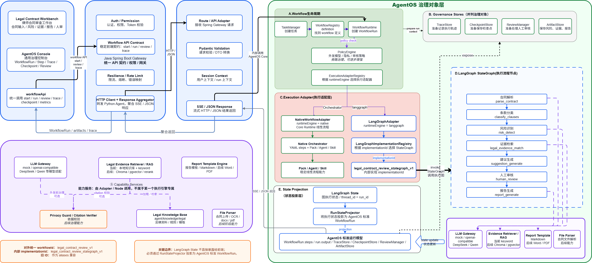

# 演示指南

本文用于 V1.0-alpha 演示链路冻结。演示目标是说明知弈 AgentOS 如何把律师合同审查变成可追踪、可审核、可生成报告的专业任务链路。

配套数据流图：



## 1. 启动 Python Agent

```bash
cd agent
python -m uvicorn app.main:app --host 0.0.0.0 --port 8000 --reload
```

健康检查：

```bash
curl http://localhost:8000/health
```

## 2. 启动 Spring Boot 后端

如果本地没有 PostgreSQL / Redis，可先启动基础依赖：

```bash
docker compose up -d postgres redis
```

启动后端：

```bash
cd backend
mvn spring-boot:run
```

健康检查：

```bash
curl http://localhost:8080/health
```

## 3. 启动前端

```bash
cd frontend
npm install
npm run dev
```

打开：

```text
http://localhost:3000
```

如果系统要求登录，使用页面上的注册入口创建演示账号。

## 4. 打开律师合同审查工作台

```text
http://localhost:3000/agentos/legal/contract-review
```

工作台默认只展示：

```text
合同审查标准流程
```

内部实际启动：

```text
legal_contract_review_v1
```

## 5. 输入演示合同

可使用以下演示文本：

```text
甲方委托乙方开发 CRM 系统，合同总价 100 万元。合同签署后甲方支付 30%，系统上线验收后支付 70%。
乙方应在 60 日内完成开发并交付。若乙方延期交付，每延期一日按合同总价的 0.1% 支付违约金。
合同未明确验收标准、需求变更流程、知识产权归属、数据安全责任和争议解决方式。
```

## 6. 启动合同审查标准流程

点击工作台中的启动按钮后，系统会创建或复用 AgentOS Task，并启动 `WorkflowRun`。

当前标准流程会进入 LangGraphAdapter，执行内部 implementation：

```text
legal_contract_review_stategraph_v1
```

## 7. 查看 Step 执行

重点观察以下步骤：

```text
parse_contract
classify_clauses
risk_detect
legal_evidence_match
suggestion_generate
human_review
report_generate
```

在 `human_review` 前，系统会生成风险、Evidence 和 Trace。

## 8. 查看风险点

风险面板用于展示合同中的结构化风险，例如：

- 验收标准不清
- 需求变更流程缺失
- 知识产权归属缺失
- 数据安全责任缺失
- 违约责任可能不足或约定不完整

具体结果以当前运行输出为准。

## 9. 查看 Evidence

Evidence 面板展示演示级本地知识库 + keyword 检索结果。

必须说明：

```text
当前 Evidence 不是正式法律依据库，不代表完整法律法规或案例检索结果。
```

## 10. 查看 Trace

工作台或 AgentOS Console 中可以查看运行轨迹。Trace 用于说明每一步做了什么、输出了什么、是否进入了人工审核。

演示时可以强调：

```text
AgentOS 的价值不是只给出回答，而是让任务过程可追踪、可审核、可恢复、可交接。
```

## 11. 进行 Human Review

在 Human Review 面板选择审核结果：

- `approved`：继续生成报告。
- `rejected`：不生成报告，运行进入 rejected / failed 语义。
- `need_more_info`：保持等待审核，不生成报告。

演示推荐选择：

```text
approved
```

## 12. 生成报告

审核通过后，系统会继续执行 `report_generate`，并生成 Markdown 报告。

报告路径保持：

```text
output.artifacts.report_generate.report_markdown
```

## 13. 打开 AgentOS Console

```text
http://localhost:3000/agentos-console
```

在 Console 中查看同一个 WorkflowRun：

- Workflow：`legal_contract_review_v1`
- Engine：`langgraph`
- Implementation：`legal_contract_review_stategraph_v1`
- Run status
- Trace
- Checkpoint
- Review

## 14. 演示重点

这条链路展示 AgentOS 不是普通聊天机器人：

- 普通聊天机器人偏向一次性问答。
- AgentOS 把任务放进 WorkflowRun 生命周期。
- 每一步有状态、输出和 Trace。
- 关键节点可以 Human Review。
- 审核通过后才进入报告生成。
- Console 可以从治理视角查看同一个运行实例。

演示时不要把当前系统描述为正式法律意见系统，也不要称为完整法律 RAG。当前是 V1.0-alpha 的可演示闭环。
