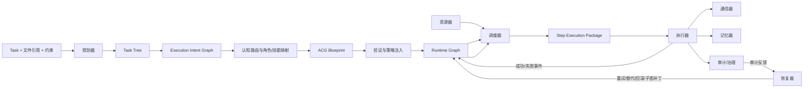
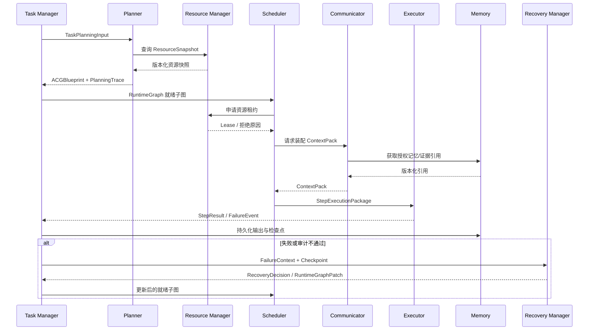

# AgentOS ACG 能力补齐与架构设计报告

> 日期：2026-07-26
> 范围：规划器、调度器、执行器、资源器、恢复器、记忆器、通信器，以及它们围绕 ACG 的接口与运行闭环
> 依据：`完成稿.docx` 与当前工作区代码

## 1. 执行摘要

当前项目已经具备一套可运行的 **ACG 基础执行骨架**：多类型节点/边模型、蓝图序列化、依赖图验证、就绪集并行执行、字段级上下文装配、通信血缘、检查点和重试。这些能力足以执行预先定义或由规则拼装的 DAG。

但项目尚未实现《完成稿》所描述的完整 ACG。当前所谓“动态规划”主要是：

1. 将用户意图解析为能力列表；
2. 将能力匹配到已注册 Agent；
3. 按核心层预设的角色顺序和字段关系生成图；
4. 由执行器按依赖关系并行执行。

这条路径缺少 `Task Tree → Execution Intent Graph（EIG）→ 拓扑选择 → 角色/技能/Agent 映射 → 完整 ACG 编译 → 策略注入 → 图优化` 的规划链，也缺少资源租约、运行时图演化和真正的局部重规划。因此，当前系统更准确的定位是：

> **“具备 ACG 数据结构与 DAG 执行能力的工作流运行时”，尚不是“能够按任务生成并持续演化 ACG 的认知操作系统”。**

后续建设应优先补齐通用中间表示和模块接口，禁止在 AgentOS Core 中枚举合同主题、步骤名称或业务字段来制造拓扑差异。

## 2. 目标架构与职责边界

完整 ACG 应采用“设计时蓝图 + 运行时图景”双态模型：



### 2.1 核心职责原则

- **规划器决定要执行什么，以及为何形成这种协作结构。**
- **调度器决定何时执行、在哪个资源上执行。**
- **执行器只执行已经绑定的 Step，不负责重新解释业务意图。**
- **资源器提供事实状态和租约，不决定任务语义。**
- **恢复器根据故障和检查点生成恢复动作或图补丁，不伪装成普通重试。**
- **记忆器负责状态分层、检索、压缩与生命周期，不只是一个输出字典。**
- **通信器负责契约化数据传递、路由、降噪和审计，不允许 Agent 私下读取全局上下文。**
- **业务 Pack 声明能力、技能和数据契约；Core 不认识“付款、验收、知识产权”等领域主题。**

## 3. 当前实现总览

| 组件               | 当前状态   | 可复用基础                                              | 主要缺口                                                       |
| ------------------ | ---------- | ------------------------------------------------------- | -------------------------------------------------------------- |
| ACG 模型与验证     | 部分完成   | 六类节点模型、七类边、环检测、端点与契约校验            | 缺运行时图、图补丁、策略和资源语义                             |
| 规划器             | 部分完成   | 语义画像、模板匹配、简单能力路由、蓝图构建              | 缺 Task Tree、EIG、拓扑决策、角色/技能生成、图优化             |
| 调度器             | 部分完成   | 就绪集、优先级、全局及 Agent 并发上限                   | 缺资源感知、租约、队列、公平性、数据位置和成本决策             |
| 执行器             | 基础可用   | 并行批次、Agent 调用、契约校验、Trace、人工审核、重试   | 条件/循环不支持，超时和取消治理不完整，图演化不受理            |
| 资源器             | 缺失       | Agent 上有少量静态描述字段                              | 无资源注册、心跳、容量、配额、租约、端边云位置和健康模型       |
| 恢复器             | 大部分缺失 | 检查点快照、Step 重试、故障注入                         | 独立恢复模块为空，所谓局部重规划没有修改图                     |
| 记忆器             | 大部分缺失 | WorkflowMemory、运行输出快照                            | 语义/证据记忆为空，无检索、压缩、保留、失效和持久化策略        |
| 通信器             | 部分完成   | ContextPack、字段投递、契约校验、Token 估算、血缘哈希链 | 独立协议/路由为空，无版本适配、压缩、广播/聚合策略和异常修复   |
| 策略与技能基础设施 | 缺失       | AgentProfile 有`allowedSkills` 字段                   | Policy Engine 与 Skill Registry 为空，无法支撑策略注入和技能链 |

## 4. 规划器需要补齐的能力

### 4.1 当前能力

当前规划入口位于 `agentOS/src/agentos/core/planning/engine.py`，实际链路为：

```text
IntentParser → TemplateMatcher（可选）→ CognitiveRouter → ACGBuilder
```

可复用内容包括：

- `TaskSemanticProfile`：核心目标、约束、能力、复杂度、风险、预算等基础字段。
- 静态模板相似度匹配。
- AgentRegistry 中的能力匹配。
- ACGBlueprint 的生成和基础验证。

已完成的闭环修复包括：

- `dynamic` 与 `template_preferred` 均先执行 LLM 语义解析，确定性解析仅用于测试或显式降级。
- 规划输入已拆分为目标、约束、交付物、验证要求和有界任务材料，Run 中只记录材料摘要哈希与覆盖统计。
- `planningMode` 已成为权威模式；Native bootstrap 不再隐式强制动态构图，显式工作流优先。
- 模板与动态图均执行服务端可信熵预算检查，并在 Run/Trace/前端展示结构化规划诊断。

仍需继续演进的限制包括：

- `CognitiveRouter` 是别名/包含关系匹配，不具备文档要求的多维效用评分。
- `ACGBuilder` 依赖 `_ROLE_ORDER`、`_ROLE_SOURCE_FIELDS` 等核心规则，生成的是预设角色链。
- Memory/Evidence/Control 节点主要靠能力关键词注入，不是规划语义的编译结果。

### 4.2 必须新增的规划中间表示

#### A. Task Tree

建议新增：

```text
TaskTree
├── GoalNode
├── SubGoalNode
├── TaskNode
└── ControlIntentNode
```

每个可执行任务至少需要：

- `task_node_id`
- `goal`
- `preconditions`
- `expected_outputs`
- `logical_dependencies`
- `required_capabilities`
- `risk_tags`
- `source_refs`
- `decomposition_rationale`

Task Tree 只描述 **WHAT**，不能直接携带具体 Agent 名称。

#### B. Execution Intent Graph（EIG）

EIG 将 Task Tree 转换为 **HOW**，至少需要表达：

- 可并行关系与互斥关系；
- 同步点和汇聚规则；
- 条件分支与循环意图；
- 数据依赖和通信方向；
- 共享/隔离记忆需求；
- 证据要求和人工审核要求；
- 幂等性、超时、重试和补偿属性；
- 数据隐私、位置和资源约束；
- 每条通信的熵预算。

#### C. Role Collaboration Graph

在 EIG 之后建立角色协作图，避免“能力列表直接变 Step”：

- 发现角色与职责边界；
- 将能力要求映射到角色；
- 将角色映射到技能链；
- 将技能链映射到具体 Agent/模型/工具；
- 保留首选与备选绑定；
- 记录每次选择的评分和理由。

### 4.3 认知路由需要实现的评分

候选过滤至少包括：

1. 能力语义匹配；
2. Agent 健康状态与心跳；
3. 隐私等级和部署位置；
4. 当前负载与并发余量；
5. 所需模型、工具和技能是否可用。

候选评分至少包括：

```text
utility =
    w_semantic × semantic_match
  + w_reliability × historical_success
  - w_load × current_load
  - w_cost × inference_cost
  - w_network × network_distance
```

权重应来自策略引擎，并随风险、复杂度、预算和时延目标调整。评分结果必须进入规划审计记录。

### 4.4 ACG 编译器需要输出的完整内容

规划器最终输出不能只是 Step DAG，而应包含：

- Step Node：目标、前置条件、输入/输出契约、风险、幂等性、优先级。
- Agent Node：绑定角色、候选执行者、模型、容量和生命周期。
- Skill Node：技能版本、工具、输入/输出契约和执行成本。
- Memory Node：记忆类型、写入点、读取点、压缩和保留策略。
- Evidence Node：来源、可信度、版本、校验和、引用关系。
- Control Node：开始、结束、并行、共识、条件、循环、人工审核门。
- Dependency/Communication/Execution/Read/Write/Support/Control Flow Edge。
- 图级策略：资源、通信、记忆、恢复、审核、超时和预算。
- 编译来源：Task Tree、EIG、路由决策和策略版本。

### 4.5 规划器验收标准

- 同一输入和同一资源快照下，规划可重放并解释差异。
- 不同任务材料能够产生不同 Task Tree/EIG；差异来自模型/规则结果，而非 Core 业务关键词。
- 模型不能直接发明未注册 Agent、技能或字段；所有绑定必须由注册中心解析。
- 每个输入字段都有可证明的生产者或任务原始输入来源。
- 规划失败时返回结构化诊断，不静默降级成“看起来动态”的固定图。
- Blueprint 同时通过结构、能力、契约、资源、通信和策略验证。

## 5. 调度器需要补齐的能力

### 5.1 当前能力

当前调度逻辑分散在：

- `core/workflow/orchestrator.py`：根据 Agent 名称/能力分派调用；
- `core/execution/acg_executor.py`：计算就绪集、按优先级排序，并受全局与单 Agent 并发上限约束。

它已经能证明 DAG 中真正无依赖的 Step 可以进入同一执行批次，但尚不构成《完成稿》中的资源调度器。

### 5.2 必须新增的调度能力

- 全局任务队列和 Step 就绪队列；
- Task/Step 优先级、租户公平性、老化和抢占规则；
- 基于 ResourceSnapshot 的候选资源过滤与评分；
- 资源预留与租约申请，防止规划完成后容量被抢占；
- Agent、模型、工具、端点四类并发配额；
- 数据位置感知，避免隐私数据跨边界传输；
- 时延、成本、可靠性和网络开销联合决策；
- 超时、取消、背压和熔断；
- 备选 Agent/资源快速切换；
- 调度决策审计和可重放。

### 5.3 调度接口建议

```text
schedule(
  runtime_graph,
  ready_step_ids,
  resource_snapshot,
  policy_snapshot
) -> SchedulingDecision[]
```

每个 `SchedulingDecision` 至少包含：

- `step_id`
- `agent_id`
- `resource_id`
- `lease_id`
- `model_endpoint`
- `reserved_capacity`
- `deadline`
- `decision_score`
- `decision_reasons`
- `fallback_bindings`

### 5.4 调度器验收标准

- 无有效租约的 Step 不得进入执行器。
- 超额并发、隐私位置不符和健康异常资源必须在调度前被过滤。
- 相同优先级下不能长期饿死低成本或长等待任务。
- 资源失效时能切换备选执行者，而不是直接重跑同一失效端点。
- 每个调度结果都能解释“为什么选它、为什么没选其他候选”。

## 6. 执行器需要补齐的能力

### 6.1 当前可复用能力

- 基于 Dependency Edge 计算就绪集；
- 并行批次执行；
- 将 StepNode 桥接为现有 WorkflowStep；
- 调用 AgentRegistry 中的 Agent；
- 输入/输出契约校验；
- 结构化 Trace、人工审核暂停和恢复；
- 批次完成后创建检查点；
- 基础重试和故障注入。

### 6.2 必须补齐的执行能力

- 消费调度器生成的 `StepExecutionPackage` 和资源租约；
- 执行前重新验证租约、策略、输入版本和证据有效性；
- 真正执行条件节点、循环节点和共识节点；
- Step 级超时、协作取消和进程/远端调用中断；
- 工具调用沙箱、权限和审计；
- 幂等键、重复投递去重与副作用补偿；
- 流式输出和部分结果提交；
- 执行结果版本化，避免重试覆盖审计历史；
- 将运行结果写回 Runtime Graph，而不是只更新 `run.steps`；
- 区分业务失败、契约失败、资源失败、策略失败和系统失败。

### 6.3 StepExecutionPackage 建议

执行器不应读取整个 Task/Blueprint 后自行猜测输入。建议调度器下发：

```text
StepExecutionPackage
├── graph_id / graph_version / step_id / attempt
├── agent_binding / skill_chain / model_binding
├── resource_lease
├── context_pack_ref
├── input_contract / output_contract
├── memory_read_refs / evidence_refs
├── policy_snapshot
├── timeout / retry / idempotency / compensation
└── trace_context
```

### 6.4 执行器验收标准

- 执行器无法绕过资源租约和策略检查。
- 条件分支只激活满足条件的路径，未选路径有明确终态。
- 循环必须有最大次数、终止条件和预算上限。
- 同一幂等键重复执行不会产生重复副作用。
- 每次 Agent/模型/工具调用可追溯到 Step、输入版本、租约和策略版本。

## 7. 资源器需要新建设计

### 7.1 当前状态

仓库中没有独立 Resource Manager。当前可见的资源相关信息只包括：

- `AgentProfile` 的能力、风险等级和允许技能；
- `AgentNode.max_concurrency`；
- `ACGExecutor.max_parallelism`。

这些字段不能反映真实端、边、云资源状态，也不能提供调度租约。

### 7.2 需要管理的资源对象

- Agent 实例；
- 模型端点及 Token/请求配额；
- 工具/API 并发与速率限制；
- CPU、GPU、内存和容器；
- 数据源、向量库和对象存储；
- 端、边、私有云、公有云位置；
- 网络延迟、带宽和故障域；
- 成本、碳耗或其他经济策略。

### 7.3 资源描述符

建议定义 `ResourceDescriptor`：

- 身份：`resource_id/type/provider/region/location`；
- 静态能力：模型、技能、硬件、隐私认证；
- 动态状态：健康、心跳、负载、队列、可用容量；
- 经济属性：调用成本、Token 单价、带宽成本；
- 网络属性：延迟、带宽、故障域；
- 治理属性：租户、数据级别、允许任务类型；
- 版本和更新时间。

### 7.4 资源器核心服务

- 注册、注销和心跳；
- 资源快照和增量事件流；
- 容量查询与候选过滤；
- 原子预留、租约续期、释放和过期回收；
- 全局/租户/任务/Agent 多级配额；
- 健康降级、隔离和熔断；
- 使用账本和成本核算。

### 7.5 资源器验收标准

- 并发竞争下不超卖容量。
- 租约过期可回收，任务恢复后不会复用失效租约。
- ResourceSnapshot 带版本，规划和调度能发现快照过期。
- 资源事件能触发调度器重新评估，但不能直接篡改任务语义。

## 8. 恢复器需要补齐的能力

### 8.1 当前能力与问题

`core/governance/checkpoint.py` 已保存 Step、Blueprint、完成集、活动集、血缘和执行状态，属于可复用基础。

但 `agentos/recovery/` 下的 `recovery_manager.py`、`checkpoint.py`、`retry_strategy.py` 目前只有模块说明，没有实现。执行器中的“local_replan”只是记录事件并重新运行原 Step，没有生成或应用图补丁。

### 8.2 故障分类

恢复器至少应识别：

- 瞬时模型/API/网络故障；
- Agent 或资源永久不可用；
- 输入/输出契约不匹配；
- 证据缺失或版本失效；
- 低置信度/审计不通过；
- 人工审核退回；
- 策略或隐私违规；
- 预算耗尽；
- 图死锁、不可达或运行时条件异常；
- 不可幂等副作用失败。

### 8.3 恢复策略

恢复动作应是显式枚举，而不是统一重试：

- `RETRY_SAME_BINDING`
- `RETRY_ALTERNATE_BINDING`
- `REASSEMBLE_CONTEXT`
- `REPAIR_CONTRACT`
- `RETRIEVE_MISSING_EVIDENCE`
- `ROLLBACK_TO_CHECKPOINT`
- `REEXECUTE_SUBGRAPH`
- `PATCH_RUNTIME_GRAPH`
- `REPLAN_SUBTREE`
- `WAIT_FOR_RESOURCE`
- `REQUEST_HUMAN_DECISION`
- `FAIL_TERMINALLY`

### 8.4 RuntimeGraphPatch

真正的局部重规划必须产出可验证补丁：

```text
RuntimeGraphPatch
├── base_graph_version
├── add_nodes / remove_nodes / replace_nodes
├── add_edges / remove_edges
├── invalidate_outputs
├── reset_step_states
├── migration_rules
├── reason / evidence / policy_decision
└── expected_new_version
```

补丁应用前必须进行环检测、契约验证、资源可行性检查和影响分析；应用后递增图版本并生成审计事件。

### 8.5 恢复器验收标准

- 同一种错误不会无限重复相同策略。
- 恢复决策包含错误分类、策略、影响子图和预算。
- 局部重规划能够在测试中实际增加/替换节点和边。
- 回滚后恢复输入、记忆、证据、血缘、资源账本和策略状态。
- 不可幂等步骤未经补偿或人工确认不得自动重跑。

## 9. 记忆器需要补齐的能力

### 9.1 当前状态

`WorkflowMemory` 当前主要把已完成 Step 输出整理为 `observations`，或根据 ContextPack 构造 Agent 可见上下文。`semantic_memory.py` 与 `evidence_memory.py` 目前为空。

这属于运行上下文容器，不是完整的长期记忆系统。

### 9.2 建议的记忆分层

- **Working Memory**：当前 Step 和当前运行的短期上下文。
- **Episodic Memory**：任务阶段、决策、失败和恢复经历。
- **Semantic Memory**：跨任务可复用的结构化知识与经验。
- **Evidence Memory**：原文、检索结果、工具输出及可信引用。
- **Procedural Memory**：模板、技能链、策略和成功执行模式。

### 9.3 记忆对象必须具备的元数据

- `memory_id/type/task_id/run_id/step_id`
- `content_ref/summary/embedding_ref`
- `source_refs/evidence_refs`
- `version/checksum/confidence`
- `privacy_level/tenant_id/access_policy`
- `created_at/expires_at/retention_policy`
- `supersedes/invalidated_by`

### 9.4 记忆器核心能力

- 写入、读取、检索、压缩、摘要和合并；
- 按目标、Step、角色、证据和时间检索；
- Token 预算驱动的上下文选择；
- 敏感信息分级、租户隔离和删除；
- 记忆版本与失效传播；
- 检查点快照和恢复重建；
- 将历史成功率和失败经验反馈给规划器/路由器。

### 9.5 记忆器验收标准

- Agent 只能读取 ACG 和策略授权的记忆。
- 超长任务上下文不会无限增长，压缩前后保留关键事实和来源。
- 上游结果更新后，依赖旧版本的记忆可被标记失效。
- 任务恢复能够重建与检查点一致的记忆视图。
- 跨任务语义记忆必须隔离租户并记录引用来源。

## 10. 通信器需要补齐的能力

### 10.1 当前可复用能力

`core/communication` 已实现较有价值的基础：

- `ContextPack` 结构化消息载体；
- 根据 `inputSpec.from/fields` 按字段装配输入；
- 输入契约校验和缺失字段报告；
- Token 粗略估算和节省率；
- DataProduction/DataConsumption/RuntimeInteraction 血缘事件；
- 哈希链完整性验证。

### 10.2 当前缺口

顶层 `agentos/communication/message.py`、`protocol.py`、`router.py` 为空。现有 ContextAssembler 仍缺：

- 消息协议版本和兼容性协商；
- Schema Registry 与字段适配器；
- 条件路由、广播、聚合和共识消息；
- 大对象引用与流式传输；
- 动态压缩、摘要和熵预算执行；
- 消息重试、去重、顺序和投递确认；
- 契约异常的分级修复；
- 隐私脱敏与字段级访问控制；
- 独立消息持久化和回放。

### 10.3 通信协议建议

统一消息信封至少包含：

```text
MessageEnvelope
├── message_id / correlation_id / causation_id
├── task_id / run_id / graph_version
├── producer_step_id / consumer_step_id
├── schema_id / schema_version
├── payload_ref / payload_checksum
├── evidence_refs / memory_refs
├── privacy_label / access_policy
├── entropy_cost / token_count
├── attempt / idempotency_key
└── created_at / expires_at
```

### 10.4 契约异常处理顺序

建议由通信器和恢复器协作执行：

1. 使用明确默认值或版本适配器；
2. 查找同契约的最新有效生产版本；
3. 查找 ACG 声明的替代生产者；
4. 请求上游幂等重算；
5. 注入数据适配 Step；
6. 降级并告警；
7. 转交局部重规划或人工处理。

禁止在 Core 中通过业务字段别名表猜测 `payment → payment_terms` 一类映射。字段适配必须来自版本化 Schema/Skill/Pack 声明。

### 10.5 通信器验收标准

- Agent 之间不存在绕过通信器的直接上下文读取。
- 每个消费字段都能追溯到生产事件和数据版本。
- 消息重复投递不会造成重复消费副作用。
- 契约升级可以通过显式适配器兼容，不修改 Core 业务规则。
- 熵预算超限会触发压缩、批处理或重新规划，而不是只记录备注。

## 11. 七类组件之间的统一接口

建议先冻结以下跨模块对象，再分别开发组件：

| 对象                     | 生产者           | 消费者              | 作用                             |
| ------------------------ | ---------------- | ------------------- | -------------------------------- |
| `TaskPlanningInput`    | Task Manager     | 规划器              | 用户意图、文件引用、约束和预算   |
| `TaskSemanticProfile`  | 意图分析器       | Task Structurer     | 统一语义画像                     |
| `TaskTree`             | Task Structurer  | EIG Compiler        | WHAT 层目标结构                  |
| `ExecutionIntentGraph` | EIG Compiler     | Cognitive Router    | HOW 层执行约束                   |
| `CollaborationPlan`    | Cognitive Router | ACG Compiler        | 角色、技能、Agent 候选和通信结构 |
| `ACGBlueprint`         | ACG Compiler     | 验证器/运行时       | 设计时权威蓝图                   |
| `PolicySnapshot`       | Policy Engine    | 规划/调度/执行/恢复 | 可审计的策略版本                 |
| `ResourceSnapshot`     | 资源器           | 规划器/调度器       | 带版本的资源事实                 |
| `RuntimeGraph`         | Workflow Runtime | 调度/执行/恢复      | 当前运行图及节点状态             |
| `SchedulingDecision`   | 调度器           | 资源器/执行器       | 绑定和租约决策                   |
| `StepExecutionPackage` | 调度器           | 执行器              | 完整、不可猜测的执行输入         |
| `ContextPack`          | 通信器           | 执行器/Agent        | 受契约约束的上下文               |
| `RecoveryDecision`     | 恢复器           | Runtime/调度器      | 恢复动作与影响范围               |
| `RuntimeGraphPatch`    | 恢复器/重规划器  | Runtime             | 版本化子图变更                   |

## 12. 建议的运行时闭环



## 13. 推荐代码边界

建议逐步形成以下目录，而不是继续扩大现有 `intent_parser.py` 和 `acg_builder.py`：

```text
agentos/core/
├── planning/
│   ├── semantic_profile.py
│   ├── task_tree.py
│   ├── task_structurer.py
│   ├── execution_intent_graph.py
│   ├── eig_compiler.py
│   ├── topology_selector.py
│   ├── role_planner.py
│   ├── skill_matcher.py
│   ├── acg_compiler.py
│   ├── strategy_injector.py
│   └── plan_validator.py
├── scheduling/
│   ├── scheduler.py
│   ├── queue.py
│   ├── scoring.py
│   └── lease_coordinator.py
├── resources/
│   ├── models.py
│   ├── registry.py
│   ├── monitor.py
│   ├── quota.py
│   └── lease.py
├── execution/
│   ├── runtime_graph.py
│   ├── step_package.py
│   └── executor.py
├── recovery/
│   ├── classifier.py
│   ├── decision.py
│   ├── graph_patch.py
│   └── recovery_manager.py
├── memory/
│   ├── working.py
│   ├── episodic.py
│   ├── semantic.py
│   ├── evidence.py
│   └── retrieval.py
└── communication/
    ├── envelope.py
    ├── schema_registry.py
    ├── router.py
    ├── compressor.py
    ├── assembler.py
    └── audit.py
```

现有模块可以在接口稳定后迁移，不要求一次性重写。

## 14. 分阶段实施建议

### 阶段 P0：冻结契约与真实性边界

目标：停止通过演示规则伪造动态性。

- 定义 TaskTree、EIG、CollaborationPlan、ResourceSnapshot、RuntimeGraph 和 GraphPatch 模型。
- 为 Agent、Skill、Schema、Resource 建立注册接口。
- 明确 Core 与 Pack 的边界。
- 动态规划失败必须显式暴露原因。

验收物：模型定义、JSON Schema、接口测试、架构决策记录。

### 阶段 P1：实现真实的设计时 ACG 编译

- Task 材料解析与 Task Tree；
- EIG 编译；
- 拓扑选择；
- 角色/技能/Agent 映射；
- 完整 ACG 编译；
- 策略注入和图验证。

验收物：至少三个跨领域任务产生可解释、不同的完整 ACG，且不依赖 Core 领域关键词。

### 阶段 P2：实现资源器与资源感知调度

- 资源注册、心跳、快照、配额和租约；
- 调度队列、评分、备选绑定、背压；
- StepExecutionPackage。

验收物：容量竞争、资源故障、隐私位置和成本策略的集成测试。

### 阶段 P3：实现 Runtime Graph 与恢复闭环

- 运行时节点状态与版本；
- GraphPatch；
- 故障分类和恢复策略；
- 检查点一致性和子图重执行。

验收物：故障后图拓扑真实变化，并从检查点完成续跑。

### 阶段 P4：完成记忆与通信治理

- 多层记忆、检索、压缩、失效和隔离；
- 消息信封、Schema Registry、版本适配、路由和回放；
- 熵预算的实际执行和指标闭环。

验收物：长程任务、契约升级、低熵通信和跨任务记忆测试。

### 阶段 P5：评测与可视化

- 规划质量、关键路径、资源效率、恢复率、熵消耗指标；
- 前端区分 Blueprint、Runtime Graph、调度绑定和数据血缘；
- 展示图版本变化与恢复补丁。

验收物：端到端演示不依赖预设拓扑，所有动态变化有审计依据。

## 15. 总体验收清单

完整 ACG 可以按以下条件判定，不应只看前端是否显示了不同节点：

- [ ] 用户材料进入 TaskPlanningInput，而非只进入 Agent 执行阶段。
- [ ] 系统产生可持久化的 Task Tree 和 EIG。
- [ ] 拓扑类型有明确选择依据和规划审计。
- [ ] Agent、Skill、Schema 和 Resource 均通过注册中心解析。
- [ ] ACG 包含任务所需的多类型节点和边，而非可视化装饰节点。
- [ ] 所有 Step 输入可由原始输入、上游输出、Memory 或 Evidence 满足。
- [ ] 调度器基于实时资源快照并获取租约。
- [ ] 执行器只消费 StepExecutionPackage，不猜测业务字段或上游节点。
- [ ] Memory/Communication Edge 在运行时产生真实读写/传输事件。
- [ ] 失败能够产生 RecoveryDecision，局部重规划能够应用 GraphPatch。
- [ ] Blueprint 与 Runtime Graph 分离并具有独立版本。
- [ ] 两个拓扑不同的任务，其差异可回溯到 Task Tree/EIG/资源/策略变化。
- [ ] 同一输入可重放，随机规划结果受 Schema、注册中心和验证器约束。
- [ ] Core 中没有领域主题、合同字段或演示步骤 ID 的硬编码。

## 16. 需要项目负责人优先决策的问题

在编码完整 ACG 前，需要先确定以下产品与架构边界：

1. **动态规划允许模型决定到什么层级？** 仅 Task Tree，还是允许提出角色和拓扑候选？
2. **角色生成是生成描述符，还是允许运行时创建新的 Agent 实例？**
3. **技能注册中心的最小可执行单元是什么？** Python Skill、远端 Tool、模型 Prompt，还是统一抽象？
4. **第一阶段是否真实接入端边云资源，还是先使用可替换的模拟 Resource Provider？**
5. **条件与循环是否纳入首个完整版本？** 如果暂不支持，Blueprint 必须明确拒绝，而非画出来但不执行。
6. **长期记忆是否跨租户/跨任务？** 这会直接决定隔离、删除和合规模型。
7. **局部重规划由原规划器完成，还是由独立 Recovery Planner 完成？**
8. **静态模板和动态规划的选择条件是什么？** 文档给出 85% 阈值，但还需定义质量、风险和成本门槛。
9. **ACG 的首个权威验收场景是什么？** 建议至少选择两个领域，避免再次把单一合同流程误当成通用架构。

## 17. 当前代码依据索引

| 判断                                                           | 代码依据                                                                                        |
| -------------------------------------------------------------- | ----------------------------------------------------------------------------------------------- |
| 规划链已包含有界上下文、LLM/规则画像、模板、路由、预算和 Builder | `agentOS/src/agentos/core/planning/engine.py`、`context.py`、`budget.py`                    |
| 两种模式均可调用 LLM，材料经 12,000 字符预算进入同一次画像解析  | `agentOS/src/agentos/core/runtime.py`、`planning/intent_parser.py`、`planning/context.py`   |
| 认知路由仍是简化能力匹配，但模板和动态图的熵超限已强制拦截      | `agentOS/src/agentos/core/planning/cognitive_router.py`、`planning/engine.py`               |
| Builder 依赖固定角色顺序、来源字段和组图规则                   | `agentOS/src/agentos/core/planning/acg_builder.py:39`、`:49`、`:59`、`:257`             |
| ACG 六类节点模型已经存在                                       | `agentOS/src/agentos/core/acg/nodes.py:33`、`:54`、`:67`、`:78`、`:87`、`:95`       |
| 当前图验证支持环、端点、契约和依赖路径，但明确拒绝 IF/LOOP     | `agentOS/src/agentos/core/acg/graph_ops.py:144`                                               |
| 当前“调度”是就绪集、优先级和并发上限选择                     | `agentOS/src/agentos/core/execution/acg_executor.py:258`、`:270`                            |
| Orchestrator 只负责解析 Agent 并调用                           | `agentOS/src/agentos/core/workflow/orchestrator.py:19`                                        |
| 当前局部重规划只记录恢复事件，没有应用图补丁                   | `agentOS/src/agentos/core/execution/acg_executor.py:638`                                      |
| 检查点已保存蓝图、完成集、活动集、血缘和执行状态               | `agentOS/src/agentos/core/governance/checkpoint.py:8`                                         |
| 独立 Recovery Manager、Checkpoint、Retry Strategy 仍为空壳     | `agentOS/src/agentos/recovery/`                                                               |
| 当前 WorkflowMemory 是运行输出/ContextPack 容器                | `agentOS/src/agentos/memory/workflow_memory.py:12`                                            |
| Semantic Memory 与 Evidence Memory 仍为空壳                    | `agentOS/src/agentos/memory/semantic_memory.py`、`evidence_memory.py`                       |
| 字段装配和通信血缘可复用                                       | `agentOS/src/agentos/core/communication/assembler.py:28`、`audit.py:77`                     |
| 独立消息、协议和路由层仍为空壳                                 | `agentOS/src/agentos/communication/`                                                          |
| Policy Engine 与 Skill Registry 仍为空壳                       | `agentOS/src/agentos/governance/policy_engine.py`、`agentOS/src/agentos/skills/registry.py` |
| 当前没有独立资源注册、快照、配额和租约模块                     | `agentOS/src/agentos/` 下无 `resources/` 或 Resource Manager 实现                           |

## 18. 结论

项目不需要推翻现有代码。最合适的路径是保留现有 ACG 模型、图验证、并行执行、ContextPack、血缘和检查点，在其前面补齐真实的认知编译链，在其旁边建立资源器与调度器，在其后面补齐 Runtime Graph、恢复、记忆和通信治理。

真正的关键不是“让两张图看起来不同”，而是建立一条可验证的因果链：

```text
任务与材料不同
→ Task Tree / EIG 不同
→ 能力、角色、技能和资源约束不同
→ ACG Blueprint 不同
→ 调度与通信路径不同
→ Runtime Graph 根据执行事实继续演化
```

只有这条因果链完整成立，项目才实现了《完成稿》定义的完整 ACG。
